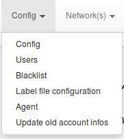
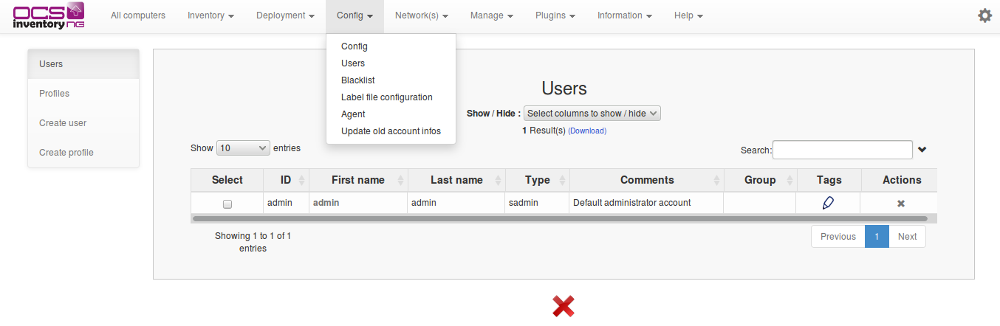
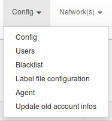
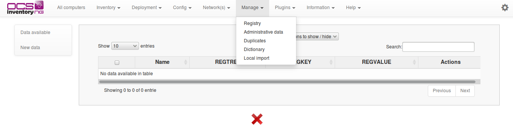
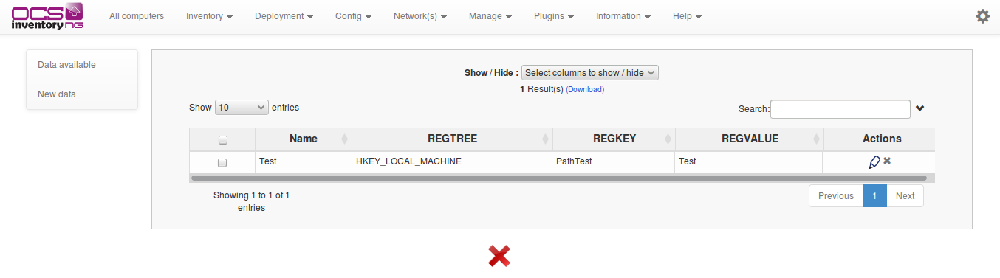
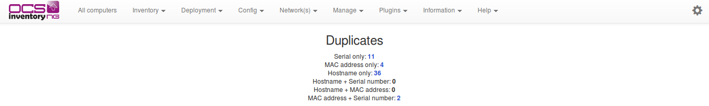
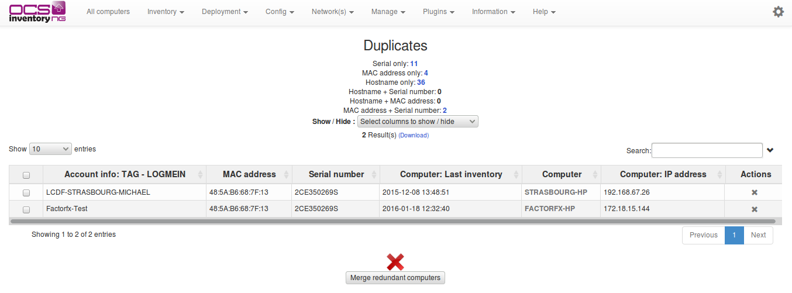
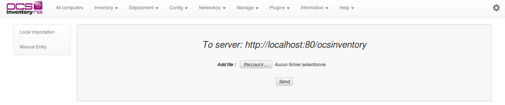

# Administration of OCS Inventory NG

Adminstrative Console: Point your browser to
[http://your_administration_server/ocsreports](http://your_administration_server/ocsreports)
and login with username “admin”, and password “admin”.

**`Warning: You must change the default password or better, add a new administrative user and remove
the default "admin" user.`**

**`Note: All these features are only available to OCS Inventory NG administrators.`**

## Managing OCS Inventory NG Administration server users.

Click on the toolbar config menu and then on users to display all configured OCS Inventory NG
Administration server users.

You can add new users by entering their name, password (user will be able to change it when logged in),
and selecting their type. You can choose between:

* Super Administrators : user has the ability to configure all parameters of the product. Look like root.
* Local Administrators : user has the ability to configure all parameters of the product authorized
by the super administrator or administrator.
* Teledeploy requesters : user has the ability to make a deployment request.
* Administrators : user has the ability to configure all parameters of the product authorized by
the super administrator.
* User: user can only query the database and view results of inventory. It just has the top left
Combo-box of menu toolbar to run general queries.

You can create new types as you want, with **Add a new user** tab. To delete a user, just click
on red cross at the end of the corresponding line.

## Managing OCS Inventory NG general options

### **Access to main configuration page**

Click on the toolbar **Config** menu and then **config** to display all general options.

### List of configuration variables

General options of configuration

**Configuration options** | **Meaning**
-------|-------
**AUTO_DUPLICATE_LVL** | Duplicate computer detection. Select which values to use in duplicate detection. If multiple values are selected, they all must match for 2 machine records to be considered duplicate.
**CONF_PROFILS_DIR** | Specify directory of profiles conf files. (must be writable)
**DEPLOY** | Activate or disable the automatic deployment of new agents.
**DOWNLOAD** | Activate or disable package deployment feature. Turning off DOWNLOAD stop this functionality on the server AND on the agents. With DOWNLOAD off, once agents will have contacted OCS server, they will stop current download WITHOUT cleaning packages.
**DOWNLOAD_CYCLE_LATENCY** | Time in seconds to wait between each download cycle
**DOWNLOAD_FRAG_LATENCY** | Time in seconds to wait between each fragment download.
**DOWNLOAD_GROUPS_TRACE_EVENTS** | Enable or disable monitoring of the affected packages to a group at computer.
**DOWNLOAD_PACK_DIR** | Specify the directory to create packages.
**DOWNLOAD_PERIOD_LATENCY** | Time in seconds to wait between each download period.
**DOWNLOAD_PERIOD_LENGTH** | Number of cycles per period.
**DOWNLOAD_REDISTRIB** | Enable or disable the feature Redistribution Server.
**DOWNLOAD_REP_CREAT** | Define the directory to create packages for redistribution.
**DOWNLOAD_SERVER_DOCROOT** | Define the packages destination directory.
**DOWNLOAD_SERVER_URI** | Specify the redistribution servers URI.
**DOWNLOAD_TIMEOUT** | Validity in days of a package on an agent. If the time used to download a package is over DOWNLOAD_TIMEOUT days, package will be cleaned and ERR_TIMEOUT will be sent to ocs server.
**DOWNLOAD_URI_FRAG** | Specify the address where deployment packages fragments are located to activate them.
**DOWNLOAD_URI_INFO** | Specify the address where INFO files of deployment packages are located to activate them.
**ENABLE_GROUPS** | Enable or disable the functionality of groups of machines.
**EXPORT_SEP** | Define the separator dump files.
**FREQUENCY** | Specify the frequency in days of inventories.
**GENERATE_OCS_FILES** | Enable or disable the multi entities feature (use ocsinventory-injector.pl).
**GROUPS_CACHE_OFFSET** | Specify a range between 0 and the set value to avoid the simultaneous calculation of all groups.
**GROUPS_CACHE_REVALIDATE** | Specify the group validity.
**INVENTORY_DIFF** | Enable or disable differential inventory to speed up the server. With differential inventory, only changes are stored by the server, not full inventory.
**INVENTORY_FILTER_ENABLED** | Enable or disable the authorization to change things "on the fly" by the filter system.
**INVENTORY_FILTER_FLOOD_IP** | Enable or disable the anti-flooding filter of inventory. One IP address can send a new computer only once in the period.
**INVENTORY_FILTER_FLOOD_IP_CACHE_TIME** | Define the period for INVENTORY_FILTER_FLOOD_IP in seconds.
**INVENTORY_FILTER_ON** | Enable or disable the filter stack of inventory.
**INVENTORY_TRANSACTION** | Enable or disable database transactions on server. With transaction, an inventory is stored only if all data has been processed correctly.
**INVENTORY_WRITE_DIFF** | Enable or not the differential update of inventory sections at the engine.
**INVENTORY_SESSION_ONLY** | Accept an inventory only if a session is active.
**INVENTORY_CACHE_REVALIDATE** | Specify the cleaning frequency of inventory structures in cache.
**IPDISCOVE** | Specify the number of agents that will run the IP discovery feature for each gateway (subnet). If you leave the default value of 2, this means that the Communication server will ask the 2 most active computers on each subnet to run IP discovery feature. If you set it to 0, IP discovery will be disabled.
**IPDISCOVER_BETTER_THRESHOLD** | Specify the minimum difference in days to replace an ipdiscover agent.
**IPDISCOVER_IPD_DIR** | Specify the cache directory of ipdiscover analyzes.
**IPDISCOVER_LATENCY** | Agent will pause this many seconds between each IP address scan during IP discovery.
**IPDISCOVER_MAX_ALIVE** | Maximum number of days between two inventories for an IP Discovery enabled computer to hold his status of IP discovery computer. An IP discovery enabled computer will lose his status if it has not been seen by the Communication server for more days than the number of days defined in this setting. Another computer in the same sub network will then be designated.
**IPDISCOVER_NO_POSTPONE** | Disable or not the time before a first election.
**IPDISCOVER_USE_GROUPS** | Enable or disable the use of groups for ipdiscover.
**LOCAL_PORT** | IP port of OCS Inventory NG Communication Server.
**LOCAL_SERVER** | IP address or DNS name of OCS Inventory NG Communication Server.
**LOG_DIR** | Specify the logs directory
**LOG_GUI** | Enable or not the logs of the GUI.
**LOGLEVEL** | Enable or disable detailed log for Communication server. If enabled, server will write logs to file “ocsinventory-NG.log” in directory “/var/log/ocsinventory-NG” for Linux and “…\xampp\apache\logs” for Windows.
**LOG_SCRIPT** | Specify the logs directory of scripts
**LOCK_REUSE_TIME** | Specify the lock validity of computer in seconds.
**OCS_FILES_FORMAT** | Define the format of the inventory file, compressed (OCS) or plain XML.
**OCS_FILES_OVERWRITE** | Enable or disable the storage of all inventories between a synchronization with a higher level server.
**OCS_FILES_PATH** | Define the path of .OCS or .XML files.
**OLD_CONF_DIR** | Specify the backups directory backups of profiles conf files.
**PROLOG_FILTER_ON** | Enable or not the stack of filter prolog.
**PROLOG_FREQ** | Controls how often the windows service agent runs. Specified in number of hours 1-24. The agent will contact the OCS server every PROLOG_FREQ hours. The agent will not send an inventory if inventory is not older than FREQUENCY days.
**REGISTRY** | Activates or disables the registry query function.
**SESSION_VALIDITY_TIME** | Spécifier la durée de validité d'une session en secondes.
**SNMP** | Activer ou non la fonctionnalité SNMP.
**SNMP_DIR** | Spécifier le répertoire du fichier des communautés SNMP.
**SNMP_INVENTORY_DIFF** | Activer ou non la fonctionnalité de mise à jour de l'inventaire snmp en se basant sur la table snmp_laststate.
**SNMP_URI** | Spécifier l'adresse du fichier des communautés SNMP.
**TAB_CACHE** | Activer ou non le cache des tableaux .
**TELEDIFF_WK** | Activate workflow for teledeployment.
**TRACE_DELETED** | Activates or not tracking of deleted/renamed computers for integration with GLPI. Enable this feature only if you use integration with GLPI asset management software.
**UPDATE** | Not used, always set to OFF.
**USE_FLASH** | Utiliser ou non flash dans la GUI.
**WEB_SERVICE_ENABLED** | Activer ou non le webservice.

Click **[ Update ]** button when you set all changes.

## Uploading Agent for deployment through launcher “OcsLogon.exe”

**`Warning: This feature works only for network connected computers able to connect to the
Communication server.`**

OCS Inventory NG is able to automatically install an agent on computers when the launcher “OcsLogon.exe”
is used through a login script or GPO. The Agent’s files are downloaded from the Communication server.

You first must upload the agent package(s) into the Administration console and activate the deployment
feature by setting the “DEPLOY” general option to ON (see § 6.2 Managing OCS Inventory NG general options.).

One or both of the following 2 files must be uploaded to the server:

* **OCS-NG-Windows-Agent-Setup.exe** file for Windows, to deploy the standalone Agent
(not running as a Windows service). This file is included in package OCSNG-Windows-Agent-2.0.zip.
* **ocspackage.exe** file, created using OCS Inventory NG
[Packager](../6.OCS-Tools/OCS-Packager.md), to deploy the Windows
service version of the Agent, even if the connected user does not have Administrator privileges.

**`Warning: A control is made on files name imported via GUI. You will not upload file having a
different name of ocsagent.exe and ocspackages.exe.`**

To create the “ocspackage.exe” file, run the
[OCS Inventory NG Packager](../6.OCS-Tools/OCS-Packager.md)
[OCS Inventory NG Packager](../6.OCS-Tools/OCS-Packager.md)
and fill in the following informations:

* Path to file “OcsAgentSetup.exe”, the OCS Inventory NG service Agent installer, included in the package
OCSNG_WIN32_AGENT_XX.zip.
* Path to the Certificate file, for checking the server certificate when using the package deployment feature.
* Optionally, another file to include in the setup.
* Command line parameters for running “OcsAgentSetup.exe” service installer. At the minimum both “/S” to
run the installer in silent mode and “/SERVER:my_ocs_com_server_address” to specify “my_ocs_com_server”
the address of the OCS Inventory NG Communication Server.
* Username (**account@domain** for Active Directory account and **domain\account** for a NT4 account)
and password of an Administrator account on client computers. “OcsAgentSetup.exe” will be run under
this account on client computers, to allow installing service even if user connected does not have
Administrator privileges.

**`Note`**`: Refer to OCS Inventory NG Packager documentation for more informations on how to use Packager.`

OcsAgentSetup.exe supports the following command line parameters (and all Agent’s parameters
defined in § 4.1.5 Agent’s command line switches):

* **/S** Use quiet, silent installation
* **/SERVER=IP_ADDRESS** Use Communication Server address “IP_ADDRESS”
* **/PNUM=XX** Use port XX instead of default HTTP port 80.
* **/NP** Do not use Microsoft Internet Explorer Proxy settings
* **/DEBUG** Produce a log file of OCS Inventory NG agent execution. This mode is automatically
used under Windows to launch agent as a service through an entry in registry key
HKEY_LOCAL_MACHINE\Software\Microsoft\Windows\CurrentVersion\RunServices.

This will create the file “ocspackage.exe” to upload into Administration console. Click on
toolbar **Config** menu.

Click **[ Agent ]** toolbar menu, browse your hard drive to select agent file and click **[ Send ]** button.

**`Note: If you encounter error while uploading agent, refer to common errors § 11.2.3 PHP Requested
content-length.`**

## Using Registry Query feature

OCS Inventory NG agent for Windows is able to query the registry of inventoried computers for a value of
a key or for all values of a key under registry hives HKEY_CLASSES_ROOT, HKEY_CURRENT_USER,
HKEY_LOCAL_MACHINE, HKEY_USERS, HKEY_CURRENT_CONFIG (and HKEY_DYN_DATA for Windows 9X based computers).

### **Enable query registry feature**

You have to enable this feature in the general settings **REGISTRY**.

### **Display/modify/delete an existant request**

Click on the toolbar **Manage** menu then to **registry**.

You can display registry queries in central table. Clicking on pencil, you can modify a request.
You can delete a request clicking on red cross.

### **Create a new registry request**

**`Warning: Since OCS Inventory NG 2.0, you do not have to double backslash in the path of the hive.`**

Click _Add_ button to add a new query. Enter a name for this query, for example PDFCreator Version if you
want to retrieve version number, select the registry hive (HKEY_LOCAL_MACHINE in this example), enter the
registry key (SOFTWARE\PDFCreator\program) and the value name to query (ApplicationVersion) and validate.

**`Note: Put star (*) in field “Name of the key” to get all values of the key (This is useful to get all
values of key “HKLM\Software\Microsoft\Windows\CurrentVersion\Run” to know which process are automatically
started for example).`**

After that, each time a Windows client will make an inventory, it will retrieve and store all the
values corresponding to these keys.

## Managing duplicates computers

OCS Inventory NG is able to detect a renamed computer, reinstalled computer…

Generally, it will handle that alone. But sometimes, it is impossible for the server to know whether
two computers are the same or not, for example when it has no network adapter (no Mac address)
or when the serial number was not properly set by the constructor (If you change a computer’s name,
the application won’t be able to recognize it if it has no serial or no Mac address, and
thus a duplicate fake computer may be created).

This page accessible by clicking **Manage** toolbar menu then **Duplicates** is used to solve this problem.

You may choose the kind of comparison you want in the top right combo-box.

* Redundancy summary – Shows the number of redundant computers detected with each comparison method.
* “Hostname + Serial number”, “Hostname + Mac address”, “Mac address + Serial number” - These are the
two criteria comparison methods, the more reliable. It returns all computers that have two criteria in common.
* “Hostname only”, “Serial only”, “Mac address only” - These are the one criterion comparison methods;
it only shows all computers that shares one parameter.

Once computers are shown, it’s up to you to check whether several computers are redundant or not.

After that, you only have to select (checkbox) computers that look the same,
and click “merge redundant computers”: all the data from checked computers will be merged.

The administrative data of the oldest computer are kept on the merged device.

**`Note: When those filters are applied, some values are filtered out (For example: 'NNNNNNN' or
'xxxxxxxxxxx' for serial number).`**

## Editing administrative information

OCS Inventory NG allows you to store custom information for each inventoried computers. For example,
you can add administrative information to specify the owner of the computer, or the location of the computer.

This administrative information is stored both on the server and on the client to avoid any loss of data.

For example, if the database is lost, all clients will come back with their administrative information.

You can define the administrative information you want for each computer by clicking
**Manage** toolbar menu and then **Administrative Data**.

You can add new administrative information definition by entering their name (space or special
characters are not allowed) and selecting their type. You can choose type between:

* Text
* Textarea
* Select
* Show this fied
* Checkbox
* Blob
* Radiobutton
* Date

To delete an administrative information definition, just click on red cross at the end of the corresponding
line. For example, we will add administrative information corresponding to the buy date of computer.

You can now browse all your computers to set the buy date for each.

## Editing the label

If the _DEPLOY_ option is activated, clients may get the **label** file. It is used to fill the popup shown
on first start of a client.

This popup asks for the TAG value that is used to class computers (it may be, for example,
a unit code, the name of one of your company’s section, a street number, etc). This **label** file
is generated during the server install, and may be edited by clicking on **Label** sub-menu of
**Config** menu intoolbar.

If you submit a blank label, the label file will be deleted, and no window will be displayed
anymore on client’s computer.

## Importing inventory for non network connected computers

### **With Administration server through your web browser**

For non network connected computers, you can import inventory results from a file created on the
computer by the agent run in local mode (see § 3.2 We have chosen to package OCS inventory NG server
for Windows as an integrated package containing all required components. As is, the 3 main components
of Management server (database server, web communication server and web administration server)
are installed on the same computer.). We assume that you’re able to save this file in your hard disk
from your mailbox, or any other way.

**`Note: If Communication Server is not running on standard HTTP port 80, or on the same computer
as Administration console, you must update General Options. See § 6.2 Managing OCS Inventory NG
general options.`**

Click **Manage** toolbar menu and then **local import**, browse your hard drive to select the ".ocs"
file or ".xml" file created by agent release and click **[ Send ]** button.

### **With Communication server through a Perl script**

Communication server provides the ability to import inventory from a file created on the computer.
This file has “.ocs” extension.

We assume that administrator can get the file from somewhere, his mailbox, a USB drive or any other place.

Go to the directory where you’ve installed Communication server, “/usr/local/ocsinventory-NG” for us,
and run the script “Ocsinventory_local.pl” with path to file which contains inventory results as argument.

**`Note: With OCSInventory NG Server for Windows, import script “local_import.bat” is located in
“INSTALLDIR\binutils” directory, where “INSTALLDIR” is the installation folder selected during server setup.`**

This will import inventory results into the database.

    [root@l16753101aao ocsinventory-NG]# Ocsinventory_local.pl ST32491DL-2005-06-23-10-04-02.ocs
    OK for ST32491DL-2005-06-23-10-04-02.ocs
    ---------------------------
    Successly inventoried : 1''
    Errors : 0

If you have multiple files to import, you can put them in a directory and them launch the script
“Ocsinventory_local.pl” without argument, but within the directory where resides files to import.

    [root@l16753101aao home]# Ocsinventory_local.pl
    OK for ST32491DL-2005-06-23-10-04-02.ocs''
    ---------------------------
    Successly inventoried : 1
    Errors : 0
