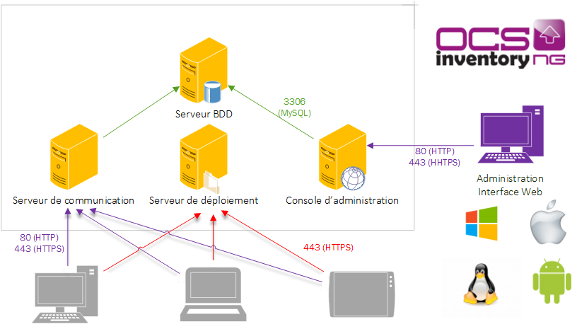

#Newbie documentation - What you should know
##OCS Inventory NG in 5 lines, what is it ?

OCS Inventory NG or **Open Computer and Software Inventory Next Generation** is free software that enables users to automatically inventory their IT assets. OCS-NG collects information about the hardware and software of networked machines running the OCS client program ("OCS Inventory Agent"). OCS can be used to visualize the inventory through a web interface. Furthermore, OCS allows the possibility of deploying applications on the computers according to search criteria. Agent-side IpDiscover and snmp scan make it possible to identify the entire network of computers and devices.

## Operating principle

The OCS server receives inventories which are sent by agents in XML format, and stored data in MySQL database. The Agents contact the server and not vice versa. The Server only listens during this process. Exchanges between agents and server are made in http and/or https. Software deployments and snmp scans are made in https only.

Schema of data transmission :

`Raw `**`data`**` -> `**`XML`**` formatting -> sending in HTTP or HTTPS in `**`/ocsinventory`**` -> handling with `**`mod_perl`**` on the fly -> DB `**`mysql`**

Management server is made up of 4 main components:

1. **Database server**, which stores inventory information (mysql)
2. **Communication server**, which handles HTTP communications between database server and agents (Apache, perl and mod_perl)
3. **Administration console, which allows administrators to query the database server using their favorite browser (Apache, php)**
4. **Deployment server, which stores all package deployment configuration (Apache, ssl)**

## Deployment tools of the solution

### **Simplified installation of server**
* Preconfigured XAMPP package for Windows
* Parckage tar.gz with automatic install script

### **Deployment tools of agents by the network**
* [OCS Deployment Tool](http://wiki.ocsinventory-ng.org/index.php/Documentation:DeployTool/fr) based on psexec
* [OCSPackager](http://wiki.ocsinventory-ng.org/index.php/Documentation:Packager) and [OCSLogon](http://wiki.ocsinventory-ng.org/index.php/Documentation:WindowsAgent#Deploying_Agent_using_launcher_OcsLogon.exe_through_Login_Script_or_Active_Directory_GPO.) based on GPO and logon scripts

## Interfacing with many softwares

### **Classics**
* GLPI (requests directly in OCS database)
* LDAP for authentification on web interface (ocsreports)

### **Others**
OCS provides a SOAP Web service, which allows it to interface with many applications, such as Nagios for exemple.

## Major technical information

### **Windows agent**
Agent configuration directory :
* C:\Documents and Settings\All Users\Application Data\OCS Inventory NG\Agent under Windows 2000, XP and 2003.
* C:\ProgramData\OCS Inventory NG\Agent under Windows Vista, 2008, Seven and 2008 R2.
Agent configuration file is **ocsinventory.ini**

### **Server**
Do not confuse directories **/ocsinventory** and **/ocsreports**.
* ocsreports : directory containing all the php files that make up the administration console.
We use a browser to access, with URL : http://serveur/ocsreports
* ocsinventory : **virtual** directory used by mod_perl to handle XML inventories files sent by agents and to store data in database.

### **Debug the solution**
* Using agents logs :
    * Windows : Use **Debug** parameter in **ocsinventory.ini** file to have more verbose logs (Debug=2). This config file is located in :
        * C:\Documents and Settings\All Users\Application Data\OCS Inventory NG\Agent for Windows 2000, XP et 2003.
        * C:\ProgramData\OCS Inventory NG\Agent for Windows Vista, 2008, Seven et 2008 R2.
You have first to stop OCS service if OCS is installed as a service. Then, set Debug=2 to obtain the higher log level and save. Finally, restart OCS service, and send a new inventory.
    * Unix/Linux : Use **--debug** and **--logfile** parameters to obtain a detailed log.
Launch inventory with these options : ocsinventory-agent --debug --logfile=/mon/path/log.txt
* Using server log :
    * Apache logs : **access.log** and **error.log**. To found it use locate or find commands.
    * OCS log : **activity.log**
To use this functionality, you have to activate log function from administration console (LOGLEVEL), and modify server configuration file **z-ocsinventory-server.conf** to set **OCS_OPT_DBI_PRINT_ERROR** option to **1**.
Remember to restart apache to reflect this change.
