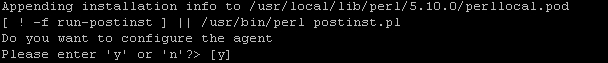
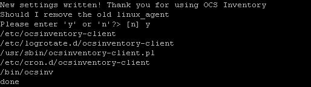
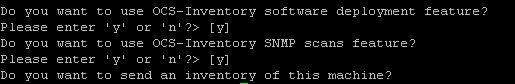

# OCS Inventory NG Agent 2.0 on Unix Operating Systems.

OCS Inventory NG agent for Linux can only be set up locally. You cannot deploy the agent
through the network currently as is possible for Windows agent. However, you can choose during
setup to activate auto-update of the agent if you’ve chosen HTTP inventory method.

**`Warning: You must have root privileges to set Administration server up.`**

## Requirements

Required modules:

* PERL 5.8
    * Perl module XML::Simple
    * Perl module Compress::Zlib
    * Perl module Net::IP
    * Perl module LWP::UserAgent
    * Perl module Digest::MD5
    * Perl Module Net::SSLeay
    * Perl Module Mac::SysProfile is need on MacOSX
* dmidecode
* lspci on Linux and *BSD (pciutils package)
* Make utility
* C/C++ compiler like GNU GCC

Optional modules:

* Perl module Proc::Daemon
* Perl module Proc::PID::File if Proc::Daemon is installed
* Perl module Net::SNMP
* Perl module Nmap::Parser
* Perl module Module::Install
* Perl module Net::CUPS
* Nmap (v3.90 or superior)

**`Note: It’s better for system integrity to use the precompiled packages for your distribution
if they are available.`**

_**On Fedora/Redhat like Linux**, you can use “yum” tool to set required modules up like following:_

    yum install perl-XML-Simple perl-Compress-Zlib perl-Net-IP perl-LWP perl-Digest-MD5 perl-Net-SSLeay

_Optional modules: these modules are available on EPEL repository. Don't forget to add this repository
to your system or download each package individually from the repository_

    yum install perl-Crypt-SSLeay perl-Net-SNMP perl-Proc-Daemon perl-Proc-PID-File perl-Sys-Syslog pciutils smartmontools monitor-edid

_**On Debian like Linux**, you can use “apt-get” tool to set required modules up:_

    apt-get install dmidecode libxml-simple-perl libcompress-zlib-perl libnet-ip-perl libwww-perl libdigest-md5-perl libnet-ssleay-perl

_Optional modules:_

    apt-get install libcrypt-ssleay-perl (to use SSL) libnet-snmp-perl (to use SNMP feature) libproc-pid-file-perl libproc-daemon-perl net-tools libsys-syslog-perl pciutils smartmontools read-edid nmap

**Unix agent 2.0 is now installed without script “setup.sh”. During compilation, information about
configuration and dependencies are returned. However, it will never upgrade an install module.
If one module has version lower than required once, you must upgrade it yourself.**

**`Warning`**`: The installer does not install ancestor dependencies. For example, Net::SSLeay requires
openssl to be installed. If not installed, setup of Net::SSLeay will fail and OCS Inventory NG agent
setup will also fail.`

**Also, a log file is generated. If you encounter any error while installing OCS Inventory NG agent,
please refer to this file to have detailed error message.**

## Installing the agent non-interactively

Download “Ocsinventory-Agent-2.0.x.tar.gz” from OCS Inventory Web Site
([http://www.ocsinventory-ng.org/en/#download-en](http://www.ocsinventory-ng.org/en/#download-en)).

1. Unpack it.

       tar –xvzf Ocsinventory-Agent-2.0.x.tar.gz
       cd Ocsinventory-Agent-2.0.x

2. Check perl configuration with the script Makefile.PL. Its looks at the configuration of Perl, machine,
libraries ... and it generates the Makefile. During this step, we will create a temporary environment
variable to install agent non-interactively.

       env PERL_AUTOINSTALL=1 perl Makefile.PL

    Exemple :

       Please install Crypt::SSLeay if you want to use SSL.
       Please install nmap or ipdiscover if you want to use the network discover feature.
       Please install Proc::Daemon and Proc::PID::File if you want to use the daemon monde.

3. Compilation

       make
       make install

**`Note: Installer writes a log file “ocs_agent_setup.log” in the same directory. If you encounter any errors,
please refer to this log for the detailed error message.`**

A check for PERL interpreter binary, C/C++ compiler and make utility is made during installation.
If one of these components is not found, setup will stop.

Setup will check for:

* dmidecode binary.
* Compress::Zlib PERL module
* XML::Simple PERL module
* Net::IP PERL module
* LWP::UserAgent PERL module
* Digest::MD5 PERL module
* Net::SSLeay PERL module

If not found, it will ask you if you wish to install it. Enter “y” or validate to enable install
of required component. If you enter “n”, setup will stop here.

Configuration begins. Choice to configure agent now or later.

Select the path of configuration file directory.

Validation to create the directory, and definition of OCS Inventory NG server address (IP address or hoshtname.domain)

You will then have to choose between 3 methods for generating inventory:

1. http: computer is connected to the network and is able to reach the Communication server with
HTTP protocol **USED BY DEFAULT**.

2. https: computer is connected to the network and is able to reach the Communication server with
HTTPS protocol. You have to configure SSL on your OCS Server and copy the SSL certificate
on the agent directory to use this method.

3.  local: computer is not connected to the network and inventory will be generated in a file
to manually send to OCS Inventory NG operator. This option must be set manually
in ocsinventory-agent.conf like this :

        local=/tmp

For two others methods :

    Syntax : http[s]://ocsinventory-ng-server[:port]/ocsinventory

Examples :

    ocsserver.domains.local
    https://w.x.y.z
    ocsserver.domains.local:1234
    https://ocsserver.domains.local

Choice to use or not apache auth, and possibility to define an administrative tag.

Choice to create or not a cron task, definition and validation of agent files directory.

Choice to remove or not the old agent version.

Choice to use or not software deployment feature, SNMP scans feature and send an inventory.

If Accountinfo file doesn't exist, it will be created, and the inventory will be sent to the server.

Here is a sample configuration file for OCS Inventory NG Linux agent.

    <CONF>
        <DEVICEID>computer.domain.tld-2006-02-27-13-59-47</DEVICEID>
        <DMIVERSION>2.2</DMIVERSION>
        <IPDISCOVER_VERSION>3</IPDISCOVER_VERSION>
        <OCSFSERVER>my_ocs_com_server.domain.tld:80</OCSFSERVER>
    </CONF>

**Figure 5 : Sample agent’s configuration file ocsinv.conf for a network connected computer.**

# Deploying agent through scripted installation without user interaction

Actually not possible in version 2.0. This feature will be integrated in 2.1.

**`Warning: This feature will be only available in OCS 2.1. Don't try this options using OCS 2.0
Unix agent...it won't work !!`**

Since OCS Unix Unified agent 2.1, you are able to launch _postinst.pl_ script in non-interactive mode.
A set of launch arguments has been added to this script to allow to set all configuration options
as you can do in interactive mode. This is a list of all availaible _postinst.pl_ script arguments:

* **--nowizard** : launch this script without interaction
* **--server** : set OCS Inventory NG server address (e.g: http://ocsinventory-ng/ocsinventory)
* **--basevardir** : set OCS Inventory NG Unix Unified agent variables directory (e.g: /var/lib/ocsinventory-agent)
* **--configdir** : set OCS Inventory NG Unix Unified configuration directory (e.g: /etc/ocsinventory-agent)
* **--user** : set username for OCS Inventory server Apache authentication (if needed)
* **--password** : set password for OCS Inventory NG server Apache authentication (if needed)
* **--realm**: set realm name for OCS Inventory NG server Apache authentication (if needed)
* **--crontab** : set a crontab while installing OCS Inventory NG Unix Unified agent
* **--get-old-linux-agent-config** : retrieve old OCS Inventory NG Linux agent configuration (if needed)
* **--remove-old-linux-agent** : remove old OCS Inventory NG Linux agent from system (if needed)
* **--debug** : activate debug mode configuration option while installing OCS Inventory NG Unix Unified agent
* **--logfile** : set OCS Inventory NG Unix Unified agent log file path (if needed)
* **--nossl** : disable SSL CA verification configuration option while installing OCS Inventory NG Unix Unified agent (not recommended)
* **--ca** : set OCS Inventory NG Unix Unified agent CA certificate chain file path
* **--download** : activate package deployment feature while installing OCS Inventory NG Unix Unified agent
* **--snmp** : activate SNMP scans feature while installing OCS Inventory NG Unix Unified agent
* **--now** : launch OCS Inventory NG Unix Unified agent after installation
* **-h** or **--help** : display help menu

For example, if you want to install OCS Unix Unified agent in non-interactive mode and set server address,
create a crontab, set a custom tag, enable debug mode, set a log file path and activate download feature,
you have to run this command:

    env PERl_AUTOINSTALL=1 perl Makefile.PL && make && make install && perl postinstl.pl --nowizard --server=http://yourserver/ocsinventory --crontab

# Agent’s command line switches

If you encounter error, agent’s produce a log file in directory “/var/log/ocsinventory-client”.

However, agent’s also support some command line switches. You can use them while launching the
agent manually using “ocsinv” command:

Agent’s command line switch | Meaning
----------- | ------------
**--local** | Runs the agent in local mode, without any connection to communication server. You will be prompted for a target directory where agent will put inventory results in XML compressed file with “.ocs” extension.
**--xml** | Agent will create a non-compressed XML file with “.ocs” extension, containing inventory results. You will be prompted for a target directory where agent will put the file. If not used in conjunction with -local, agent tries to connect to communication server.
**--tag=”my tag value”** | Set agent setting TAG value to “my TAG value”.
**--force** | Force agent to always send inventory results, independently of the FREQUENCY parameter.
**--debug** | Force agent to produce a more detailed log file, showing XML exchange with communication server.
**--nosoftware** | Do not search for installed software.
**--info** | Show a detailed output of agent runs.
**--proxy=”PROXY SERVER”** | Specify a proxy.
**--lazy** | Do not contact the server more than one time during the PROLOG_FREQ and do an exit if there is nothing to do.
**--daemon** | Launch ocsinventory-agent in background. Proc::Daemon is needed.
**--basevardir=”PATH”** | Used to specify the place where the agent should store its files.
**--logfile=”PATH”** | Used to record log message in FILE and turn off STDERR.
**--user=”PASSWORD”** | Used to specify a user for server authentification.
**--password=”PASSWORD”** | Used to specify a password for server authentification.

For more informations, use

    man ocsinventory-agent

# Compatibility

## FreeBSD

**OS Version** | **Compatibility** | **Works with agent** | **Comments**
--------|--------|--------|--------
5.x | YES | Unix Unified Agent 1.01 | 32 & 64 bits
6.x | YES | Unix Unified Agent 1.01 | 32 & 64 bits
7.x | YES | Unix Unified Agent 1.01 | 32 & 64 bits
8.x | to be tested | |

## OpenBSD

**OS Version** | **Compatibility** | **Works with agent** | **Comments**
--------|--------|--------|--------
4.5 | YES | Unix Unified Agent 1.01 | 32 & 64 bits
4.6 | YES | Unix Unified Agent 1.01 | 32 & 64 bits
5.1 | YES | Unix Unified Agent 1.01 | 32 & 64 bits

### **Installation Procedure**

    export PKG_PATH="http://ftp.arcane-networks.com/pub/OpenBSD/4.5/packages/i386/"
    export OCS_VERSION="1.1.2"
    mkdir /var/lib
    pkg_add nmap
    pkg_add dmidecode
    pkg_add pciutils
    pkg_add p5-libwww
    pkg_add p5-XML-Simple
    pkg_add p5-Net-IP
    pkg_add p5-Proc-Daemon
    cd
    mkdir ocs
    wget http://launchpad.net/ocsinventory-unix-agent/1.1.x/ocsinventory-unix-agent-$OCS_VERSION/+download/Ocsinventory-Agent-$OCS_VERSION.tar.gz
    tar xvzf Ocsinventory-Agent-$OCS_VERSION.tar.gz
    cd Ocsinventory-Agent-$OCS_VERSION
    perl Makefile.PL
    make
    make install

## AIX

**OS Version** | **Compatibility** | **Works with agent** | **Comments**
--------|--------|--------|--------
4.x | seems to work| Unix Unified Agent 1.01 |
5.x | YES | Unix Unified Agent 1.01 |
6 | YES | Unix Unified Agent 1.01 |

## Solaris

**OS Version** | **Compatibility** | **Works with agent** | **Comments**
--------|--------|--------|--------
>8 | YES | Unix Unified Agent 1.01 |