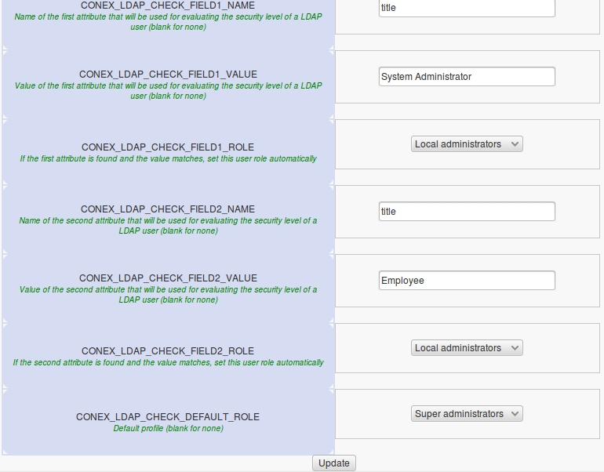
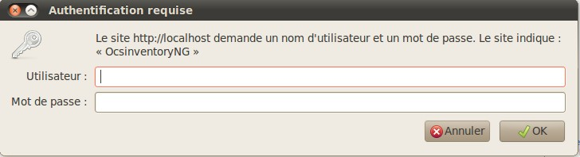
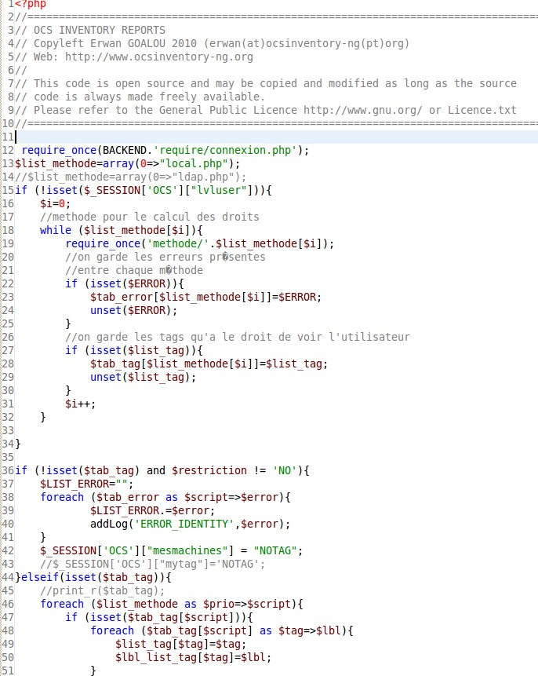
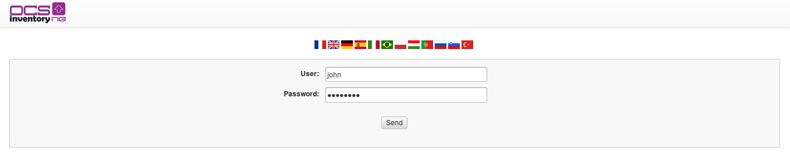
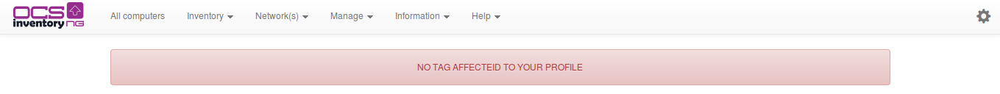

# Manage authentification with LDAP

It is possible to delegate authentication to the administration console of OCS Inventory NG to an annex
database. Some modules have already been developed and are available natively in version 2.0. So we will
see how to delegate the connection to the OCSInventory NG GUI to LDAP.

**`Note: For this documentation, we set up an LDAP from the following documentation :
`[`http://doc.ubuntu-fr.org/openldap-server`](http://doc.ubuntu-fr.org/openldap-server)`
and we kept the default configuration.`**

## Connection to OCS Inventory NG management console with administrator account

Click on **LDAP configuration** tab.

First configuration fields concern the way to connect to the LDAP.

For our exemple :

* database is on local
* administrator account is **admin**
* password admin is **secret**
* database listen on defaut port
* login connection will be based on the uid field

The remaining configuration fields concern rights of the user on administration console of OCS Inventory NG.

For our exemple :

* if the user whitch connects through the LDAP to title fiels to System Administrator,
it will automatically Super Administrator rights profile.
* if the value of this field is Employee, it has the rights of the Local Administrator profile.
* in other cases, LDAP users will have no OCS profile assigned

It only remains to modify the connection method to the administration console of OCS Inventory NG.
To do this, you will have to edit two files in the directory / ocsreports.

## Modification of /backend/AUTH/auth.php file

For this file, several options :

Modify the connection type to have only LDAP authentication. For this, comment the line :

    $list_methode=array(0=>"local.php");

and uncomment bottom line

    $list_methode=array(0=>"ldap.php");

By cons, if you want to couple the LDAP connection to standard connection (mysql database ocsweb),
you have to modify the line as this :

    $list_methode=array(0=>"ldap.php",1=>"local.php");

## Modification of connection form

If you don't modify the line

    $affich_method='HTML';

then you will keep the "classic " login page.

However, if you replace **html** by **SSO**

    $affich_method='SSO';

the request for _username / password_ will be in this form

**`Note: In this case, the choice of language will no longer directly available.
You will need to choose it and freeze it in the var.php file.`**

## Modification of backend/identity/identity.php file

This file allow to define rights that the account logged will have into the administration console of
OCS Inventory NG. In order to delegate those rights to a schedule base, in our case an LDAP,
you have to change the line

    $list_methode=array(0=>"local.php");

by

    $list_methode=array(0=>"ldap.php");

It is also possible to keep the 2 ways to connect to the administration console by changing the line

    $list_methode=array(0=>"ldap.php",1=>"local.php");

In this case, rights will be retrieve in the LDAP, and will be completed by those found locally.

## Exemple & practice

Based on the LDAP database created at the beginning, and having made changes outlined in
preceding paragraphs, so we can connect with the user **john/password**.

On connection, he will have automatically rights of **Super administrator** profile.

His account will be created directly in the _ocsweb_ database LDAP information. His Password will
not be stored.

However, the user **georgess**, may well identify but can not connect directly. Indeed, we have assigned by
default a **Local Administrator** profile, which has a limited view of the park of machines.
So, after the connection of that user, it will have the following message:

For that user can access the administration console of OCS Inventory NG, it will wait a
**Super Administrator** gives it access to TAG witch interested it.