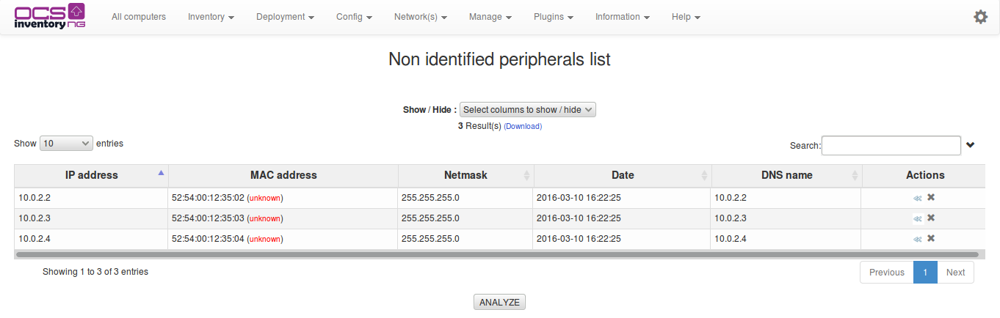
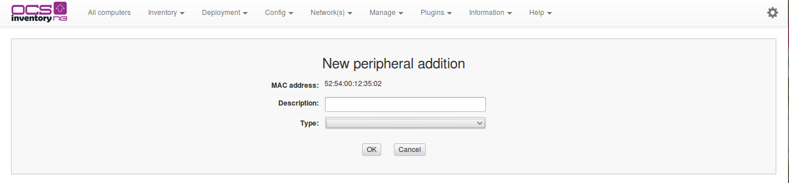
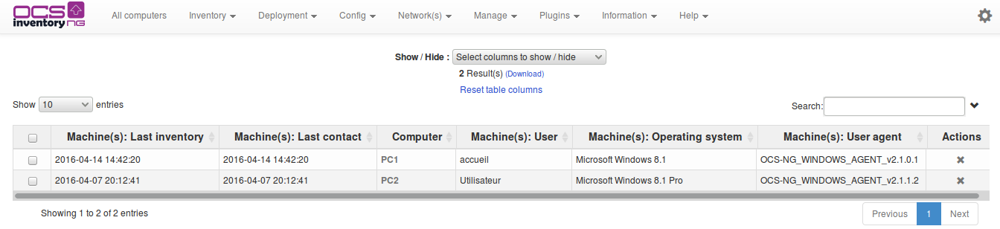
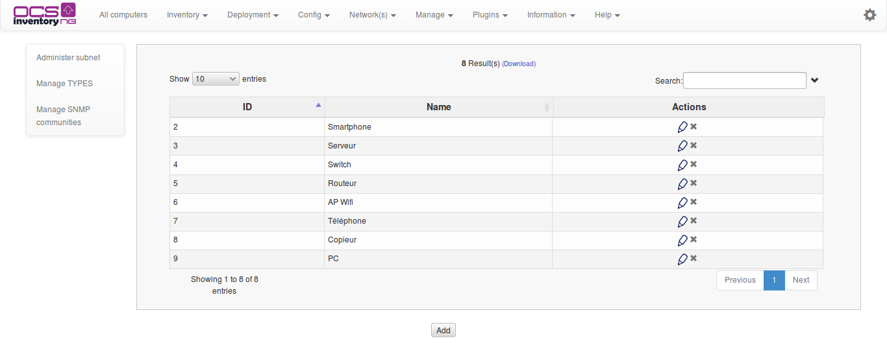
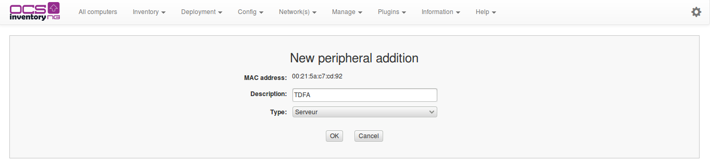

# Using IP discovery feature

IP discovery feature allow OCS Inventory NG to discover all network connected devices on the network.

For this, Communication server asks a number of most “active” computers running OCS Inventory NG agent
to scan for MAC addresses in their sub network at each run. **They will not scan the entire wide area
network, but only their local network defined by the couple IP address/subnet mask.**

# Introduction

Inventory software is very useful for an administrator. It allows them to "take stock" of their network.
Today, with the use of TCP/IP, we can say that this is can be done at the same time for the entire
enterprise network, especially if, like OCS Inventory NG, work is natively on a network basis.

But, what about devices which for one reason or another (i.e. uncooperative users) do not send their
inventory? This could include; all “alive” devices which cannot run inventory agent (printers, switches,
routers, WiFi access points…). Computers which do not have to be connected on your network and which
are conspicuous by their absence?

IPDISCOVER trys to answer those problems. Even if it is used independently, it works perfectly with
the OCS structure. As it is based on a client server based communication, it’s easy for the server
to order it's “subordinate” client to perform some tasks, such as getting registry keys, doing an
inventory or retrieving all devices answering on the IP segment.

# How does it work?

## Retrieving information

The OCS NG system is based on a dialog between an agent installed on host computers and a Apache
module installed on a OCS NG server.The exchange is done in compressed XML and allows configuring
the agent to perform tasks.

When a computer sends an inventory result, the server will try to determine if it needs some
other computers (number can be configured) to scan hosts in this subnet.By using the Gateway IP
address a map of the enterprise network is formed.

If required,the server estimates host quality and decide whether or not to activate the host as an
ipdiscovered computer. In this case, computer will systematically send an inventory result,
independently of the general configuration parameter 'FREQUENCY'.

## Election mechanism

Once the server has determined that there is a need for the selected gateway, it evaluates the
following criteria:

* OS: operating system must be Windows XP or Windows 2000 (all versions) or Linux.
* QUALITY: this parameter means the host connection average to the server in days. It is evaluated
dynamically by Communication server only when there is more than the number (defined by
‘IPDISCOVER’ option) of inventoried hosts for a gateway. If the current computer sending inventory
results has better quality than another IPDISCOVER enabled computer for this gateway, the current
computer will replace the other one. ‘IPDISCOVER’ option must be greater than zero to enable this feature!
* FIDELITY: total connection number to the server of the computer. This number must be at least 3,
to allow QUALITY to be computed from representative data.
* NETMASK: subnet mask. It must describe a maximum of a B class IP network (2 first bytes to
255 => 255.255.X.X).
* LASTDATE: when the Communication server computes QUALITY, if it finds a host which hasn’t sent
inventory results from number of days defined by ‘IPDISCOVER_MAX_ALIVE’ option, it will replace
this host by a new one.

**`Note`**`: You can customize agent’s ipdiscover settings for each computer from the administration console.
You can totally disable ipdiscover or force ipdiscover on a specific network. These options are
available on the computer properties page, under “Customization” section. However, the election
mechanism is the best way to do the network discovery. Use ipdiscover customization with care.`

## How do agents work?

Once agent has received order to proceed to discovery of his sub network, it identifies first network
interface to use. It tries then to resolve through ARP all IP addresses answering on his segment
(delay between 2 hosts scan may be defined using option “IPDISCOVER_LATENCY”, see
[Managing OCS Inventory NG general options](../2.Basic-documentation/Administration-of-OCS-Inventory-NG.md#managing-ocs-inventory-ng-general-options)).
All devices answering to the question are stored in XML inventory result and sent to server.

## Server tuning

When doing a new installation of OCS NG, we understand easily that it requires some times to be ready
to enable ipdiscovery feature. It requires some times to grab all gateways and to elect computers
for ipdiscovery. As a computer can only be elected if it REALLY provides an inventory, it may be wiser
to configure at the beginning ‘FREQUENCY’ option to zero, always generate an inventory. You can increase
this value later, when infrastructure will be ready.

Analyzing errors (thought ipdiscover-util.pl used directly or from web interface) will allow you to
detect potential problems. More the value of QUALITY will be lesser, more your ipdiscover information
will be up to date.

System will be giving you the best in a domain, with a daily authentication and inventory. Tests done
with this configuration on 20 000 hosts and 250 sub networks generate a DAILY actualization of 15 000 IP
addresses.

To finish, value set for IPDISCOVER will tell to server how many computers are wished by gateway to run
this task (if you set this value to zero, feature will be disabled).

# Working with results

You can view which computers run the IP discovery scans by clicking on toolbar “Security” menu
(“IpDisc” menu if some languages).

## Manage names of your networks

**`Note`**`: You may define your sub networks by a name and a unique ID, to view results easily.`

For each network, you will be able to view how many inventoried hosts, non inventoried hosts,
IPDISCOVER feature enabled hosts and identified hosts (known hosts manually registered in the database)
are connected to this network.

Click on the number of needed column to view each type of devices.

## Show inventoried hosts in the network

You can view the list of inventoried hosts (computers with OCS Inventory NG agent installed)
on your network by clicking on number in column “Inventoried” in the network list.

If there is, in the list, devices you know as legitimate, you can register them so they will not be
displayed next time. For this, just click the icon at the end of corresponding line. Before, you may
want to register “Device type” to easily identify known hosts (see §7.3.8 Registering known hosts.).

You may also analyze this network by clicking “Analyze” button. IPDISCOVER-UTIL perl script will be
used to determine, for each network device, his NetBios name or DNS name and the type of operating system.

This feature uses IPDISCOVER-UTIL perl script available only under Linux Server which requires
the following components:

* _nmap (tested on 3.75)_
* _nmblookup (part of the samba suite, tested on 3.0.7/3.0.10)_
* _Perl module Net::IP_
* _Perl module DBI_
* _Perl module DBD::mysql_
* _Perl module XML::Simple_

The following types are used:

* **Windows**: host seems to run one version of Microsoft Windows operating system.
* **Linux**: host seems to run under Linux operating system.
* **Network**: operating system cannot be determined, so it can be network device such as router, managed
switch, printer, or host running Sun Solaris or IBM AIX… Maybe, host is running some firewall software?
* **Phantom**: host is not responding at this time. Maybe it is powered off or there is a firewall ?

If a network device is legitimate, you can register it by clicking on icon “Register” at the end of
corresponding line. You will be able to enter a brief description and to select network device type
while registering it (see § 7.3.8 Registering known hosts.).

## Show IPDISCOVER enabled hosts

You can view the list of hosts running IPDISCOVERY feature (computers with OCS Inventory NG
agent installed, and this agent is elected by server to run discovery of his sub network) on your
network by clicking on number in column “IpDiscover” in the network list.

## Show known or identified hosts

You can view the list of known hosts already identified by someone on your network by clicking on number
in column “Identified” in the network list.

You can view the list of known hosts already identified by someone on your network by clicking on
number in column “Identified” in the network list.

## Managing known device types

You can register devices (such as routers, switches, network printers, computers for which there
is no inventory agent…) as you know they are legitimate. As is, they will not be displayed in the list
of uninventoried devices, to allow you concentrate on suspicious devices.

You may first define some device types to identify them easily.

Click on Manage and then on “Administer” and finally on Manage TYPES menu to manage your device types.

You can add new device type by entering the “Type name” you want and clicking “Send” button.

You can remove any device type by clicking on the red cross at the end of corresponding line.

## Registering known hosts

You can add new devices by browsing list of uninventoried devices and clicking the icon at the end of
corresponding line. This will bring you to page for adding or removing network devices and “MAC” field
will be automatically fill in.

To remove a network device, just click on the red cross at the end of corresponding line.

### **Script to scan IP address**

#### **Operating principle**

You can make a request to scan a specific IP address to obtain information about a host. In the tarball
binutils directory of linux server, the perl script is _ipdiscover-util.pl_. It use NMAP & NMBLOOKUP
utilities to obtain information about the host (DNS name, NetBios, ...), and also to see if the host
is inventoried / discovered.

#### **Prerequires**

**`Note`**`: This feature requires the following components :`

    * nmap (tested on 3.75)
    * nmblookup (part of Samba suite, tested on 3.0.7/3.0.10)
    * Perl module Net::IP
    * Perl module DBI
    * Perl module DBD::mysql
    * Perl module XML::Simple

#### **Command line options**

USAGE

**Options** | **Meaning**
------|------
-h | Help menu
-ip=X.X.X.X/X.X.X.X (ex: 10.1.1.1/255.255.240.0 or 10.1.1.1/20) | Looks for the ip in a subnet
-net=X.X.X.X | Specify a network
-a | Launch the analyze
-ipdiscover=X | Show all the subnet with up to XX ipdiscover
-xml | XML output
-list | Show all the networks present in the database with "connected"/"discovered" computers

DATABASE

**Options** | **Meaning**
------|------
-p=xxxx | Password (default ocs)
-P=xxxx port | Port (default 3306)
-d=xxxx | Database name (default ocsweb)
-u=xxxx | User (default ocs)
-h=xxxx | Server (default localhost)

**Example**

Example of command to scan IP 192.168.1.252 and reach back informations in database named _ocsdb_
of mysql server _OCSserveur_, witch listen on port 3306, using _gui_ account with password _ocsrox_ :

    perl ipdiscover-util.pl -ip=192.168.1.252/255.255.255.0 -net=255.255.255.0 -a -xml -h=OCSserveur -u=gui -p=ocsrox -d=ocsdb

Result example :

# Solutions and Tips

To enable ipdiscover.pl to run correctly with SElinux enabled (CentOS/RHEL) type the following
command in a terminal :

    chcon -t httpd_sys_content_t ipdiscover-util.pl