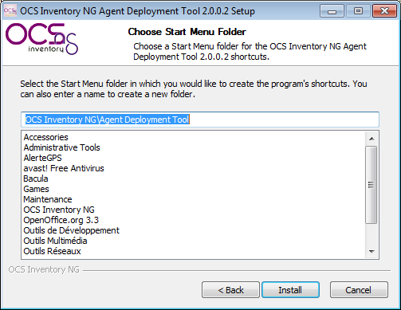
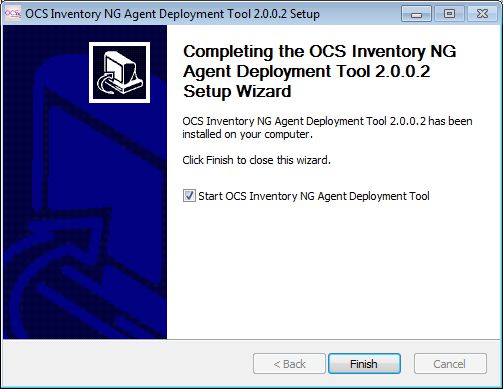
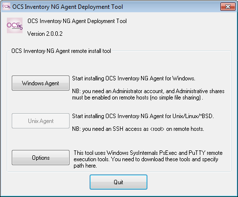
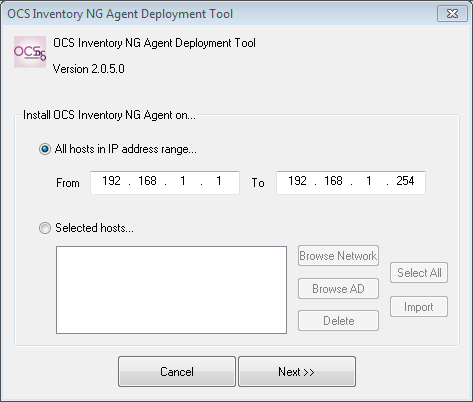
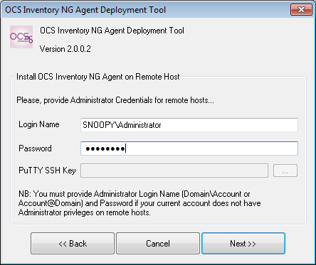
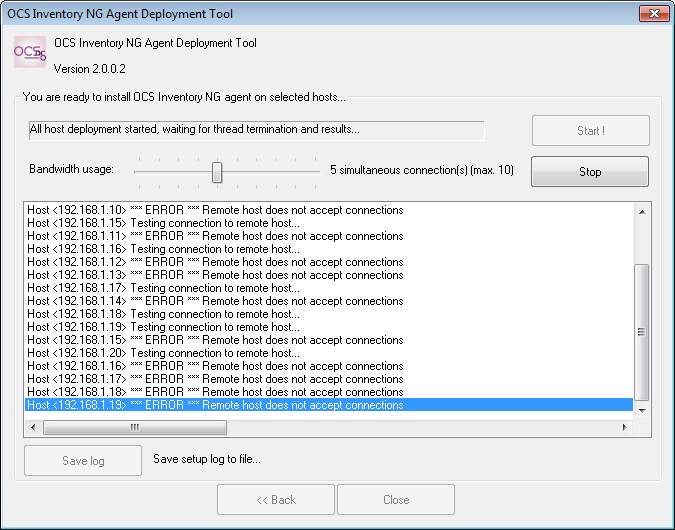
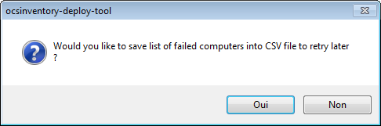

# Pushing OCS Inventory NG Agent installation on remote computers

**OCS Inventory NG Agent Deployement Tool allows you to remotely push installation of OCS Inventory NG
Agent on computers**. You just need to have administrative credentials on remote comuter and it will do
the job for you.

**`Note`**`: To push setup on Windows Computer, it requires administrative shares enabled (no simple file sharing)
and Microsoft SysInternals PsExec free utility
(`[`http://technet.microsoft.com/en-us/sysinternals/bb897553.aspx`](http://technet.microsoft.com/en-us/sysinternals/bb897553.aspx)`).`

`To push setup on Unix computer, it requires PuTTY SSH and PuTTY PSCP free tools
(`[`http://www.chiark.greenend.org.uk/~sgtatham/putty/`](http://www.chiark.greenend.org.uk/~sgtatham/putty/)`).`

## Installing and configuring OCS Inventory NG Agent Deployement tool

To install OCS Inventory NG Agent Deployment Tool, download zip archive from
[http://www.ocsinventory-ng.org/en/#download-en](http://www.ocsinventory-ng.org/en/#download-en).

Uncompress the zip file and run **OCS-NG-Agent-Deployment-Tool-Setup.exe** on a Windows Computer.

Click **[ Next ]** button

Validate license agreement by clicking **[ I agree ]** button

Choose destination folder, _C:\Program Files\OCS Inventory Agent Deployement Tool” by default
(“C:\Program Files (x86)\OCS Inventory Agent Deployment tool_ under Windows 64 bits),
and click **[ Next ]** button

Choose start menu folder, _OCS Inventory NG\Agent Deployement Tool_ by default,
and click **[ Install ]** button.

Click **[ Finish ]** button to close OCS inventory NG Agent Deployment Tool Setup.
Setup can start the tool for you if you the box Start OCS Inventory NG Agent Deplyment Tool is checked

Click on **[ Options ]** button of Agent Deployment Tool main window to display settings.

You must provide path to:

* Microsoft SysInternals **PsExec.exe** tool (click on the link to open your browser with SysInternals
Home page and download PsTools suite from here).
* **PuTTY.exe** SSH and **Pscp.exe** tools (click on the link to open your bowser with PuTTY Home page
and donwload tools from here).

Click **[ OK ]** button to save changes.

## Pushing OCS Inventory NG agent for Windows setup

**`Note`**`: To push setup, administrative shares must be enabled on remote computer. Moreover, on computers
not members of a Windows domain, you have to disable “Using simple share (recommended)”
using “Folders options”.`

Click on **[ Windows Agent ]** button of Agent Deployment Tool main window to start deploying on Windows computers. You can choose to deploy Agent on

* all Windows computers within the specified IP range,
* a list of manually selected computers: select them in the network neighborhood using button
"_Browse Network_", or specify them using UNC notation (_\\Computer_name or \\IP_Address_) or
select multiple computers into Active Directory using button "_Browse AD_",
or import them from a file (file must contain one IP or computer name by line)

Click **[ Next ]** button.

* Select Windows Agent installer file to push,
* Select optional plugin files to copy into plugins directory of the agent,
* Select additional files to copy into Agent's data folder, like certificate file,
* Enter OCS Inventory NG server URL
[http://your_ocs_server/ocsinventory](http://your_ocs_server/ocsinventory)
or [http://your_ocs_server:ip_port/ocsinventory](http://your_ocs_server:ip_port/ocsinventory)
or [https://your_ocs_server/ocsinventory](https://your_ocs_server/ocsinventory)
or [https://your_ocs_server:ip_port/ocsinventory](https://your_ocs_server:ip_port/ocsinventory),
* Check Enable _verbose log_ to activate OCS Inventory Agent logs (same as /DEBUG parameter)
* Check _Do not register service_ if you do not wish to use service for launching Agent
(same as /NO_SERVICE parameter)
* Check _Do not register Systray applet autostart_ if you do not wish to display OCS icon into Systray
(same as /NO_SYSTRAY parameter)
* Check _Force inventory just after setup_ to force inventory launch after OCS agent installation
(beware to OCS server load if you install a lot of computers at the same time !)
* Enter additional parameters in Other options for Agent (/HKCU for example)
* Check _Change Agent setup directory_ to modify OCS Inventory agent installation directory

and click **[ Next ]** button

Provide credentials of an Administrator account on remote computers with associated
password and click **[ Next ]** button.

**`Note`**`: If computers are in an Active Directory or Samba Domain, you must specify account
like `*`DOMAIN_NAME\Administrator`*`. Otherwise, only the account name without domain name is enough.`

You are now ready to process. Choose the number of computers to push installation simultaneously
(up to 10 computers) using the slider and click **[ Start ]** button.

**`Note`**`: WARNING !!! Increasing the simultaneous connections will increase the memory and CPU use
on the computer which is running OCS Inventory NG Agent Deployment Tool.`

Agent Deployment Tool will first check if remote computer is up and running Windows OS,
copy installation files to remote computer through administratibe shares,
uses PSEXEC to execute installation on remote computer and display logs into listbox.

If Agent Deployment Tool encounter errors on one or more computers, it will prompt you to save
the list of failed computers into a CSV file, and you will be able to import this file later to restart
installation process on these computers.

You can stop at any time the process using “Stop” button and also, when deployment is finished,
save logs to a file using “Save logs” button.
