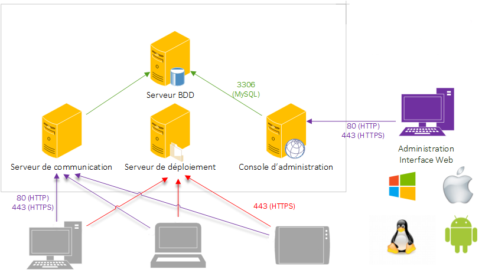

# Setting up OCS Inventory Server

Management server is made up of 4 main components:

1. **Database server**, which stores inventory information.
2. **Communication server**, which handles HTTP communications between database server and agents.
3. **Administration console**, which allows administrators to query the database server using
their favorite browser.
4. **Deployment server**, which stores all package deployment configuration (requires HTTPS!).

These 4 components can be hosted on a single computer or on different computers to allow load balancing. Above 10000 inventoried computers, we recommend using at least 2 physical servers, one hosting database server + Communication server and the other one hosting a database replica + Administration server + Deployement server.



**Figure 1 : OCS Inventory NG communication architecture.**

**`Note: If you want to use multiple computers to host OCS inventory NG management server,
we recommend that you set it up on Linux servers.`**

**Database** server currently can only be MySQL 4.1 or higher with InnoDB engine active.
**Communication server** needs Apache Web Server 1.3.X/2.X and is written in PERL as an Apache module. Why? Because PERL scripts are compiled when Apache starts, and not at each request. This is better performance-wise. Communication server may require some additional PERL modules, according to your distribution.
**Deployment server** needs any Web Server with SSL enabled.
**Administration console** is written in PHP 4.1 (or higher) and runs under Apache Web Server 1.3.X/2.X. Administration console requires ZIP and GD support enabled in PHP in order to use package deployment.

# Under Linux Operating System

We assume that you have:

1. MySQL database server running somewhere and listening on default port 3306 with TCP/IP communication enabled.
2. Apache Web server installed and running for Communication server and Administration server.
3. PHP and Perl installed and usable by Apache Web server for the Administration console.
4. Perl and mod_perl installed and usable by Apache Web server for the Communication server.

## Requirements

* Apache version 1.3.33 or higher / Apache version 2.0.46 or higher.
    * Mod_perl version 1.29 or higher.
    * Mod_php version 4.3.2 or higher.
* PHP 4.3.2 or higher, with ZIP and GD support enabled.
    * php_curl
    * php_mbstring
    * php_soap
    * php_xml
* PERL 5.6 or higher.
    * Perl module XML::Simple version 2.12 or higher.
    * Perl module Compress::Zlib version 1.33 or higher.
    * Perl module DBI version 1.40 or higher.
    * Perl module DBD::Mysql version 2.9004 or higher.
    * Perl module Apache::DBI version 0.93 or higher.
    * Perl module Net::IP version 1.21 or higher.
    * Perl module SOAP::Lite version 0.66 or higher (optional)
    * Perl module Mojolicious::Lite
    * Perl module Plack::Handler
    * Perl module Archive::Zip
    * Perl module YAML
    * Perl module XML::Entities
* MySQL version 4.1.0 or higher with InnoDB engine active.
* Make utility such as GNU make.

**`Note: OCS Inventory NG Server Setup will check for all these components and will exit
if any are missing.`**

## Installing Communication server required PERL modules.

The web communication server requires Apache web server and Perl 5 scripting language and some additional modules for Perl 5
(see [Requirements](Setting-up-a-OCS-Inventory-Server.md#requirements)).
It acts as an Apache module which handles HTTP OCS Inventory agents' requests to a virtual directory _/ocsinventory_.
Already the web communication server requires mysql dependancies if you choose to install the database server alone, you can reffer to this page : [`Deploying Database Server`](../../english/02.Basic-documentation/Deploying-database-server.md)

**On Fedora/Redhat/Centos 7 like Linux**

    yum install httpd
    yum install mariadb-client

**On Debian 9 Stretch like Linux**

    apt install apache2
    apt install mysql-client

**`Warning: You must have root privileges to set required perl modules up.
It is better for system integrity to use your distribution's precompiled packages when they are available.
Some of these packages are only avalaible in`[`EPEL`](https://fedoraproject.org/wiki/EPEL/FAQ#howtouse)`.`**

**`Note: On Fedore/Redhat/Centos 7 the package " Apache DBI " wasn't in the repo EPEL you can find the rpm `[`here`](https://centos.pkgs.org/7/epmel-x86_64/perl-Apache-DBI-1.12-2.el7.noarch.rpm.html)`.`**

**On Fedora/Redhat/Centos 7 like Linux**, you can use “yum” to set required modules up:

    yum install perl-XML-Simple perl-Compress-Zlib perl-DBI perl-DBD-MySQL perl-Net-IP perl-SOAP-Lite perl-Archive-Zip perl-Mojolicious perl-Plack perl-XML-Entities perl-Switch

**On Debian 9 Stretch like Linux**, you can use “apt” to set required modules up:

    apt install libxml-simple-perl libcompress-zlib-perl libdbi-perl libdbd-mysql-perl libapache-dbi-perl libnet-ip-perl libsoap-lite-perl libarchive-zip-perl make build-essentials
    cpan install XML::Entities

**On Gentoo like Linux**, you can use "emerge" to get required modules set up:

    emerge dev-perl/XML-Simple perl-core/IO-Compress dev-perl/Apache-DBI dev-perl/Net-IP dev-perl/SOAP-Lite app-portage/g-cpan
    g-cpan -i XML::Entities


## Installing Administration console required PHP modules

The Web Administration console requires Apache web server and PHP 4 scripting language and some additional modules
for PHP (see [Requirements](Setting-up-a-OCS-Inventory-Server.md#requirements)).
Already the web communication server requires mysql dependancies if you choose to install the database server alone, you can reffer to this page : [`Deploying Database Server`](../../english/02.Basic-documentation/Deploying-database-server.md)

**On Fedora/Redhat/Centos 7 like Linux**

    yum install httpd
    yum install mariadb-client

**On Debian 9 Stretch like Linux**

    apt install apache2
    apt install mysql-client

**install PHP Zip support and dependacies**

**On Fedora/Redhat/Centos 7 like Linux**, you can use “yum” to set it up:

    yum install php-pecl-zip
    yum install perl-XML-Simple perl-DBI perl-DBD-MySQL perl-Net-IP

**For later Fedora installations 7.x+ :**

    yum install php-common

**On Debian 9 Stretch like Linux**, you can use “apt” to set it up:

    apt install php-plczip
    apt install make build-essentials
    cpan -i DBI DBD::mysql XML::Simple Net::IP


**You also need to install GD support for PHP.**

**On Fedora/Redhat/Centos 7 like Linux**

    yum install php-gd

**On Debian 9 Stretch like Linux**, you can use “apt” to set it up:

    apt install php7.0-gd

## Installing management server

**You must have root privileges to set OCS Inventory Server up.**

**`Note: Ensure MySQL InnoDB engine is activated on your database server.
Open my.cnf and ensure there is no line “skip-innodb” or this line is commented (begins with ‘#’).`**


Download latest version of server tarball “OCSNG_UNIX_SERVER-2.4.x.tar.gz” from OCS Inventory Web Site.

Unpack it.

    tar –xvzf OCSNG_UNIX_SERVER-2.4.x.tar.gz
    cd OCSNG_UNIX_SERVER-2.4.x

Run “setup.sh” installer. During the installer, default choice is presented between [].
For example, [y]/n means that “y” (yes) is the default choice, and “n” (no) is the other choice.

    sh setup.sh

**`Note: Installer writes a log file “ocs_server_setup.log” in the same directory.
If you encounter any error, please refer to this log for detailed error message.`**


**`Warning: If you’re upgrading from OCS Inventory NG 1.01 RC2 and previous,
you must first remove any Apache configuration file for Communication server.`**


<p style="background-color: black;">Do you wish to continue ([y]/n)?
</p>
Type "y" or "enter" to continue the installation

<p style="background-color: black;"> Which host is running database server [localhost] ?

</p>
Type “y” or “enter” to validate and, then enter MySQL server host address, in most cases localhost.


Then, setup checks for MySQL client binary files version 4.1 or higher. If not present, you will be
prompted to continue or abort setup.

<p style="background-color: black;">On which port is running database server [3306] ?

</p>

If all is OK, enter MySQL server port, generally 3306.

<p style="background-color: black;">Where is Apache daemon binary [/usr/sbin/apache2ctl] ?

</p>
Enter or validate path to Apache daemon binary, generally “/usr/sbin/apache2ctl”. It will be used to find
Apache configuration files.

**`Note: If you’re not using system Apache daemon, but another one like XAMPP/LAMPP Apache server,
you must enter full path to your Apache daemon, not the system one.`**

<p style="background-color: black;">Where is Apache main configuration file [/etc/apache2/apache2.conf] ?
</p>
Enter or validate Apache main configuration file path, generally “/etc/apache2/conf/apache2.conf”
or “/etc/httpd/conf/httpd.conf”.

<p style="background-color: black;">Which user account is running Apache web server [www-data] ?
</p>
Enter or validate Apache daemon running user account, generally “apache” or “www” (under Debian/Ubuntu is “www-data”).

<p style="background-color: black;">Which user group is running Apache web server [www-data] ?
</p>

Enter or validate Apache daemon user group, generally “apache” or “www” (under Debian/Ubuntu is “www-data”).

<p style="background-color: black;">Where is PERL interpreter binary [/usr/bin/perl] ?
</p>
Next, setup checks for PERL interpreter binaries. Enter or validate path to PERL interpreter.

**`Note: If you’re not using system perl interpreter, but another one like XAMPP/LAMPP perl interpreter,
you must specify full path to this perl interpreter, not the default system one
(/opt/lampp/bin/perl generally used in XAMPP/LAMPP).`**

<p style="background-color: black;">Do you wish to setup Communication server on this computer ([y]/n)?
</p>
Common information for setting up Communication server or Administration console is now collected.
Setup prompts you if you wish to set Communication server up on this computer. Enter “y” or validate
to set Communication server up, “n” to skip Communication server installation.


Setup will then try to find make utility. If it fails, setup will stop.


Setup will next try to determine your Apache mod_perl version. If it is not able to determine mod_perl version,
it will ask you to enter it.

**`Note: You can check which version of mod_perl you are using by querying your server's software database.`**

* `Under RPM enabled Linux distribution (RedHat/Fedora, Mandriva…), `**`run rpm –q mod_perl`**`.`
* `Under DPKG enabled Linux distribution (Debian, Ubuntu…), run dpkg –l `**`libapache*-mod-perl*`**`.`

Communication server can create detailed logs. This logs can be enabled
by setting integer value of LOGLEVEL to 1 in Administration console
menu Configuration.

<p style="background-color: black;">Where to put Communication server log directory [/var/log/ocsinventory-server] ?

</p>

Communication server need a directory for plugins configuration files.
<p style="background-color: black;">Where to put Communication server plugins configuration files [/etc/ocsinventory-server/plugins] ?

</p>

Communication server need a directory for plugins Perl modules files.

<p style="background-color: black;">Where to put Communication server plugins Perl modules files [/etc/ocsinventory-server/perl] ?
</p>

Next, setup will check for required PERL modules
(cf [Requirements](Setting-up-a-OCS-Inventory-Server.md#requirements).):

* XML::Simple version 2.12 or higher
* Compress::Zlib version 1.33 or higher
* DBI version 1.40 or higher
* DBD::mysql version 2.9004 or higher
* Apache::DBI version 0.93 or higher
* Net::IP version 1.21 or higher
* SOAP::Lite version 0.66 or higher

**`Warning: If any of these modules is missing, setup will abort.`**

the setup will ask you if you want to install the rest API

<p style="background-color: black;">Do you wish to setup Rest API server on this computer ([y]/n)?
</p>

asking you for where you want store API code

<p style="background-color: black;">Where do you want the API code to be store [/usr/local/share/perl/5.24.1] ?
</p>

If all is OK, setup will install Communication server:

* Configure Communication server PERL module.
* Build Communication server PERL module.
* Install Communication server PERL module into PERL standard library directories.
* Create Communication server log directory (/var/log/ocsinventory-server by default).
* Configure daily log rotation for Communication server (file /etc/logrotate.d/ocsinventory-server by default)
* Creating Communication server plugins configuration directory (/etc/ocsinventory-server/plugins).
* Creating Communication server plugins Perl directory (/etc/ocsinventory-server/perl).

* Create Apache configuration file (ocsinventory-server.conf). If you are using Apache configuration directory,
this file will be copied under this directory. Otherwise, you will be prompted to add content of this file
to the end of Apache main configuration file.

To ensure Apache loads mod_perl before OCS Inventory NG Communication Server,
Setup can name Communication Server Apache configuration file
'z-ocsinventory-server.conf' instead of 'ocsinventory-server.conf'.

<p style="background-color: black;">Do you allow Setup renaming Communication Server Apache configuration file
to 'z-ocsinventory-server.conf' ([y]/n) ?
</p>

**`Warning: Do not add content to apache main configuration file if it is not a fresh install!
You must manually copy content of the ocsinventory.conf.local file created by setup into apache
main configuration file, replacing existing configuration.`**

```
  ################################################################################
  #
  # OCS Inventory NG Communication Server Perl Module Setup
  #
  # Copyleft 2006 Pascal DANEK
  # Web: http://www.ocsinventory-ng.org
  #
  # This code is open source and may be copied and modified as long as the source
  # code is always made freely available.
  # Please refer to the General Public Licence http://www.gnu.org/ or Licence.txt
  ################################################################################

  <IfModule mod_perl.c>

  # Which version of mod_perl we are using
  # For mod_perl <= 1.999_21, replace 2 by 1
  # For mod_perl > 1.999_21, replace 2 by 2
  PerlSetEnv OCS_MODPERL_VERSION 2

  # Master Database settings
  # Replace localhost by hostname or ip of MySQL server for WRITE
  PerlSetEnv OCS_DB_HOST localhost
  # Replace 3306 by port where running MySQL server, generally 3306
  PerlSetEnv OCS_DB_PORT 3306
  # Name of database
  PerlSetEnv OCS_DB_NAME ocsweb
  PerlSetEnv OCS_DB_LOCAL ocsweb
  # User allowed to connect to database
  PerlSetEnv OCS_DB_USER user
  # Password for user
  PerlSetVar OCS_DB_PWD user

  # Slave Database settings
  # Replace localhost by hostname or ip of MySQL server for READ
  # Useful if you handle mysql slave databases
  # PerlSetEnv OCS_DB_SL_HOST localhost
  # Replace 3306 by port where running MySQL server, generally 3306
  # PerlSetEnv OCS_DB_SL_PORT_SLAVE 3306
  # User allowed to connect to database
  # PerlSetEnv OCS_DB_SL_USER ocs
  # Name of the database
  # PerlSetEnv OCS_DB_SL_NAME ocsweb
  # Password for user
  # PerlSetVar OCS_DB_SL_PWD ocs

  # Path to log directory (must be writeable)
  PerlSetEnv OCS_OPT_LOGPATH "/var/log/ocsinventory-server"

  # If you need to specify a mysql socket that the client's built-in
  #PerlSetEnv OCS_OPT_DBI_MYSQL_SOCKET "path/to/mysql/unix/socket"
  # DBI verbosity
  PerlSetEnv OCS_OPT_DBI_PRINT_ERROR 0

  # Unicode support
  PerlSetEnv OCS_OPT_UNICODE_SUPPORT 1

  # If you are using a multi server architecture,
  # Put the ip addresses of the slaves on the master
  # (This is read as perl regular expressions)
  PerlAddVar OCS_OPT_TRUSTED_IP 127.0.0.1
  #PerlAddVar OCS_OPT_TRUSTED_IP XXX.XXX.XXX.XXX

  # ===== WEB SERVICE (SOAP) SETTINGS =====

  PerlSetEnv OCS_OPT_WEB_SERVICE_ENABLED 0
  PerlSetEnv OCS_OPT_WEB_SERVICE_RESULTS_LIMIT 100
  # PerlSetEnv OCS_OPT_WEB_SERVICE_PRIV_MODS_CONF "WEBSERV_PRIV_MOD_CONF_FILE"

  # Be careful: you must restart apache to make settings taking effects

  # Configure engine to use the settings from this file
  PerlSetEnv OCS_OPT_OPTIONS_NOT_OVERLOADED 0

  # Try to use other compress algorithm than raw zlib
  # GUNZIP and clear XML are supported
  PerlSetEnv OCS_OPT_COMPRESS_TRY_OTHERS 1

  ##############################################################
  # ===== OPTIONS BELOW ARE OVERLOADED IF YOU USE OCS GUI =====#
  ##############################################################

  # NOTE: IF YOU WANT TO USE THIS CONFIG FILE INSTEAD, set OCS_OPT_OPTIONS_NOT_OVERLOADED to '1'

  # ===== MAIN SETTINGS =====

  # Enable engine logs (see LOGPATH setting)
  PerlSetEnv OCS_OPT_LOGLEVEL 0
  # Specify agent's prolog frequency
  PerlSetEnv OCS_OPT_PROLOG_FREQ 12
  # Specify if agent take contact on service startup
  PerlSetEnv OCS_OPT_INVENTORY_ON_STARTUP 0
  # Configure the duplicates detection system
  PerlSetEnv OCS_OPT_AUTO_DUPLICATE_LVL 15
  # Futur security improvements
  PerlSetEnv OCS_OPT_SECURITY_LEVEL 0
  # Validity of a computer's lock
  PerlSetEnv OCS_OPT_LOCK_REUSE_TIME 600
  # Enable the history tracking system (useful for external data synchronisation
  PerlSetEnv OCS_OPT_TRACE_DELETED 0

  # ===== INVENTORY SETTINGS =====

  # Specify the validity of inventory data
  PerlSetEnv OCS_OPT_FREQUENCY 0
  # Configure engine to update inventory regarding to CHECKSUM agent value (lower DB backend load)
  PerlSetEnv OCS_OPT_INVENTORY_DIFF 1
  # Make engine consider an inventory as a transaction (lower concurency, better disk usage)
  PerlSetEnv OCS_OPT_INVENTORY_TRANSACTION 1
  # Configure engine to make a differential update of inventory sections (row level). Lower DB backend load, higher frontend load
  PerlSetEnv OCS_OPT_INVENTORY_WRITE_DIFF 1
  # Enable some stuff to improve DB queries, especially for GUI multicriteria searching system
  PerlSetEnv OCS_OPT_INVENTORY_CACHE_ENABLED 1
  # Specify when the engine will clean the inventory cache structures
  PerlSetEnv OCS_OPT_INVENTORY_CACHE_REVALIDATE 7
  # Enable you to keep trace of every elements encountered in db life
  PerlSetEnv OCS_OPT_INVENTORY_CACHE_KEEP 1

  # ===== SOFTWARES DEPLOYMENT SETTINGS =====

  # Enable this feature
  PerlSetEnv OCS_OPT_DOWNLOAD 0
  # Package which have a priority superior than this value will not be downloaded
  PerlSetEnv OCS_OPT_DOWNLOAD_PERIOD_LENGTH 10
  # Time between two download cycles (bandwidth control)
  PerlSetEnv OCS_OPT_DOWNLOAD_CYCLE_LATENCY 60
  # Time between two fragment downloads (bandwidth control)
  PerlSetEnv OCS_OPT_DOWNLOAD_FRAG_LATENCY 60
  # Specify if you want to track packages affected to a group on computer's level
  PerlSetEnv OCS_OPT_DOWNLOAD_GROUPS_TRACE_EVENTS 1
  # Time between two download periods (bandwidth control)
  PerlSetEnv OCS_OPT_DOWNLOAD_PERIOD_LATENCY 60
  # Agents will send ERR_TIMEOUT event and clean the package it is older than this setting
  PerlSetEnv OCS_OPT_DOWNLOAD_TIMEOUT 7
  # Agents will send an error event and clean the package if package command does not respond during this setting
  PerlSetEnv OCS_OPT_DOWNLOAD_EXECUTION_TIMEOUT 120

  # Enable ocs engine to deliver agent's files (deprecated)
  PerlSetEnv OCS_OPT_DEPLOY 0
  # Enable the softwares deployment capacity (bandwidth control)

  # ===== GROUPS SETTINGS =====

  # Enable the computer\s groups feature
  PerlSetEnv OCS_OPT_ENABLE_GROUPS 1
  # Random number computed in the defined range. Designed to avoid computing many groups in the same process
  PerlSetEnv OCS_OPT_GROUPS_CACHE_OFFSET 43200
  # Specify the validity of computer's groups (default: compute it once a day - see offset)
  PerlSetEnv OCS_OPT_GROUPS_CACHE_REVALIDATE 43200

  # ===== IPDISCOVER SETTINGS =====

  # Specify how much agent per LAN will discovered connected peripherals (0 to disable)
  PerlSetEnv OCS_OPT_IPDISCOVER 2
  # Specify the minimal difference to replace an ipdiscover agent
  PerlSetEnv OCS_OPT_IPDISCOVER_BETTER_THRESHOLD 1
  # Time between 2 arp requests (mini: 10 ms)
  PerlSetEnv OCS_OPT_IPDISCOVER_LATENCY 100
  # Specify when to remove a computer when it has not come until this period
  PerlSetEnv OCS_OPT_IPDISCOVER_MAX_ALIVE 14
  # Disable the time before a first election (not recommended)
  PerlSetEnv OCS_OPT_IPDISCOVER_NO_POSTPONE 0
  # Enable groups for ipdiscover (for example, you might want to prevent some groups to be ipdiscover agents)
  PerlSetEnv OCS_OPT_IPDISCOVER_USE_GROUPS 1

  # ===== INVENTORY FILES MAPPING SETTINGS =====

  # Use with ocsinventory-injector, enable the multi entities feature
  PerlSetEnv OCS_OPT_GENERATE_OCS_FILES 0
  # Generate either compressed file or clear XML text
  PerlSetEnv OCS_OPT_OCS_FILES_FORMAT OCS
  # Specify if you want to keep trace of all inventory between to synchronisation with the higher level server
  PerlSetEnv OCS_OPT_OCS_FILES_OVERWRITE 0
  # Path to ocs files directory (must be writeable)
  PerlSetEnv OCS_OPT_OCS_FILES_PATH /tmp

  # ===== FILTER SETTINGS =====

  # Enable prolog filter stack
  PerlSetEnv OCS_OPT_PROLOG_FILTER_ON 0
  # Enable core filter system to modify some things "on the fly"
  PerlSetEnv OCS_OPT_INVENTORY_FILTER_ENABLED 0
  # Enable inventory flooding filter. A dedicated ipaddress ia allowed to send a new computer only once in this period
  PerlSetEnv OCS_OPT_INVENTORY_FILTER_FLOOD_IP 0
  # Period definition for INVENTORY_FILTER_FLOOD_IP
  PerlSetEnv OCS_OPT_INVENTORY_FILTER_FLOOD_IP_CACHE_TIME 300
  # Enable inventory filter stack
  PerlSetEnv OCS_OPT_INVENTORY_FILTER_ON 0

  # ===== DATA FILTER =====

  #Enable the dat filtering capacity
  PerlSetEnv OCS_OPT_DATA_FILTER 0

  # Set the table names and the field associated you want to filter
  #PerlAddVar OCS_OPT_DATA_TO_FILTER HARDWARE
  #PerlAddVar OCS_OPT_DATA_TO_FILTER USERID


  # ===== REGISTRY SETTINGS =====

  # Enable the registry capacity
  PerlSetEnv OCS_OPT_REGISTRY 1

  # ===== SNMP SETTINGS =====

  # Enable the SNMP capacity
  PerlSetEnv OCS_OPT_SNMP 0
  # Configure engine to update snmp inventory regarding to snmp_laststate table (lower DB backend load)
  PerlSetEnv OCS_OPT_SNMP_INVENTORY_DIFF 1
  # Display error message about agent https communication in logfile
  PerlSetEnv OCS_OPT_SNMP_PRINT_HTTPS_ERROR 1

  # ===== SESSION SETTINGS =====
  # Not yet in GUI

  # Validity of a session (prolog=>postinventory)
  PerlSetEnv OCS_OPT_SESSION_VALIDITY_TIME 600
  # Consider a session obsolete if it is older thant this value
  PerlSetEnv OCS_OPT_SESSION_CLEAN_TIME 86400
  # Accept an inventory only if required by server
  #( Refuse "forced" inventory)
  PerlSetEnv OCS_OPT_INVENTORY_SESSION_ONLY 0

  # ===== TAG =====

  # The default behavior of the server is to ignore TAG changes from the
  # agent.
  PerlSetEnv OCS_OPT_ACCEPT_TAG_UPDATE_FROM_CLIENT 0

  # ===== EXTERNAL USERAGENTS =====

  #Path for external useragents reference file
  #!! WARNING !! : external agents may not be supported by OCS NG Community !
  #PerlSetEnv OCS_OPT_EXT_USERAGENTS_FILE_PATH /tmp/yourfile.txt

  # ===== PLUGINS =====

  PerlSetEnv OCS_PLUGINS_PERL_DIR "/etc/ocsinventory-server/perl"
  PerlSetEnv OCS_PLUGINS_CONF_DIR "/etc/ocsinventory-server/plugins"

  # ===== DEPRECATED =====

  # Set the proxy cache validity in http headers when sending a file
  PerlSetEnv OCS_OPT_PROXY_REVALIDATE_DELAY 3600
  # Deprecated
  PerlSetEnv OCS_OPT_UPDATE 0

  ############ DO NOT MODIFY BELOW ! #######################

  # External modules
  PerlModule Apache::DBI
  PerlModule Compress::Zlib
  PerlModule XML::Simple

  # Ocs plugins
  PerlModule Apache::Ocsinventory::Plugins::Apache
  PerlModule Apache::Ocsinventory::Plugins

  # Ocs
  PerlModule Apache::Ocsinventory
  PerlModule Apache::Ocsinventory::Server::Constants
  PerlModule Apache::Ocsinventory::Server::System
  PerlModule Apache::Ocsinventory::Server::Communication
  PerlModule Apache::Ocsinventory::Server::Inventory
  PerlModule Apache::Ocsinventory::Server::Duplicate

  # Capacities
  PerlModule Apache::Ocsinventory::Server::Capacities::Registry
  PerlModule Apache::Ocsinventory::Server::Capacities::Update
  PerlModule Apache::Ocsinventory::Server::Capacities::Ipdiscover
  PerlModule Apache::Ocsinventory::Server::Capacities::Download
  PerlModule Apache::Ocsinventory::Server::Capacities::Notify
  PerlModule Apache::Ocsinventory::Server::Capacities::Snmp
  # This module guides you through the module creation
  # PerlModule Apache::Ocsinventory::Server::Capacities::Example
  # This module adds some rules to filter some request sent to ocs server in the prolog and inventory stages
  # PerlModule Apache::Ocsinventory::Server::Capacities::Filter
  # This module add availibity to filter data from HARDWARE section (data filtered won't be stored in database)
  # PerlModule Apache::Ocsinventory::Server::Capacities::Datafilter

  # PerlTaintCheck On

  # SSL apache settings
  #SSLEngine "SSL_ENABLE"
  #SSLCertificateFile "SSL_CERTIFICATE_FILE"
  #SSLCertificateKeyFile "SSL_CERTIFICATE_KEY_FILE"
  #SSLCACertificateFile "SSL_CERTIFICATE_FILE"
  #SSLCACertificatePath "SSL_CERTIFICATE_PATH"
  #SSLVerifyClient "SSL_VALIDATE_CLIENT"

  # Engine apache settings
  # "Virtual" directory for handling OCS Inventory NG agents communications
  # Be careful, do not create such directory into your web server root document !
  <Location /ocsinventory>
    <IfModule mod_authz_core.c>
      # Apache 2.4
      Require all granted
	</IfModule>
	<IfModule !mod_authz_core.c>
      # Apache 2.2
	  order deny,allow
	  allow from all
	</IfModule>
	# If you protect this area you have to deal with http_auth_* agent's parameters
	# AuthType Basic
	# AuthName "OCS Inventory agent area"
	# AuthUserFile "APACHE_AUTH_USER_FILE"
	# require valid-user
        SetHandler perl-script
        PerlHandler Apache::Ocsinventory
  </Location>

#Web Service for plugin engine
  <Location /ocsplugins>
    <IfModule mod_authz_core.c>
      # Apache 2.4
      Require local
    </IfModule>
    <IfModule !mod_authz_core.c>
      # Apache 2.2
      order deny,allow
      allow from 127.0.0.1
    </IfModule>
    SetHandler perl-script
    PerlHandler Apache::Ocsinventory::Plugins::Apache
  </Location>


  # Web service apache settings
  PerlModule Apache::Ocsinventory::SOAP

  <location /ocsinterface>
        SetHandler perl-script
        PerlHandler "Apache::Ocsinventory::SOAP"

        # By default, you can query web service from everywhere with a valid user
		<IfModule mod_authz_core.c>
          # Apache 2.4
          Require all granted
	    </IfModule>
	    <IfModule !mod_authz_core.c>
          Order deny,allow
          Allow from all
		</IfModule>
       	  AuthType Basic
	AuthName "OCS Inventory SOAP Area"
	# Use htpasswd to create/update soap-user (or another granted user)
	AuthUserFile "APACHE_AUTH_USER_FILE"
	<IfModule mod_authz_core.c>
          # Apache 2.4
          Require user "SOAP_USER"
	    </IfModule>
	<IfModule !mod_authz_core.c>
	  require "SOAP_USER"
	    </IfModule>
  </location>
</IfModule>
```
**Figure 2: Apache configuration sample file**

Communication server installation is now finished. You will be prompted to set Administration console up.
Enter “y” or validate to set Administration console up, enter “n” to skip Administration console installation.

<p style="background-color: black;">Do you wish to setup Administration Server (Web Administration Console)
on this computer ([y]/n)?
</p>

**`CAUTION: Setup now install files in accordance with Filesystem Hierarchy
Standard. So, no file is installed under Apache root document directory
(Refer to Apache configuration files to locate it).
If you're upgrading from OCS Inventory NG Server 1.01 and previous, YOU
MUST REMOVE (or move) directories 'ocsreports' and 'download' from Apache
root document directory.
If you choose to move directory, YOU MUST MOVE 'download' directory to
Administration Server writable/cache directory (by default
/var/lib/ocsinventory-reports), especially if you use deployment feature.`**

Setup asking you to copy Administration Server static files for PHP Web Console

<p style="background-color: black;">Where to copy Administration Server static files for PHP Web Console
[/usr/share/ocsinventory-reports] ?
</p>

Setup asking you to create writable/cache directories for deployment packages,
administration console logs, IPDiscover and SNMP

<p style="background-color: black;">Where to create writable/cache directories for deployment packages,
administration console logs, IPDiscover and SNMP [/var/lib/ocsinventory-reports] ?
</p>

Next, setup will check for required PERL modules
(cf [Requirements](Setting-up-a-OCS-Inventory-Server.md#requirements).):

* XML::Simple version 2.12 or higher
* DBI version 1.40 or higher
* DBD::Mysql version 2.9004 or higher
* Net::IP version 1.21 or higher
* Apache::DBI
* Compress::Zlib
* SOAP::Lite
* Archive::Zip

**`Warning: If any of these modules is missing, setup will abort.`**

If everything is OK, setup will install Administration console into the “ocsreports” subdirectory:

* Creating PHP directory /usr/share/ocsinventory-reports/ocsreports.
* Creating database configuration file /usr/share/ocsinventory-reports/ocsreports/dbconfig.inc.php.
* Creating IPDiscover directory /var/lib/ocsinventory-reports/ipd.
* Creating packages directory /var/lib/ocsinventory-reports/download.
* Creating snmp mibs directory /var/lib/ocsinventory-reports/snmp.
* Creating Administration server log files directory /var/lib/ocsinventory-reports/logs.
* Creating Administration server scripts log files directory /var/lib/ocsinventory-reports/scripts.
* Configuring / Installing IPDISCOVER-UTIL Perl script.
* Writing Administration server configuration to file /etc/apache2/conf-available/ocsinventory-reports.conf
* Fix directories and files permissions to allow Apache daemon reading and writing to required directories
(write access is required in /ocsreports, /ocsreports/ipd and /download, cf § 11.4 [Files and directories
permissions under Linux](../../english/08.Extras/Common-errors.md#files-and-directories-permissions-under-linux).).
* Configure PERL script ipdiscover-util.pl to access database and install it.


Now, you can restart Apache web server for changes to take effect.

    systemctl restart apache2


## Configuring management server

**`Warning: We recommend you to check your php.ini when you upgrade your server from 1.x to 2.x,
specially these variables :`**

* `max_execution_time`
* `max_input_time`
* `memory_limit`

**`Note: You are not obliged to launch install.php, you can use this command too :`**

    mysql -f -hlocalhost -uroot -p DBNAME < ocsbase.sql >log.log

Else, open your favorite web browser and point it on URL
[http://administration_console/ocsreports](http://administration_console/ocsreports) to connect
the Administration server.

As database is not yet created, this will begin OCS Inventory setup process.
Otherwise, you can rerun configuration process by browsing
[http://administration_console/ocsreports/install.php](http://administration_console/ocsreports/install.php)
URL (this must be used when upgrading OCS Inventory management server).

**`Note: You will see warning regarding max size of package you will be able to deploy. Please, see
`[`Uploads size for package deployment`](../../english/08.Extras/Common-errors.md#uploads-size-for-package-deployment)`
to configure your server to match your need.`**


Fill in information to connect to MySQL database server with a user who has the ability to create
database, tables, indexes, etc (usually root):

* MySQL user name
* MySQL user password
* MySQL hostname

Setup actions :

* Create **ocsweb** database, and will add MySQL user **ocs** with password **ocs**.
* Grant to user **ocs** privileges _Select | Insert | Update | Delete | Create | Drop | References | Index | Alter
| Create temp | Lock_ on database **ocsweb**.

**`Note: This user will be used by Administration server and Communication server to connect to the database.
If you do not wish to use default MySQL user ocs with ocs password, you must update in the file
dbconfig.inc.php PHP constants COMPTE_BASE, which is MySQL user login,
and/or PSWD_BASE, which MySQL user password.
Don’t forget to also update Communication server configuration, especially in apache configuration file.
Refer to `[`Secure your OCS Inventory NG Server`](../../english/08.Extras/Secure-your-OCS-Inventory-NG-Server.md)`
for all information about modifications of configuration files.`**

To secure you server, refer to
[Secure your OCS Inventory NG Server](../../english/08.Extras/Secure-your-OCS-Inventory-NG-Server.md)
documentation.

If you don't want to secure your OCS Inventory Server, you have to desactivate Warning message in user profile.
Procedure is in the same documentation page.

**`Warning: We recommend you to read this documentation and follow the procedure.`**


Click on the following link : "Click here to enter OCS-NG GUI"

Just point your browser to the URL
[http://administration_server/ocsreports](http://administration_server/ocsreports)
and login in with **admin** as user and **admin** as password.


