# Setting up OCS Inventory Server

Management server is made up of 4 main components:

1. **Database server**, which stores inventory information.
2. **Communication server**, which handles HTTP communications between database server and agents.
3. **Administration console**, which allows administrators to query the database server using
their favorite browser.
4. **Deployment server**, which stores all package deployment configuration (requires HTTPS!).

These 4 components can be hosted on a single computer or on different computers to allow load balancing. Above 10000 inventoried computers, we recommend using at least 2 physical servers, one hosting database server + Communication server and the other one hosting a database replica + Administration server + Deployement server.

**Figure 1 : OCS Inventory NG communication architecture.**

**`Note: If you want to use multiple computers to host OCS inventory NG management server,
we recommend that you set it up on Linux servers. OCS Inventory NG server for Windows comes as an integrated package
including all required components (apache, perl, php, mod_perl, mysql…).`**

**Database** server currently can only be MySQL 4.1 or higher with InnoDB engine active.
**Communication server** needs Apache Web Server 1.3.X/2.X and is written in PERL as an Apache module. Why? Because PERL scripts are compiled when Apache starts, and not at each request. This is better performance-wise. Communication server may require some additional PERL modules, according to your distribution.
**Deployment server** needs any Web Server with SSL enabled.
**Administration console** is written in PHP 4.1 (or higher) and runs under Apache Web Server 1.3.X/2.X. Administration console requires ZIP and GD support enabled in PHP in order to use package deployment.

# Under Linux Operating System

We assume that you have:

1. MySQL database server running somewhere and listening on default port 3306 with TCP/IP communication enabled.
2. Apache Web server installed and running for Communication server and Administration server.
3. PHP and Perl installed and usable by Apache Web server for the Administration console.
4. Perl and mod_perl installed and usable by Apache Web server for the Communication server.

## Requirements

* Apache version 1.3.33 or higher / Apache version 2.0.46 or higher.
    * Mod_perl version 1.29 or higher.
    * Mod_php version 4.3.2 or higher.
* PHP 4.3.2 or higher, with ZIP and GD support enabled.
    * php_curl
* PERL 5.6 or higher.
    * Perl module XML::Simple version 2.12 or higher.
    * Perl module Compress::Zlib version 1.33 or higher.
    * Perl module DBI version 1.40 or higher.
    * Perl module DBD::Mysql version 2.9004 or higher.
    * Perl module Apache::DBI version 0.93 or higher.
    * Perl module Net::IP version 1.21 or higher.
    * Perl module SOAP::Lite version 0.66 or higher (optional)
* MySQL version 4.1.0 or higher with InnoDB engine active.
* Make utility such as GNU make.

**`Note: OCS Inventory NG Server Setup will check for all these components and will exit
if any are missing.`**

## Installing Communication server required PERL modules.

The Web communication server requires Apache web server and Perl 5 scripting language and some additional modules for Perl 5
(see [Requirements](Setting-up-a-OCS-Inventory-Server.md#requirements)).
It acts as an Apache module which handles HTTP OCS Inventory agents' requests to a virtual directory _/ocsinventory_.

**`Warning: You must have root privileges to set required perl modules up.
It is better for system integrity to use your distribution's precompiled packages when they are available.
Some of these packages are only avalaible in`[`EPEL`](https://fedoraproject.org/wiki/EPEL/FAQ#howtouse)`.`**

**On Fedora/Redhat like Linux**, you can use “yum” to set required modules up:

    yum install perl-XML-Simple
    yum install perl-Compress-Zlib
    yum install perl-DBI
    yum install perl-DBD-MySQL
    yum install perl-Apache-DBI
    yum install perl-Net-IP
    yum install perl-SOAP-Lite
    yum install perl-Archive-Zip

**On Debian like Linux**, you can use “apt-get” to set required modules up:

    apt-get install libxml-simple-perl
    apt-get install libcompress-zlib-perl
    apt-get install libdbi-perl
    apt-get install libdbd-mysql-perl
    apt-get install libapache-dbi-perl
    apt-get install libnet-ip-perl
    apt-get install libsoap-lite-perl
    apt-get install libarchive-zip-perl
    cpan -i XML::Entities

**On Gentoo like Linux**, you can use "emerge" to get required modules set up:

    emerge dev-perl/XML-Simple
    emerge perl-core/IO-Compress
    emerge dev-perl/Apache-DBI
    emerge dev-perl/Net-IP
    emerge dev-perl/SOAP-Lite
    emerge app-portage/g-cpan
    g-cpan -i XML::Entities

If a precompiled package is not available for your distribution, you can download the package source
from http://search.cpan.org and build it on your system (make and C compiler must be available). For example:

    tar –xvzf package_name.tar.gz
    cd package_name
    perl Makefile.PL
    make
    make test
    make install

You can also install the missing modules using the cpan script. i.e.

    cpan -i Compress::Zlib

**`Note: If you are not using system perl interpreter, but another one such as the XAMPP/LAMPP perl interpreter,
you must call this perl interpreter, not the system one, by specifying full path to your perl interpreter.
For example:`**

    /opt/lampp/bin/perl Makefile.PL

## Installing Administration console required PHP modules

The Web Administration console requires Apache web server and PHP 4 scripting language and some additional modules
for PHP (see [Requirements](Setting-up-a-OCS-Inventory-Server.md#requirements)).

On Fedora/Redhat like Linux, you can use “yum” to install PHP Zip support:

    yum install php-pecl-zip

For later Fedora installations 7.x+ :

    yum install php-common

On Debian like Linux, you can use “apt-get” to set it up:

    apt-get install libphp-pclzip

Otherwise, the best way to do this is to use PHP PECL ZIP package. You must have PHP development libraries
(php-devel package under RedHat or Fedora Core, under Linux Debian or Ubuntu) in order to have **phpize** command.

Then, if you have pear installed, just type

    pear install zip

If you don’t have pear installed, or no connection to Internet, download package “zip-1.3.1.tgz”
from [http://pecl.php.net/package/zip](https://pecl.php.net/package/zip). In Debian/Ubuntu like systems, be sure to have installed libpcre3
and libpcre3-dev packages before install PECL_ZIP.

Install it (php devel package is required):

    tar –xvzf zip-1.3.1.tgz
    cd zip-1.3.1
    phpize
    ./configure
    make
    make install

**You also need to install GD support for PHP.**

On Fedora/Redhat like Linux, you can use “yum” to set it up:

    yum install php-gd

On Debian like Linux, you can use “apt-get” to set it up:

    apt-get install php5-gd

## Installing management server

**You must have root privileges to set OCS Inventory Server up.**

**`Note: Ensure MySQL InnoDB engine is activated on your database server.
Open my.cnf and ensure there is no line “skip-innodb” or this line is commented (begins with ‘#’).`**

Download latest version of server tarball “OCSNG_UNIX_SERVER-2.1.x.tar.gz” from OCS Inventory Web Site.

Unpack it.

    tar –xvzf OCSNG_UNIX_SERVER-2.1.x.tar.gz
    cd OCSNG_UNIX_SERVER-2.1.x

Run “setup.sh” installer. During the installer, default choice is presented between [].
For example, [y]/n means that “y” (yes) is the default choice, and “n” (no) is the other choice.

    sh setup.sh

**`Note: Installer writes a log file “ocs_server_setup.log” in the same directory.
If you encounter any error, please refer to this log for detailed error message.`**

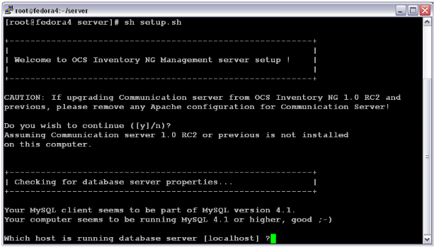

**`Warning: If you’re upgrading from OCS Inventory NG 1.01 and previous,
you must first remove any Apache configuration file for Communication server.`**

Type “y” or “enter” to validate and, then enter MySQL server host address, in most cases localhost.

Then, setup checks for MySQL client binary files version 4.1 or higher. If not present, you will be
prompted to continue or abort setup.

If all is OK, enter MySQL server port, generally 3306.

Enter or validate path to Apache daemon binary, generally “/usr/sbin/httpd”. It will be used to find
Apache configuration files.

**`Note: If you’re not using system Apache daemon, but another one like XAMPP/LAMPP Apache server,
you must enter full path to your Apache daemon, not the system one.`**

Enter or validate Apache main configuration file path, generally “/etc/apache/conf/apache.conf”
or “/etc/httpd/conf/httpd.conf”.

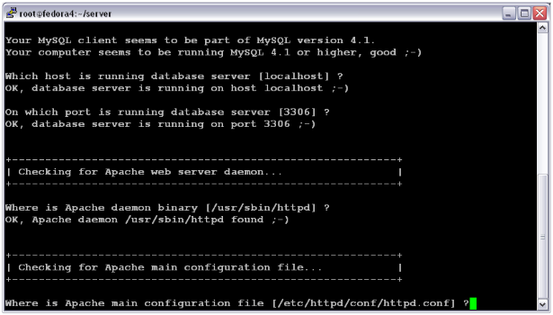

Enter or validate Apache daemon running user account, generally “apache” or “www” (under Debian/Ubuntu is “www-data”).

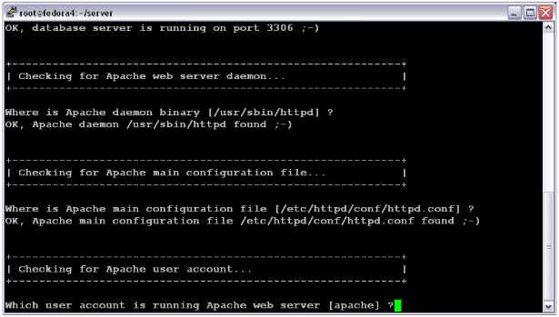

Enter or validate Apache daemon user group, generally “apache” or “www” (under Debian/Ubuntu is “www-data”).

Next, setup checks for PERL interpreter binaries. Enter or validate path to PERL interpreter.

**`Note: If you’re not using system perl interpreter, but another one like XAMPP/LAMPP perl interpreter,
you must specify full path to this perl interpreter, not the default system one
(/opt/lampp/bin/perl generally used in XAMPP/LAMPP).`**

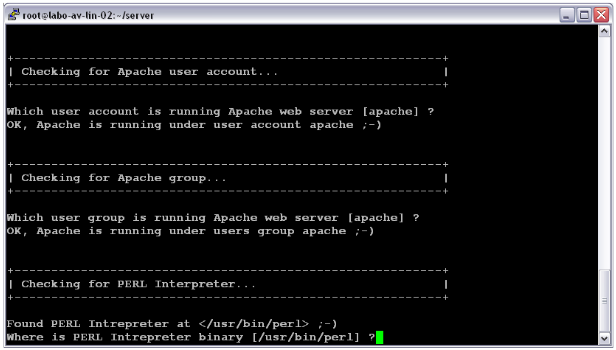

Common information for setting up Communication server or Administration console is now collected.
Setup prompts you if you wish to set Communication server up on this computer. Enter “y” or validate
to set Communication server up, “n” to skip Communication server installation.

Setup will then try to find make utility. If it fails, setup will stop.

Enter or validate path to Apache include configuration directory. This is the directory where is stored Apache
configuration for specific modules. Generally, this directory is

    /etc/httpd/conf.d

or

    /etc/apache/conf.d

If you are not using configuration directory, but having all configurations into Apache main configuration file,
enter **no**.

Setup will next try to determine your Apache mod_perl version. If it is not able to determine mod_perl version,
it will ask you to enter it.

**`Note: You can check which version of mod_perl you are using by querying your server's software database.`**

* `Under RPM enabled Linux distribution (RedHat/Fedora, Mandriva…), `**`run rpm –q mod_perl`**`.`
* `Under DPKG enabled Linux distribution (Debian, Ubuntu…), run dpkg –l `**`libapache*-mod-perl*`**`.`

Next, it will prompt you to enter log directory where Communication server will store debugging/tuning logs.
Validate or enter directory path. If it does not exist, this directory will be created.

Next, setup will check for required PERL modules
(cf [Requirements](Setting-up-a-OCS-Inventory-Server.md#requirements).):

* XML::Simple version 2.12 or higher
* Compress::Zlib version 1.33 or higher
* DBI version 1.40 or higher
* DBD::mysql version 2.9004 or higher
* Apache::DBI version 0.93 or higher
* Net::IP version 1.21 or higher
* SOAP::Lite version 0.66 or higher

**`Warning: If any of these modules is missing, setup will abort.`**

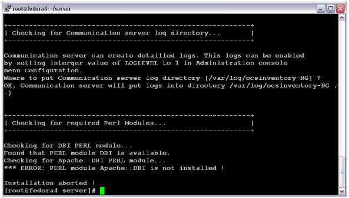

If all is OK, setup will install Communication server:

* Configure Communication server PERL module.
* Build Communication server PERL module.
* Install Communication server PERL module into PERL standard library directories.
* Create Communication server log directory (/var/log/ocsinventory-NG by default).
* Configure daily log rotation for Communication server (file /etc/logrotate.d/ocsinventory-NG by default)
* Create Apache configuration file (ocsinventory.conf). If you are using Apache configuration directory,
this file will be copied under this directory. Otherwise, you will be prompted to add content of this file
to the end of Apache main configuration file.

**`Warning: Do not add content to apache main configuration file if it is not a fresh install!
You must manually copy content of the ocsinventory.conf.local file created by setup into apache
main configuration file, replacing existing configuration.`**

    ################################################################################
    #
    # OCS Inventory NG Communication Server Perl Module Setup
    #
    # Copyleft 2006 Pascal DANEK
    # Web: http://ocsinventory.sourceforge.net
    #
    # This code is open source and may be copied and modified as long as the source
    # code is always made freely available.
    # Please refer to the General Public Licence http://www.gnu.org/ or Licence.txt
    ################################################################################

    # Which version of mod_perl we are using
    # For mod_perl <= 1.999_21, replace VERSION_MP by 1
    # For mod_perl > 1.999_21, replace VERSION_MP by 2
    PerlSetEnv OCS_MODPERL_VERSION 1

    # Where to write detailled logs
    PerlSetEnv OCS_LOGPATH "/var/log/ocsinventory-NG"

    # Database options
    # Replace DATABASE_SERVER by hostname or ip of MySQL server, generally localhost
    PerlSetEnv OCS_DB_HOST localhost
    # Replace DATABASE_PORT by port where running MySQL server, generally 3306
    PerlSetEnv OCS_DB_PORT 3306
    # Name of database
    PerlSetEnv OCS_DB_NAME ocsweb
    PerlSetEnv OCS_DB_LOCAL ocsweb
    # User allowed to connect to database
    PerlSetEnv OCS_DB_USER ocs
    # Password for user
    PerlSetVar OCS_DB_PWD ocs

    # The options below are overloaded if you are using ocs GUI
    # Be careful: you must restart apache to have any effects
    PerlSetEnv OCS_OPT_FREQUENCY 0
    PerlSetEnv OCS_OPT_PROLOG_FREQ 24
    PerlSetEnv OCS_OPT_DEPLOY 1
    PerlSetEnv OCS_OPT_TRACE_DELETED 0
    PerlSetEnv OCS_OPT_AUTO_DUPLICATE_LVL 7
    PerlSetEnv OCS_OPT_LOGLEVEL 0
    PerlSetEnv OCS_OPT_INVENTORY_DIFF 1
    PerlSetEnv OCS_OPT_INVENTORY_TRANSACTION 1
    PerlSetEnv OCS_OPT_PROXY_REVALIDATE_DELAY 3600

    # Optional modules
    PerlSetEnv OCS_OPT_IPDISCOVER 2
    PerlSetEnv OCS_OPT_IPDISCOVER_MAX_ALIVE 7
    PerlSetEnv OCS_OPT_IPDISCOVER_LATENCY 100
    PerlSetEnv OCS_OPT_REGISTRY 0
    PerlSetEnv OCS_OPT_UPDATE 0
    PerlSetEnv OCS_OPT_DOWNLOAD 0
    PerlSetEnv OCS_OPT_DOWNLOAD_FRAG_LATENCY 10
    PerlSetEnv OCS_OPT_DOWNLOAD_CYCLE_LATENCY 0
    PerlSetEnv OCS_OPT_DOWNLOAD_PERIOD_LATENCY 0
    PerlSetEnv OCS_OPT_DOWNLOAD_TIMEOUT 30
    PerlSetEnv OCS_OPT_WEB_SERVICE_ENABLED 0

    ############ DO NOT MODIFY BELOW ! #######################

    # External modules
    PerlModule Apache::DBI
    PerlModule Compress::Zlib
    PerlModule XML::Simple

    # Ocs
    PerlModule Apache::Ocsinventory
    PerlModule Apache::Ocsinventory::Server::Constants
    PerlModule Apache::Ocsinventory::Server::System
    PerlModule Apache::Ocsinventory::Server::Communication
    PerlModule Apache::Ocsinventory::Server::Inventory
    PerlModule Apache::Ocsinventory::Server::Duplicate

    # Options
    PerlModule Apache::Ocsinventory::Server::Option::Registry
    PerlModule Apache::Ocsinventory::Server::Option::Update
    PerlModule Apache::Ocsinventory::Server::Option::Ipdiscover
    PerlModule Apache::Ocsinventory::Server::Option::Download
    # This module guides you through the module creation
    # PerlModule Apache::Ocsinventory::Server::Option::Example
    # This module adds some rules to filter some request sent to ocs server in the prolog and inventory stages
    # PerlModule Apache::Ocsinventory::Server::Option::Filter

    # Virtual directory for handling OCS Inventory NG agents communications
    # Be carefull, do not create such directory into your web server root document !
    #PerlTaintCheck On
    <Location /ocsinventory>
    order deny,allow
    allow from all
    Satisfy Any
    SetHandler perl-script
    PerlHandler Apache::Ocsinventory
    </Location>

    PerlModule Apache::Ocsinventory::SOAP;
    <location /ocsinterface>
    SetHandler perl-script
    perlHandler "Apache::Ocsinventory::SOAP"
    order deny,allow
    allow from all
    Satisfy any
    </location>
**Figure 2: Apache configuration sample file**

Communication server installation is now finished. You will be prompted to set Administration console up.
Enter “y” or validate to set Administration console up, enter “n” to skip Administration console installation.

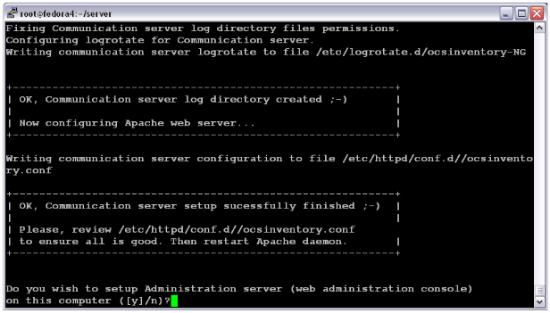

Setup will ask you to enter Apache root document directory, usually “/var/www/html” or “/var/www-data”.

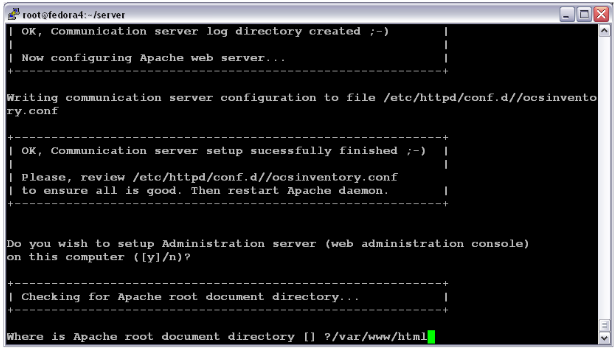

Next, setup will check for required PERL modules
(cf [Requirements](Setting-up-a-OCS-Inventory-Server.md#requirements).):

* XML::Simple version 2.12 or higher
* DBI version 1.40 or higher
* DBD::Mysql version 2.9004 or higher
* Net::IP version 1.21 or higher

**`Warning: If any of these modules is missing, setup will abort.`**

If everything is OK, setup will install Administration console into the “ocsreports” subdirectory:

* Create /ocsreports directory structure.
* Create /download directory structure.
* Copy files into /ocsreports directory.
* Fix directories and files permissions to allow Apache daemon reading and writing to required directories
(write access is required in /ocsreports, /ocsreports/ipd and /download, cf § 11.4 [Files and directories
permissions under Linux](../../08.Extras/Common-errors.md#files-and-directories-permissions-under-linux).).
* Configure PERL script ipdiscover-util.pl to access database and install it.

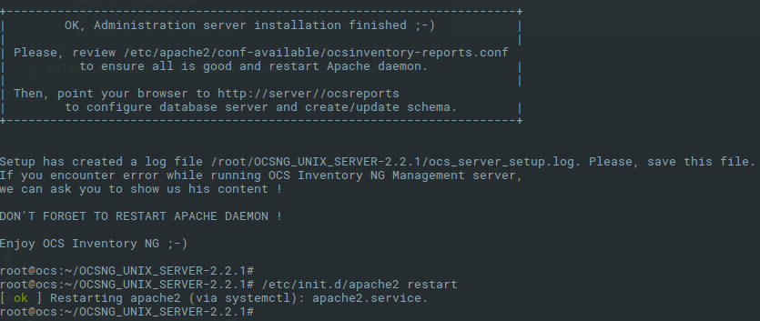

Now, you can restart Apache web server for changes to take effect (httpd is usually for apache2).

    /etc/init.d/httpd restart

or

    /etc/init.d/apache restart

## Configuring management server

**`Warning: We recommend you to check your php.ini when you upgrade your server from 1.x to 2.x,
specially these variables :`**

* `max_execution_time`
* `max_input_time`
* `memory_limit`

**`Note: You are not obliged to launch install.php, you can use this command too :`**

    mysql -f -hlocalhost -uroot -p DBNAME < ocsbase.sql >log.log

Else, open your favorite web browser and point it on URL
[http://administration_console/ocsreports](http://administration_console/ocsreports) to connect
the Administration server.

As database is not yet created, this will begin OCS Inventory setup process.
Otherwise, you can rerun configuration process by browsing
[http://administration_console/ocsreports/install.php](http://administration_console/ocsreports/install.php)
URL (this must be used when upgrading OCS Inventory management server).

**`Note: You will see warning regarding max size of package you will be able to deploy. Please, see
`[`Uploads size for package deployment`](../../08.Extras/Common-errors.md#uploads-size-for-package-deployment)`
to configure your server to match your need.`**

Fill in information to connect to MySQL database server with a user who has the ability to create
database, tables, indexes, etc (usually root):

* MySQL user name
* MySQL user password
* MySQL hostname

Setup actions :

* Create **ocsweb** database, and will add MySQL user **ocs** with password **ocs**.
* Grant to user **ocs** privileges _Select | Insert | Update | Delete | Create | Drop | References | Index | Alter
| Create temp | Lock_ on database **ocsweb**.

**`Note: This user will be used by Administration server and Communication server to connect to the database.
If you do not wish to use default MySQL user ocs with ocs password, you must update in the file
dbconfig.inc.php PHP constants COMPTE_BASE, which is MySQL user login,
and/or PSWD_BASE, which MySQL user password.
Don’t forget to also update Communication server configuration, especially in apache configuration file.
Refer to `[`Secure your OCS Inventory NG Server`](../../08.Extras/Secure-your-OCS-Inventory-NG-Server.md)`
for all information about modifications of configuration files.`**

To secure you server, refer to
[Secure your OCS Inventory NG Server](../../08.Extras/Secure-your-OCS-Inventory-NG-Server.md)
documentation.

If you don't want to secure your OCS Inventory Server, you have to desactivate Warning message in user profile.
Procedure is in the same documentation page.

**`Warning: We recommend you to read this documentation and follow the procedure.`**

Click on the following link : "Click here to enter OCS-NG GUI"

Click on "Perform the update" button

Just point your browser to the URL
[http://administration_server/ocsreports](http://administration_server/ocsreports)
and login in with **admin** as user and **admin** as password.

## Upgrading management server

When new versions of web communication server or web administration console are released,
you must upgrade your installation.

**`Note: Ensure MySQL InnoDB engine is activated on your database server. Open my.cnf and ensure there is
no line with skip-innodb or this line is commented out(begins with ‘#’).`**

**`Warning: Backup your database before upgrading! If you encounter any errors while upgrading, restore your database,
then upgrade MySQL server to version 4.1.20 or higher. Then, rerun upgrade procedure.`**

**`Warning: Notice that many package removers are asking if you want to also remove database - you should
not do this, because you want to upgrade, and not install from scratch.`**

**`Warning: Make sure you set max_execution_time limit in php.ini to zero (unlimited).
Database upgrade can take a long time.`**

**`Warning: We recommend you to migrate your OCS database to UTF8. Refer to`
[`Migrate your OCS database to UTF8`](http://wiki.ocsinventory-ng.org/index.php/Howtos:Migrate_your_OCS_database_to_UTF8)`
HowTo. You have to do this migration ONLY AFTER update.`**

To upgrade web communication server and administration console, you must follow instructions as described in
Installing management server. You don’t need to update Perl modules if not required in the release notes.

Then, just point your favorite browser to URL
[http://administration_server/ocsreports](http://administration_server/ocsreports)
and it will run the upgrade process to ensure that your database schema and default data are up to date.
Upgrade process looks like configuration of management server as described in Configuring management server.

**`Note: You will see warning regarding max size of package you will be able to deploy. Please,
see Uploads size for package deployment.) to configure your server to match your needs.`**

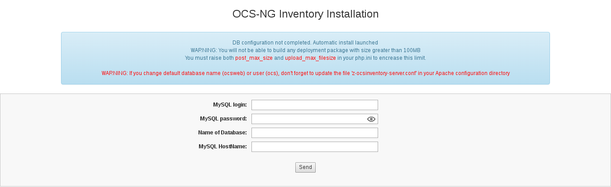

Fill in MySQL administrator name (usually root) and password, and MySQL database server address
and click on **[ Send ]** button.

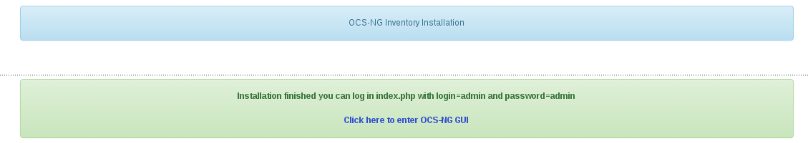

Click on the following link : "Click here to enter OCS-NG GUI"

Click on "Perform the update" button

**`Note: Notice that installers says about how to log in to server after upgrade. Actually use
your user/pass that you used before upgrade, especially if you removed/disabled user admin.`**

# Under Windows Operating System

We have chosen to package OCS inventory NG server for Windows as an integrated package containing
all required components. As is, the 3 main components of Management server (database server,
web communication server and web administration server) are installed on the same computer.

OCS Inventory NG server 1.0 for Windows is based on ApacheFriends XAMPP version 1.7.7
([ApacheFriends](http://www.apachefriends.org/index-en.html))
which sets the following components up on a single computer:

* Apache 2.2.17
* MySQL 5.5.8 + PBXT engine(currently disabled)
* PHP 5.3.5 + PEAR
* XAMPP Control Panel 2.5.8
* SQLite 2.8.17
* SQLite 3.6.20
* OpenSSL 0.9.8l
* phpMyAdmin 3.3.9
* ADOdb 5.11
* Mercury Mail Transport System v4.72
* FileZilla FTP Serveur 0.9.37
* Webalizer 2.21-02
* Perl 5.10.1
* mod_perl 2.0.4
* Xdebug 2.1.0rc1
* Tomcat 7.0.3 (with mod_proxy_ajp as connector)

**`Note: Even if all these components are installed, you will be able to choose the components
you want to automatically start.`**

## Installing management server

**`Warning: You must have Administrator privileges to set OCS Inventory NG server up under Windows NT4,
Windows 2000, Windows XP or Windows Server 2003.`**

Download **[[OCSNG-Windows-Server-2.0.zip](http://launchpad.net/ocsinventory-windows-server/stable-2.0/2.0/+download/OCSNG-Windows-Server-2.0.zip)]**
from OCS Inventory Web Site, unpack it and launch **OCSNG-Windows-Server-2.0.exe**.

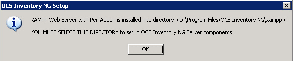

If XAMPP components (server and perl addon) are not already installed, Setup will prompt you that you have
to set them up. Otherwise, Setup will automatically install OCS Inventory Server into XAMPP directories.

Click **[ Next ]** button to start installation wizard.

Click **[ Next ]** button and accept License agreement.

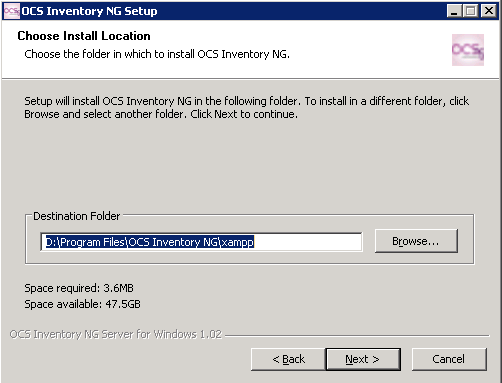

Choose installation directory, by default **C:\Program Files\OCS Inventory NG**. You need 400 MB of
free hard disk space if XAMPP components are not installed, otherwise, only 10MB are required.

**`Note: When upgrading, you must ensure that Setup detects the folder including XAMPP directory.
See `[`Upgrading management server`](Setting-up-a-OCS-Inventory-Server.md#upgrading-management-server-1)`.`**

Then, you have to validate components to install. Only **OCS Inventory NG Server** is required, if XAMPP
components are already installed.

**`Note: OCS Inventory NG Server Setup now use standard XAMPP setup. So, it may be able to upgrade existing
XAMPP installation. However, by default, Setup will _not_ upgrade XAMPP components.
See `[`Upgrading management server`](Setting-up-a-OCS-Inventory-Server.md#upgrading-management-server-1)`.`**

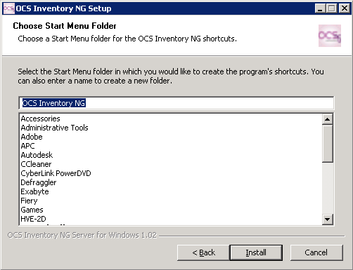

Next, you have to choose the program group name in start menu, where OCS Inventory NG icons
will be created and then click on **[ Install ]** button to start installation.

If XAMPP setup selected, Setup will first launch XAMPP 1.7.7 setup in silent mode. This will create
a folder _xampp_ under destination folder, and a program group _Apache Friends_ in start menu.

You will be prompted to start XAMPP Control Panel. Please, answer **No**.

Then, it will launch XAMPP perl addon setup in silent mode.

Last, Setup will install OCS Inventory NG Server files, configure XAMPP Apache and MySQL servers for
OCS Inventory NG Server, and automatically start MySQL and Apache server.

At the end of the process, Setup will launch your default browser to start OCS Inventory NG Server configuration
(see [Configuring management server](Setting-up-a-OCS-Inventory-Server.md#configuring-management-server-1)).

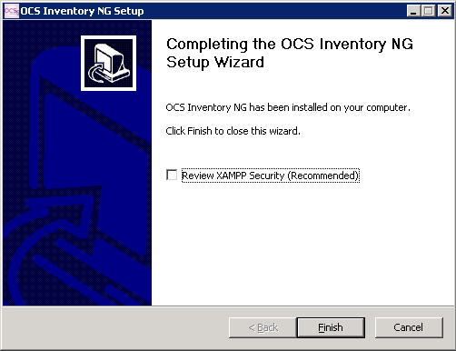

Setup is now finished and you can click **[ Finished ]** button.

**`Note: OCS Inventory NG setup for Windows has installed XAMPP components under xampp subfolder of
selected installation directory. Apache web server document root directory is located in the
htdocs sub directory of XAMPP. This is here that ocsreports administration console files are installed.`**

_Communication server files are now located into PERL standard libraries._

_Apache logs (access.log, error.log, phperror.log) and communication server logs_
(ocsinventory-NG.log) _are located in the sub-directory_ Apache\Logs”.

## Configuring management server

Open your favorite web browser on the server and point it on URL
[http://localhost/ocsreports](http://localhost/ocsreports) to connect the Administration server.

You will be prompted for information to connect to MySQL database server with a user who has the ability
to create database, tables, indexes, etc:

* MySQL user name, root by default
* MySQL user password (empty password by default)
* MySQL hostname, localhost

Setup actions :

* Create **ocsweb** database, and will add MySQL user **ocs** with password **ocs**.
* Grant to user **ocs** privileges _Select | Insert | Update | Delete | Create | Drop | References | Index
| Alter | Create temp | Lock_ on database **ocsweb**.

**`Note: This user will be used by Administration server and Communication server to connect to the database.
If you do not wish to use default MySQL user ocs with ocs password, you must update
in the file dbconfig.inc.php PHP constants COMPTE_BASE, which is MySQL user login, and/or PSWD_BASE,
which MySQL user password.
Don’t forget to also update Communication server configuration, especially in apache configuration file.
Refer to `[`Secure your OCS Inventory NG Server`](../../08.Extras/Secure-your-OCS-Inventory-NG-Server.md)`
for all information about modifications of configuration files.`**

To secure you server, refer to
[Secure your OCS Inventory NG Server](../../08.Extras/Secure-your-OCS-Inventory-NG-Server.md)
documentation.

If you don't want to secure your OCS Inventory Server, you have to deactivate the Warning message
in user profile. Procedure is in the same documentation page.

**`Warning: We recommend you to read this documentation and follow the procedure.`**

Click on the following link : "Click here to enter OCS-NG GUI"

Click on "Perform the update" button

Configuration of OCS Inventory Server is now finished.

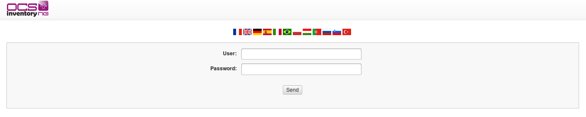

Default Administrator login is **admin** as user and **admin** as password.

## Updating security of XAMPP components.

**`Warning: By default, XAMPP is set up without security. MySQL root account do not have password, XAMPP
web configuration interface is accessible by everybody without authentication… You must update this.`**

Open your favorite web browser on the server and point it on URL
[http://localhost/xampp/splash.php](http://localhost/xampp/splash.php)
to connect the XAMPP configuration GUI.

Click on the language you want to access the XAMPP main configuration menu.

Then, click **[ Security ]** on the left menu. As you will see, all is marked as unsecure or unknown
for non started components.

You can change this by clicking the link
[http://localhost/security/xamppsecurity.php](http://localhost/security/xamppsecurity.php).

First of all, you must fill in MySQL root password and select phpMyAdmin authentication method.

**`Note: You can change this at any time by visiting the security web page of XAMPP server.`**

Validate your changes by clicking **[ Password changing ]** button.

You can then protect the access to XAMPP configuration menu by filling in user and password for
XAMPP DIRECTORY PROTECTION. As is, this user and password will be asked to connect to XAMPP
configuration menu through a web browser.

Validate your changes by clicking _[ Make safe the XAMPP directory ]_ button.

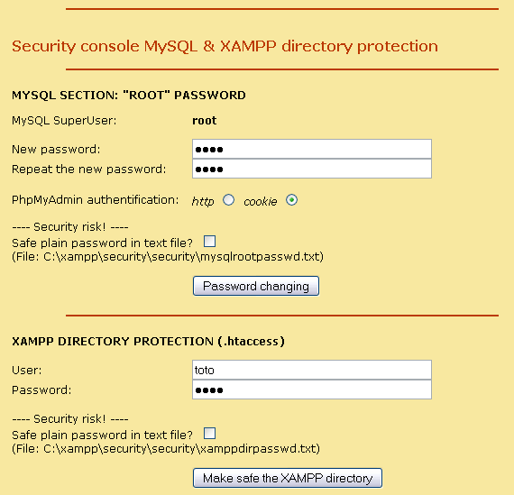

**`Note: Do not enable PHP safe mode, as you may encounter errors on Administration console.`**

Finally, you must restart Apache and MySQL services for changes to take effect.

Open XAMPP Control Panel from system tray or from OCS Inventory NG start menu folder,
click **[ Stop ]** button for Apache, then **[ Start ]** button and do the same for MySQL.

You can now reselect **[ Security ]** on left side menu to see that all started services are now secured.

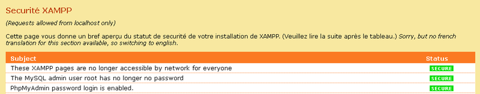

## Upgrading management server

To upgrade web communication server and administration console, you must follow instructions
as described in the section
[Installing management server](Setting-up-a-OCS-Inventory-Server.md#installing-management-server-1).
Just ensure that setup detects old installation folder correctly.

You don’t need to update XAMPP components. Setup, by default, will not select XAMPP components install.
If you do so, **backup your databases and web sites if you want to also upgrade XAMPP components !**
See the section
[Backup/restore of OCS Inventory NG database](../../08.Extras/Backup-restore-of-OCS-Inventory-NG-database.md).

At the end of the process, Setup will launch your default browser to run the upgrade process to ensure
that your database schema and default data are up to date. Upgrade process looks like configuration
of management server as described in the section
[Configuring management server](Setting-up-a-OCS-Inventory-Server.md#configuring_management_server).

**`Note: You will see warning regarding max size of package you will be able to deploy.
Please, see the section
`[`Uploads size for package deployment`](../../08.Extras/Common-errors.md#uploads-size-for-package-deployment)`
.) to configure your server to match your need.`**
