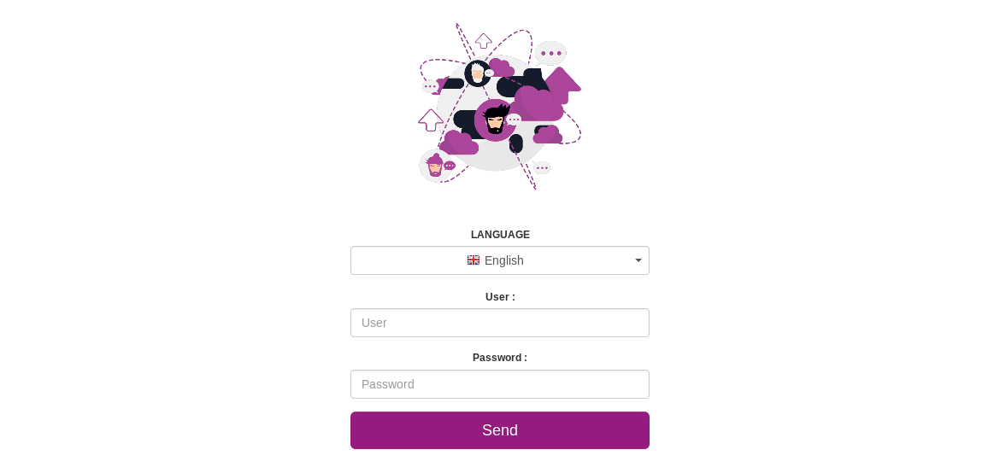

# Setting up OCS Inventory Server with RPM

We provide RPM for Fedora, RHEL and Centos system. It may work on derivate distribution like Amazon Linux or Scientific Linux but it has been not tested

**Note on SELinux**

There is no need to disable SELinux : All needed right are set in the rpm.
For more information about using selinux, please read [this documentation](https://people.redhat.com/duffy/selinux/selinux-coloring-book_A4-Stapled.pdf).

# Setting up the repo

 Other repositories required:

* Fedora: Remi
* RHEL: EPEL, Remi
* CentOS: EPEL, Remi

## YUM/DNF automatic configuration

The simplest way is to install the ocsinventory-release package which provides the repository configuration for YUM/DNF and the GPG key used to sign the RPM.

### Enterprise Linux 7 (with EPEL and Remi) x86_64

    wget https://dl.fedoraproject.org/pub/epel/epel-release-latest-7.noarch.rpm
    wget https://rpms.remirepo.net/enterprise/remi-release-7.rpm
    wget https://rpm.ocsinventory-ng.org/ocsinventory-release-latest.el7.ocs.noarch.rpm
    yum install ocsinventory-release-latest.el7.ocs.noarch.rpm epel-release-latest-7.noarch.rpm remi-release-7.rpm

### Enterprise Linux 8 (with EPEL and Remi) x86_64

    wget https://dl.fedoraproject.org/pub/epel/epel-release-latest-8.noarch.rpm
    wget https://rpms.remirepo.net/enterprise/remi-release-8.rpm
    wget https://rpm.ocsinventory-ng.org/ocsinventory-release-latest.el8.ocs.noarch.rpm
    dnf install ocsinventory-release-latest.el8.ocs.noarch.rpm epel-release-latest-8.noarch.rpm remi-release-8.rpm

### Fedora 29 (with Remi) x86_64

    dnf install https://rpm.ocsinventory-ng.org/ocsinventory-release-latest.fc29.ocs.noarch.rpm https://rpms.remirepo.net/fedora/remi-release-29.rpm

### Fedora 30 x86_64

    dnf install https://rpm.ocsinventory-ng.org/ocsinventory-release-latest.fc30.ocs.noarch.rpm

### Fedora 31 x86_64

    dnf install https://rpm.ocsinventory-ng.org/ocsinventory-release-latest.fc31.ocs.noarch.rpm

# Install OCS Inventory server

The repo provide the following packages:

* ocsinventory: Meta package for ocsinventory-server and ocsinventory-reports
* ocsinventory-server: Contain the server
* ocsinventory-reports: Contain ocsreports, the Admin GUI
* ocsinventory-agent: Meta package for ocsinventory-agent-core and full dependancies
* ocsinventory-agent-core: Contain the agent with the minimal depandancies

Here will be the instructions for installing the server with the Admin GUI.

## Enterprise Linux 7

    yum install yum-utils
    yum-config-manager --enable remi
    yum-config-manager --enable remi-php73
    yum install ocsinventory

## Enterprise Linux 8

    dnf install yum-utils
    yum-config-manager --enable remi
    dnf module reset php
    dnf module install php:remi-7.3
    dnf install --enablerepo=PowerTools ocsinventory

## Fedora

    dnf install ocsinventory

# Configure your environment

## Mariadb

At first, you need to enable and launch mariadb:

    systemctl enable mariadb
    systemctl start mariadb

To secure your database, please launch the following command:

    mysql_secure_install

## Apache

You need to enable and launch apache:

    systemctl enable httpd
    systemctl start httpd

## PHP

On RHEL 7 or Centos 7, nothing is needed for php.

On Fedora, RHEL 8 and Centos 8, php-fpm is used and must be enable:

    systemctl enable php-fpm
    systemctl start php-fpm

## Firewalld

By default, firewalld block all needed port. To open them:

    firewall-cmd --zone=public --add-service=http --permanent
    firewall-cmd --zone=public --add-service=https --permanent
    firewall-cmd --reload

## Configuring management server

**`Warning: We recommend you to check your php.ini when you upgrade your server from 1.x to 2.x,
specially these variables :`**

* `max_execution_time`
* `max_input_time`
* `memory_limit`

**`Note: You are not obliged to launch install.php, you can use this command too :`**

    mysql -f -hlocalhost -uroot -p DBNAME < ocsbase.sql >log.log

Else, open your favorite web browser and point it on URL
``http://administration_console/ocsreports`` to connect
the Administration server.

As database is not yet created, this will begin OCS Inventory setup process.
Otherwise, you can rerun configuration process by browsing
``http://administration_console/ocsreports/install.php``
URL (this must be used when upgrading OCS Inventory management server).

**`Note: You will see warning regarding max size of package you will be able to deploy. Please, see
`[`Uploads size for package deployment`](../09.Extras/Common-errors.md#uploads-size-for-package-deployment)`
to configure your server to match your need.`**

Fill in information to connect to MySQL database server with a user who has the ability to create
database, tables, indexes, etc (usually root):

* MySQL user name
* MySQL user password
* MySQL hostname

To secure your server, refer to
[Secure your OCS Inventory NG Server](../09.Extras/Secure-your-OCS-Inventory-NG-Server.md)
documentation.

If you don't want to secure your OCS Inventory Server, you have to desactivate Warning message in user profile.
Procedure is in the same documentation page.

**`Warning: We recommend you to read this documentation and follow the procedure.`**

Click on the following link : "Click here to enter OCS-NG GUI"

Just point your browser to the URL
``http://administration_server/ocsreports``
and login in with **admin** as user and **admin** as password.

