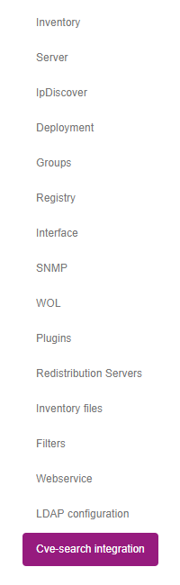

# CVE-Search integration

CVE-Search integration has ben added in release 2.x of OCS Inventory. 
By enabling this feature, OCS Inventory can automatically query a 
[cve-search](http://cve-search.github.io/cve-search/) server for 
vulnerabilities that may apply to your inventoried softwares.

**`Warning: The information given by the CVE-Search integration are 
informational only. The developpers of OCS Inventory do not accept
any responsibility related to the accuracy of the information displayed`**

## Features

When enabled, the CVE-Search integration will display a "_bug_" icon next
to softwares names in any tables displaying "_Editor_", "_Name_", and 
"_Version_" columns:

The color of this icon will change depending on whether the integration
found potentialy applicable vulnerabilities for the concerned software:

* Red: At least 1 vulnerability was found applicable to the particular
  version concerned or above, or, was not specifying any particular 
  version; 
* Green: Vulnerabilities were found, but none were found applicable to
  the particular version concerned or above;
* Orange: No vulnerabilities were found for this software, or, software
  is not recognised. 


## Configuring the CVE-Search integration

As administrator, go to the menu ```Configuration > General configuration```, 
and click on the "CVE-search integration" entry in the left navigation pane:



There are 2 settings:
+ **VULN_CVESEARCH_ENABLE**: Define wether the integration is enabled or not (default: Disabled);
+ **VULN_CVESEARCH_HOST**: Define the URL of the cve-search server to be queried (You may use
  https://cve.circl.lu if you don't host any cve-search server).


