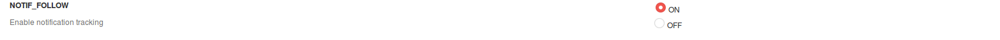
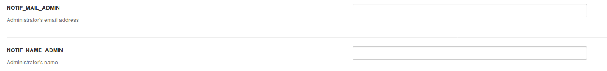
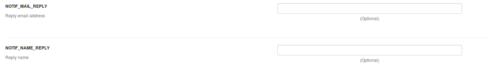
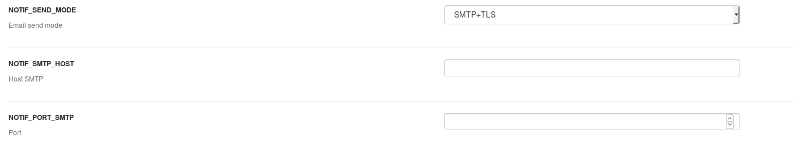
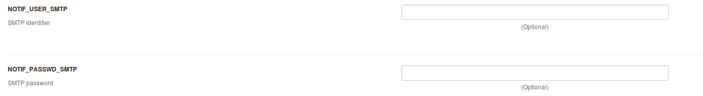
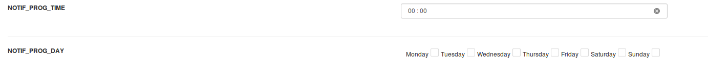
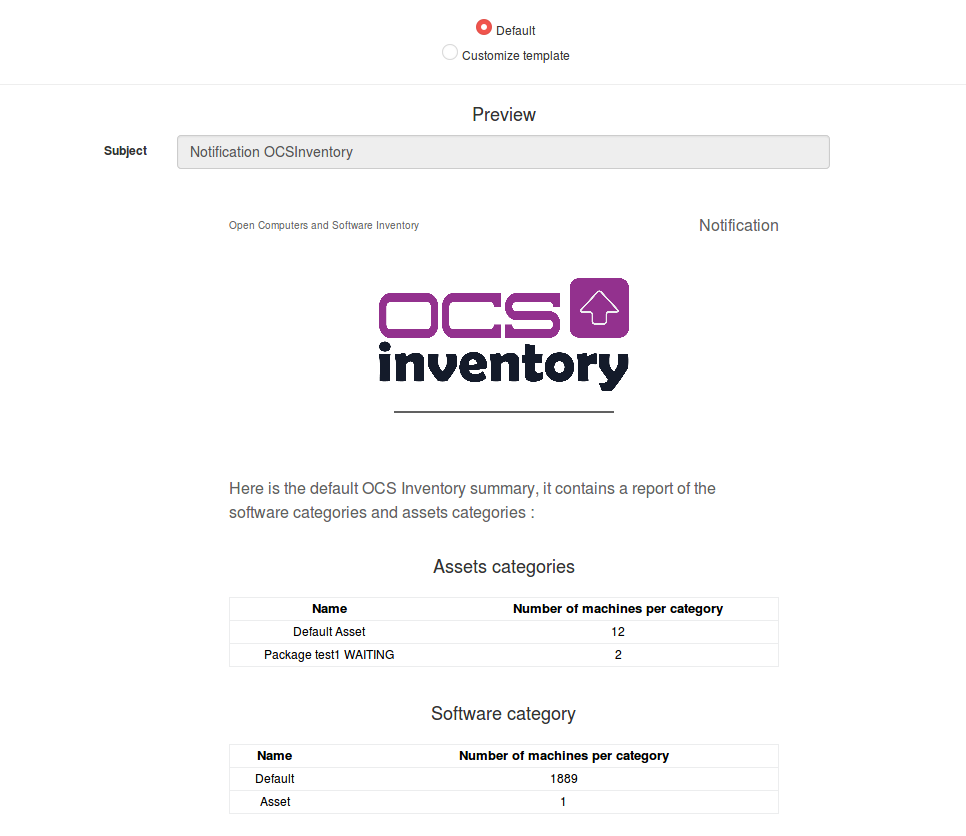
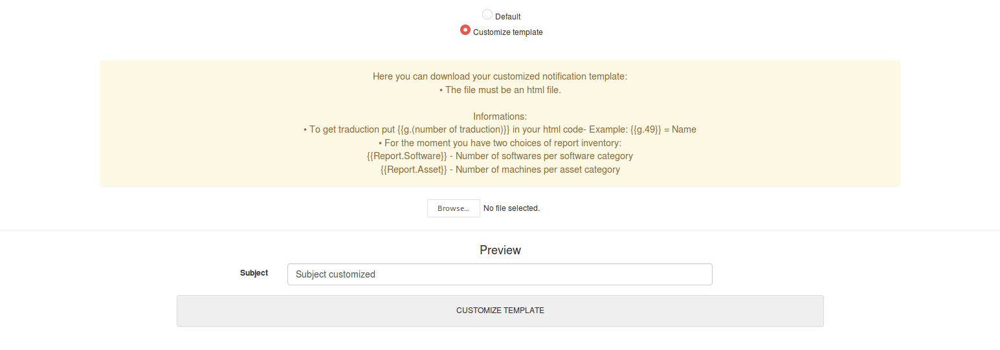

# Mail Notifications

Mail Notifications have been added in release 2.5 of OCS Inventory. This feature allow you to configure and customize your report notification.

Click on _Config_ then _Notifications_.

## Configuration

The first page is the configuration's page.

* Activate or not notification mail.

* Set Administrator's email address and name.

* Set Reply's email address and name. (Optional)

* Configure SMTP : email send mode (_SMTP_ - _SMTP + SSL_ - _SMTP + TLS_), Host and Port.

* Configure SMTP optional : User identifier and password.

* Configure recurrence : reception time and day(s).

## Customization template

The second page allows you to customize your template.

By default the OCS Inventory template is selected.

If you choose _Customize template_, you can upload an html file with your custom template. It will be uploaded to the folder

    ocsreports/templates

In your OCS Inventory report you can use traduction files with 

    {{g.number_of_the_traduction}}
    Example : {{g.49}} = Name

At the moment the notification report only offers two choices :

    {{Report.Software}} - Number of softwares per software category
    {{Report.Asset}} - Number of machines per asset category
