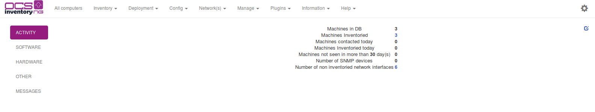
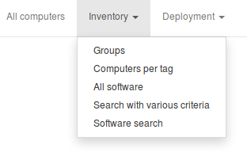
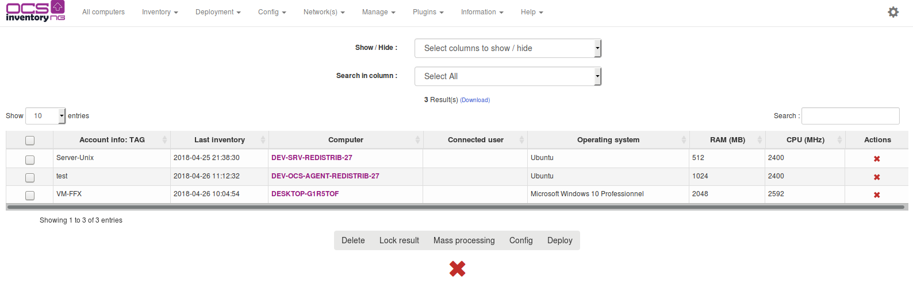
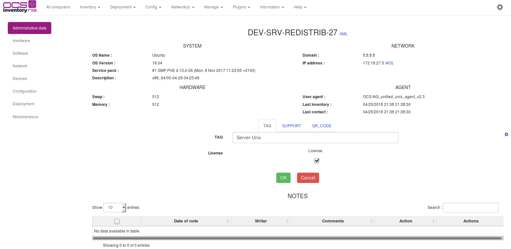
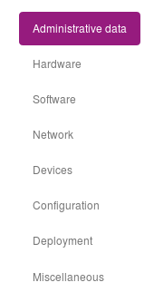
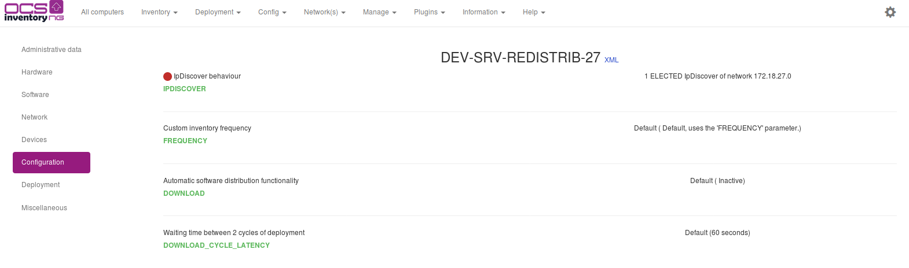
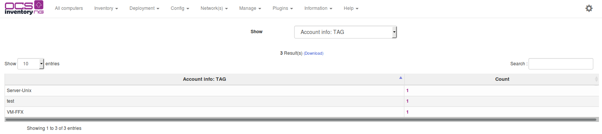
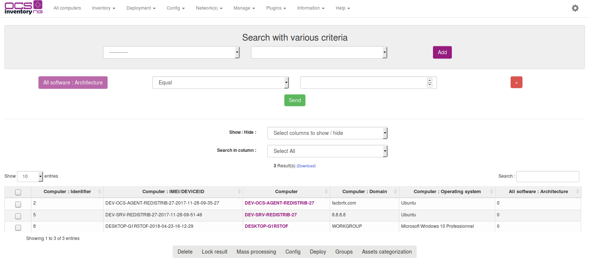
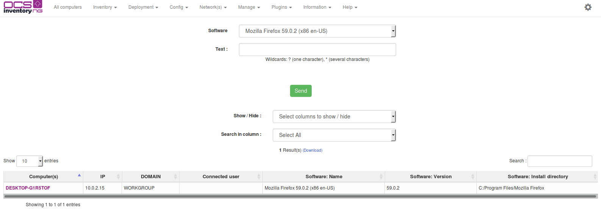

# Querying inventory results

Point your browser to the URL
[http://administration_server/ocsreports](http://administration_server/ocsreports)
and log into Administration console (default credentials are “admin” as login and “admin” as password).

You must use All Computers and Inventory menu to run predefined queries.

Each of these queries' results can be customized by adding, removing columns, or changing
the number of displayed lines per page. Theses customizations settings are saved per
user between sessions. This means that when you come back to OCS Inventory NG Administration
console, your settings are restored as they were during your last visit.

**`Note: Computers marked with a red bullet at beginning of line are computers whith
specific customization parameters. They may have specific inventory frequency,
ipdiscover status or have package deployment affected.`**

## All computers

This query will allow you to display all inventoried computers. Computers marked with a red bullet at
the beginning of line are those which have specific customized options.

Just click on a computer name to display its properties in a new browser window.

* Links section – Just click on the appropriate link to display the corresponding information.

* Special section Administrative data – Use this section to display the device's administrative data.
This page fits with your settings in “admininfo” tab. Use the “update” button to change values.

* Special section Customization – Use this section to customize configuration option for individual computer.
You can also select here package to deploy on a particular computer.

## TAG / number of PC repartition

This query allows you to display all machines grouped by TAG account info. Click on the computer
count to retrieve the corresponding devices.

For example, if you’ve choosen to set your TAG information to reflect your geographical sites,
this will display the number of computer in each different site.

## Search with various criteria

This query allows you to search for computers having specific feature.

You can add new parameters to the search query by dropping down the combo-box and selecting it in the list.

Default search parameters are:

* BIOS Manufacturer
* BIOS Version
* Computer name
* Customized IpDiscover
* Deployment Package
* Description
* Domain
* Free Disk Space
* Inventory Frequency
* Gateway
* IP Address
* IpDiscover Status
* Last Inventory
* MAC Address
* System Manufacturer
* Memory
* System Model
* Monitor Caption
* Monitor Manufacturer
* Monitor Serial Number
* Network Number
* Operating System
* Processor Speed
* Registry Key Value
* System Serial Number
* Software
* Tag value
* User logged in
* User agent (show OCS NG agent version)
* And all the administrative information you’ve defined.

For each parameter, you can use one of the following comparison operators, depending of the
parameter you’ve selected:

* EQUAL
* DIFFERENT
* SMALLER
* BIGGER
* BETWEEN
* OUT OF

**`Note: Don’t forget to enable the parameter in the search!`**

**`Note: You can search for as many software as you wish in one search query. This means that you
can search for computers having software1 and software2 and… Unlike software field, all others
fields can only be specified once in any given search query.`**

## Search Software

You can now search a software and see on witch computers it's installed.

