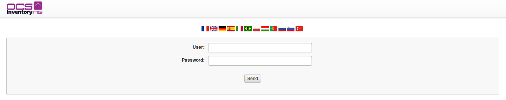

# Manage authentification with LDAP

It is possible to delegate authentication to the administration console of OCS Inventory NG to an annex
database. Some modules have already been developed and are available natively in version 2.0. So we will
see how to delegate the connection to the OCSInventory NG GUI to LDAP.

**`Note: For this documentation, we set up an LDAP from the following documentation :
`[`http://doc.ubuntu-fr.org/openldap-server`](http://doc.ubuntu-fr.org/openldap-server)`
and we kept the default configuration.`**

## Preperations
For the LDAP connection we need the php_ldap module:
``` 
apt install php-ldap
```
For debian based unix

Of course we need a administrator account to configure stuff.

**_Important: You have to do the configuration in the web gui before you do the changes in the config files!_**

## Configuration options in web gui
Open the dropdown "Config" choose "Config" and then click on "LDAP configuration".

Here we have varius files to fill:
+ **CONEX_LDAP_SERVEUR:** Is the LDAP Server (ex .127.0.0.1 or ldpa.acme.com)
+ **CONEX_ROOT_DN:** Is the user which is used to check logins (attribute: ...)
+ **CONEX_ROOT_PW:** Password if the user above
+ **CONEX_LDAP_PORT:** LDAP conection Port (389 or 686 for SSL)
+ **CONEX_DN_BASE_LDAP:** Is the Base DN where Users which are able to login could be found
+ **CONEX_LOGIN_FIELD:** The attribute with which a user logs in (ex. sAMAccountName or uid)
+ **CONEX_LDAP_PROTOCOL_VERSION:** Protocol version number (3 for Active Directory)
+ **CONEX_LDAP_CHECK_DEFAULT_ROLE:** Choose a default role from dropdown which all users have expect the one from Field check

Currently we can seperate users authenticated with ldap through three options: Field1, Field2 and default role. With the options below we can use an attribute to assigen the users to a differnt group than the default group.
+ **CONEX_LDAP_CHECK_FIELD1_NAME:** An attribute which has every user (ex. department)
+ **CONEX_LDAP_CHECK_FIELD1_VALUE:** A value of the attribute above 
+ **CONEX_LDAP_CHECK_FIELD1_ROLE:** Choose a role from dropdown


## Modification of configurations in file system
Typical the files are stored under: ```/usr/share/ocsinventory-reports/ocsreports/```
We have to change two files: In the first (auth.php) we set the authentication method and in the other (identity.php) we define that the user rights (role) are also synchronised with ldap.

### Changes of ~/backend/AUTH/auth.php
We need to change the login option from local to ldap by comment this line out 

`$list_methode=array(0=>"local.php");`       
and the line below in        
`$list_methode=array(0=>"ldap.php");`      

It is also possible to use both, ldap and local authentication:                
`$list_methode=array(0=>"ldap.php",1=>"local.php");`    


### Changes of ~/backend/identity/identity.php
We need to delegate the rights of the account also to ldap by commenting this line out

`$list_methode=array(0=>"local.php");`      
and this line below in      
`$list_methode=array(0=>"ldap.php");`     

If you use local and ldap authentication you need to use this line:

`$list_methode=array(0=>"ldap.php",1=>"local.php");`

In this case, rights will be retrieve in the LDAP, and will be completed by those found locally.


## Modification of connection form
Changes need to be done in ~/backend/AUTH/auth.php
It is possble to change the connction form from the classic html site to a browser query

If you don't modify the line

    $affich_method='HTML';

then you will keep the "classic " login page.



However, if you replace **html** by **SSO**

    $affich_method='SSO';

the request for _username / password_ will be in this form


**`Note: In this case, the choice of language will no longer directly available.
You will need to choose it and freeze it in the var.php file.`**

