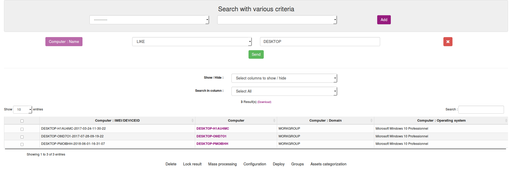
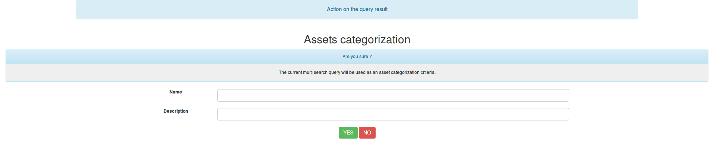
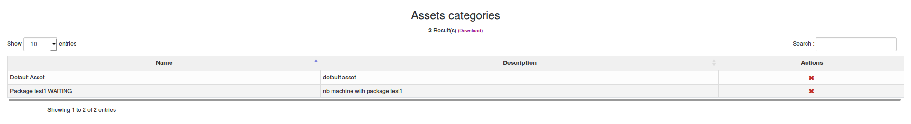

# Using assets categorization

## Introduction

Assets categorization is a new feature introduced in 2.5
It's goal is to create and attribute category to computers depending on specific criterias.

This feature may seem really similar to dynamic group and that the case. 

However, this feature is intended to be used by third party software since the category can be easly retrieved using the [REST API](../09.Rest-API/Introduction.md)

## Create an asset categorization

To create an asset category you need to go into the multi search page : ```Inventory > Search with various criteria```

If you need more informations about the multi search, please see : [Querying inventory results](03.Management-console-and-its-advanced-features/Querying-inventory-results.md)

When all you criteria are ready, perform the search. You will see a button named ```Assets categorization``` at the bottom of the page



You will be redirected to a form to create your category 



Note : Categories are set on inventory, so it can take some time to be set on computers informations.

## List an asset categorization

To list all your categories, click on the ```Manage > Assets Categories``` menu.




## Current limitation

SQL Query generated can't be seen in the categories list. You need to put explicit name in order to remember what they contains.