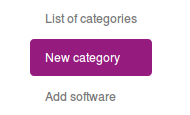
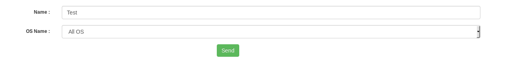
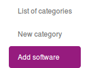
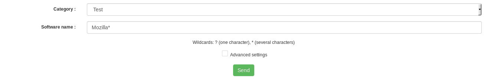
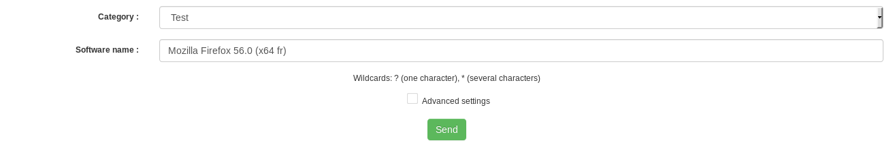
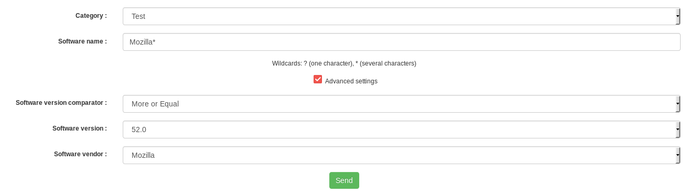
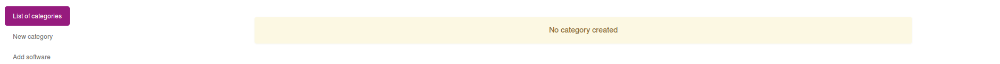
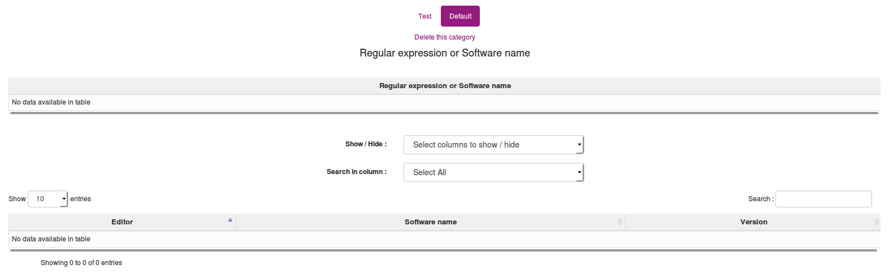
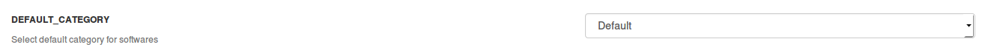

# Using software categorization

## Introduction

Softwares categorization is a new feature introduced in 2.5.

It's goal is to create and attribute category to softwares depending on regular expressions or software name.

**`Note that software categories are calculated on computer inventory. Look at your prolog frequency to see how many time it will take to have all yours computers processed.`**

## Create a software category

To create a software categories, you need to go in the ```Manage > Software category``` menu.

Click on the ```New category``` tab.



You have to fill the form to create your category, enter the name and if you want to make a sort by OS choose the name of OS (All OS, Windows, Unix or Android).



## Add regular expression / software name to a category

To add a regular expression to a category, you need to go in the ```Manage > Software category``` menu.

Click on the ```Add software``` tab.



A form will be displayed, asking for two things :
* Category
* Software name / expression



You can also add by name :



**`Note : form will autocomplete with all the software available in OCS Inventory database.`**

When you choose ```Advanced Settings``` you can add by version and publisher :



## List software categories

To list software categories, you need to go in the ```Manage > Software category``` menu.
By default, there is no category.



When categories are available they are shown as is :



## Set default category

In the case, no regular expression match, you need to be able to set a default category.

In the example, we will use a category named ```Default```.

To set a default software category, navigate to the ```Configuration > General configuration``` menu.

Click on the ```Inventory``` tab.

At the bottom of the page, you will see a configuration named ```DEFAULT_CATEGORY```.



Change this value to the desired default category.
