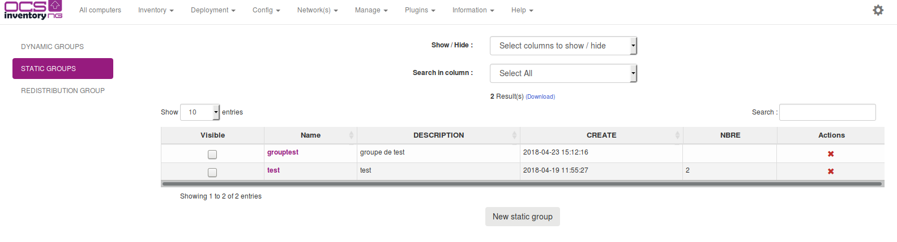
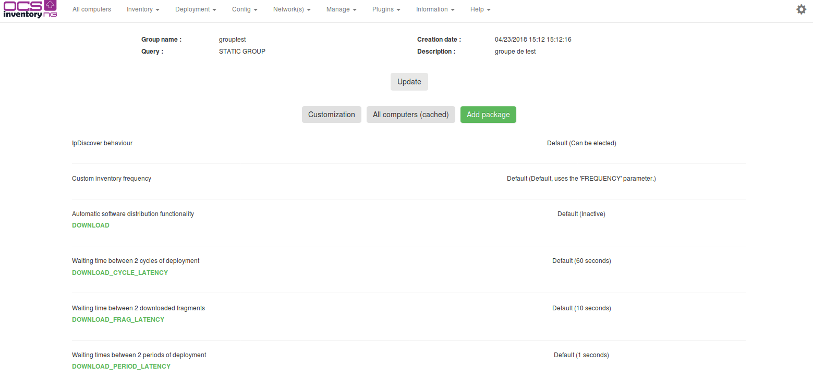
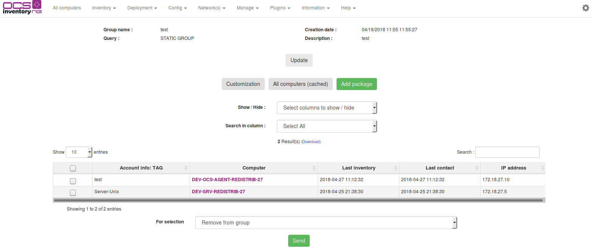
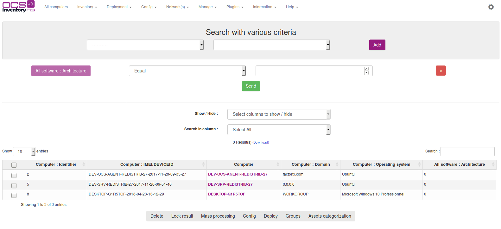
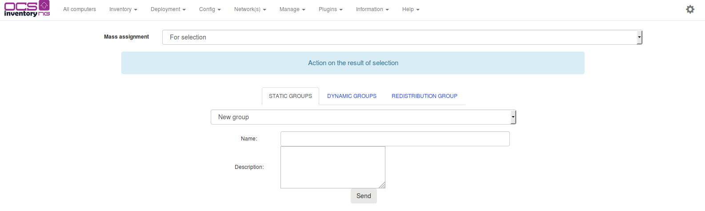
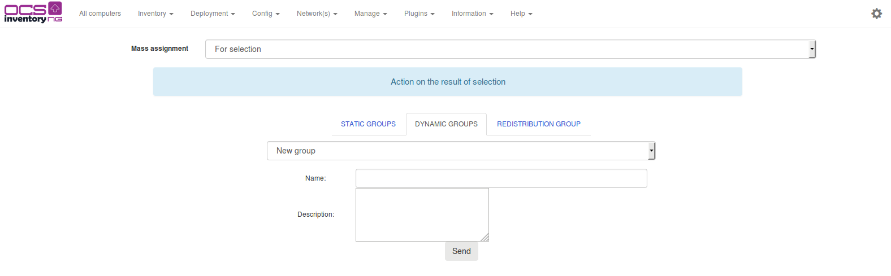
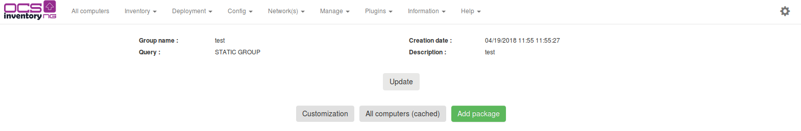
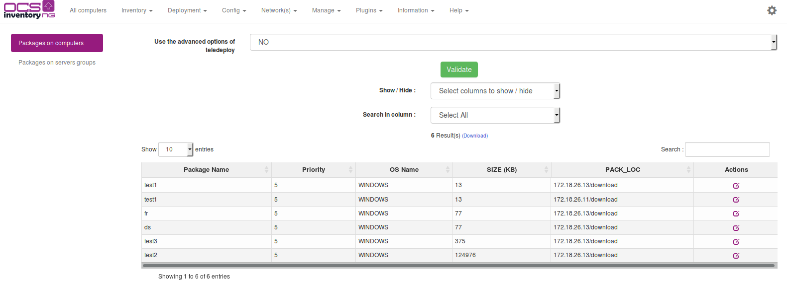
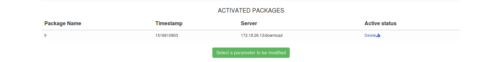

# Using computer groups

Since OCS Inventory NG 1.02, you can create computer groups. Computer groups can be used to sort your
computers, add custom parameters or deploy packages on these computers. 

Computer groups are created using
various criteria search, see [queyring inventory results](Querying-inventory-results.md) for more informations. 

You can create dynamic, static or redistribution server groups.

## Viewing groups

To views the groups you created, click on the menu Inventory toolbar and then groups.

You can see three tabs :

* Dynamic Groups tab : to view the list of dynamic groups
* Static Groups tab : to view the list of static groups
* Server Groups tab : to view the list of redistribution server groups

`Note : Restribution groups tab might be unavailable if you disabled redistributions server in the configuration`

When you click on a group name, you go to the group page. In the top,
you can see various informations about the group:

* Group name
* Creation date
* Query (the SQL query corresponding to the various criteria search parameters for dynamics groups)
* Description

You can edit the description and the group name by clicking on update.

If you click on "All computers (cached)", you can see all the computers members of the group.

## Using static groups

Static groups of computers corresponds to the result of a various criteria search. For example,
if you make a various criteria search which search all computers having Firefox, then all the
computers that meet these criteria at this moment can be added to a static group. The content
of a static group won't change until you manually add/remove computers to this group, even using
another various criteria search.

### **Create a static group**

To create a static group of computers, you have to make a various criteria search first.
Click on "Search with various criteria", select your parameters, and click on "Search" button.
In the result table, check the computers you want to add to the static group (you can click on
"the page" to select all the computers). Click on Groups at the bottom of the result table and select if you want to add what you selected (checkboxes) or for the request itself.

Now add informations in several fields:

* _Name_ : enter the name of the group here
* _Description_: add a description of the group here (optional)

Now, you can view your new static group, as described before, by clicking "Groups" and "Static groups" tab.

## Using dynamic groups

Dynamic groups of computers corresponds to the parameters you selected when you make
a various criteria search. All computers meeting these criteria will enter in the dynamic computers group.

For example, if you make a various criteria search which selects all computers having Thunderbird,
then all the computers that meet these criteria are added to the dynamic group. If you setup
Thunderbird on another computer later, this computer WILL automatically enter in the dynamic
group too when new inventory is done. Other case: if you uninstall Thunderbird from a computer,
this computer will be automatically removed from the dynamic group, also when new inventory is done.

### **Create a dynamic group**

To create a dynamic group of computers, you have to make a various criteria search first.
Click on "Search with various criteria", select your parameters, and click on "Search" button.

Now, you can view your new dynamic group, as described before, by clicking "Groups" and "Dynamics groups" tab.

## Deploying packages on groups

As you can do with computers, you can deploy packages on groups. When you affect a package on a group,
all the computers members this group will have this package affected automatically. You can affect
packages on static and dynamics groups in the same way. When you affect a package on a dynamic group,
all the computers that will be members of the dynamic group later will be affected automatically too.

**`Tip: With a such mechanism, you can even manage package dependencies.`**

For example, dynamic group of computers that have no Firefox are in the "no Firefox group".
This group is associated with deployment of "FirefoxInstall" package. Another group is defined on
the packages history: "FirefoxInstalled" group, that contains the computers having successfully
setup Firefox. On this group, there is an associated package named "FirefoxPrivateExtensionXpi".
When a new computer will check in, it will be added on the first group. As a member of this group,
it will deploy Firefox. When it will check in with Firefox installed, it will be removed from the
first group and included in the second group and will install the XPI extensions.

In the same way, you can setup computers profiles that will deploy in a given order all the software
components associated to their profile.

### **Affect package on a group**

Once you created and activated a package, you can affect this package to group. Go to the group page
and click on _Customization_. In the right corner of array, click on the link _Add Package_.

As you do for a single computer, click now on icon _ACTIONS_ in the right column and validate.

Now, your package is affected on your group and you can verify the affectation in the group custom parameters.

