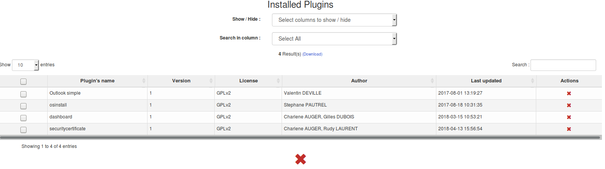

# Using the plugins feature

First step put your zip file into the ocs download folder by delfault in  /usr/share/ocsinventory-reports/ocsreports

Next step go on your web console, click on plugin then plugins manager

Select your plugins and click on Install

You can see all plugins installed under Plugins installed

