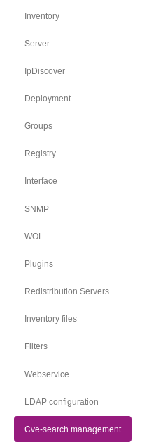
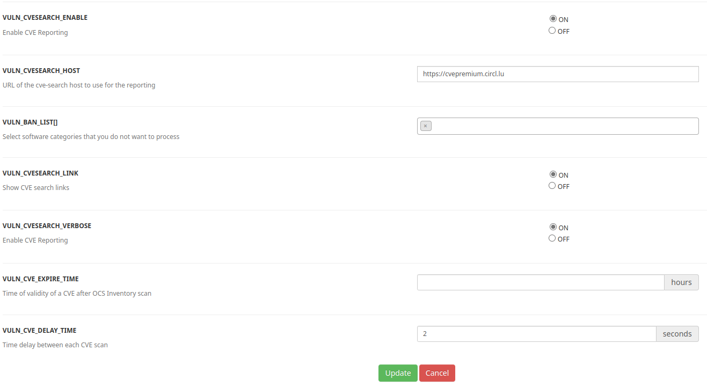
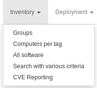
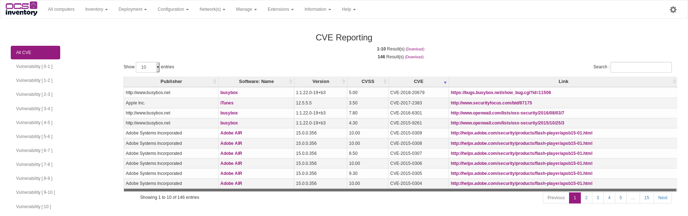

# CVE Reporting

CVE Reporting has ben added in release 2.7 of OCS Inventory. 
By enabling this feature, OCS Inventory can automatically query a 
[CVE-search](http://cve-search.github.io/cve-search/) server for 
vulnerabilities that may apply to your inventoried softwares.

**`Warning : CVE Reporting is a feature for informational purposes. OCS Inventory does not guarantee the accuracy of the informations provided.`**

## Prerequisites

In order to use CVE Reporting feature, it's recommended to install CVE-search server.

To install and configure the CVE-search server, please refer to its documentation : [CVE-search](http://cve-search.github.io/cve-search/).

## Configuring the CVE-Search management

As administrator, go to the menu ```Configuration > General configuration```, 
and click on the "CVE-search management" entry in the left navigation pane:



There are 3 settings :

* **VULN_CVESEARCH_ENABLE** : Define wether the integration is enabled or not (default : Disabled);
* **VULN_CVESEARCH_HOST** : Define the URL of the cve-search server to be queried.
* **VULN_BAN_LIST** : Select software categories that you do not want to process. When a sofwtare category has been added to VULN_BAN_LIST, All CVE for software in this category will not be processed by OCS Inventory.
* **VULN_CVESEARCH_VERBOSE** : Enable verbose mode in CVE Crontab, can help in a debugging process.
* **VULN_CVESEARCH_ALL** : CVE-Search sometimes inventory cve without any software version. If this settings is off, these non version specific CVE won't be processed by OCS.
* **VULN_CVE_EXPIRE_TIME** : Time of validity of a CVE after OCS Inventory scan. After this time, the cve entry will become invalid and will be re-processed by OCS.

`Note : You may use` [https://cve.circl.lu](https://cve.circl.lu) `if you don't host any cve-search server. However, we don't recommend using it because it can lead to network bottleneck and security breach.`



## Configure CronTab

In your server, configure a CronTab to call the file cron_cve.php in

    cd /usr/share/ocsinventory-reports/ocsreports/crontab/ && php cron_cve.php

**cron_cve.php** call cve-search server and get all CVE by software publisher, name and version.

**`Note`**`: It's recommended to execute the crontab at night. CVE cleaning is done automatically with cron_cve.php.`

## Features

When CVE-Search has been enabled and crontab cron_cve.php has been executed, click on ```Inventory > CVE Reporting ```.  



CVE Reporting displays all CVE in association with software and their versions already inventoried by OCS Inventory. Here are the different informations displayed :

+ Publisher
+ Software name
+ Targeted software version
+ CVSS (vulnerability score)
+ CVE ID
+ Link to CVE reference (only the first reference is shown)



You can display all CVE or click on left navigation pane to see CVE by vulnerability score.

When you click on the software name, you will be redirected to a search reporting based on the software name.
