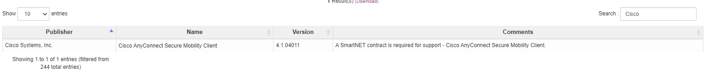
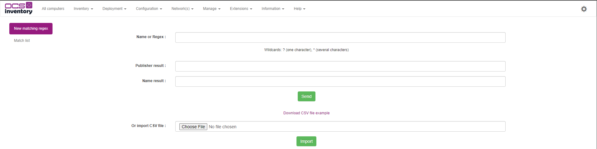
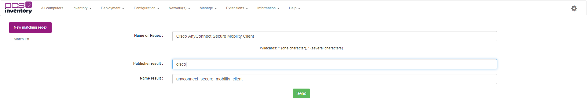
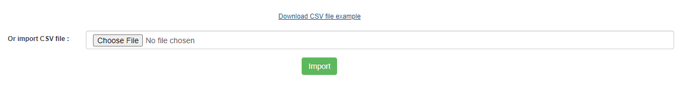

# CVE Matching expressions

## Introduction 

In some cases, softwares informations available on the operating system doesn't match the real publisher name and thus invalidate the CVE Research process.

For example, in the screen below, you will see that our Cisco software has its publisher name set as "Cisco Systems, Inc." which is not the correct name when it come to CVE Official reference.

By default, when our CVE Inventory implementation will check the product it will use "Cisco Systems, Inc." to search potential CVE and will most likely fail to find any CVE.

To make CVE more reliable OCS Inventory team created a "Matching Engine" which permit to change / replace publisher name and software name on CVE Scan.
Think of this feature as a dictionnary but only targeted for CVE Scanning.

## Create a matching regex

To create a matching regex between an existing software and a CVE, you will need to navigate to the "Manage > CVE Inventory" menu :

From this page you will be able to create a matching criteria between an inventoried software and the proper publisher name when it come to CVE References.

To take the example with Cisco Anyconnect from above, the properly name in CVE Search is : cisco as publisher and anyconnect_secure_mobility_client as name.

Link : https://cve.circl.lu/search/cisco/anyconnect_secure_mobility_client

To match the cve search reference, we need to set the following settings :

When CVE Engine will process the softwares he will replace publisher and name if there is a match in the regex and thus give us a proper result.

## Bulk import using CSV file

When you have a restricted / limited assets number, creating matching regex one by one can be the solution but in most of the case, you will need to be able to inject multiple entries at the same time.

CVE matching come with a CSV file management, you can create your matchs under Excel or LibleOffice Calc for example and inject it later in OCS.

As shown in the screen above, you can download a sample file which will help you to create valid CSV for injection.

## List matching regex

You can list created / import matching regex by clicking on "Match list" tab on the left of the page.

