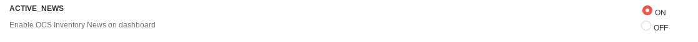
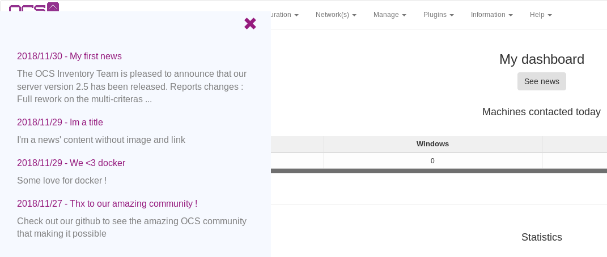
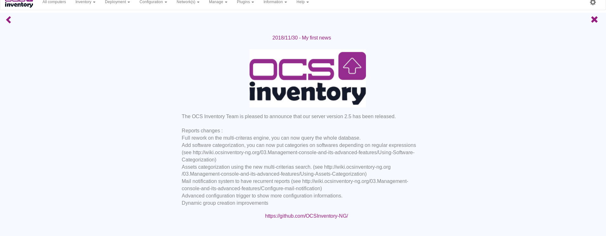

# OCS Inventory News

OCS Inventory News has been added to OCS Inventory 2.6. This feature allows you to view the latest OCS news from your dashboard.

## Enable OCS inventory News

Click on ```Configuration``` then ```General configuration``` and ```Interface```.



## Consult the news

Navigate to your dashboard and click on ```See news``` for display news menu.




Click on the news title for read it !



Click on the arrow for return to ne news menu or click on the cross for close all news menu.
