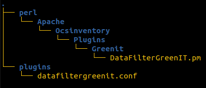

# OCS Inventory Plugin - Green IT

## Introduction

Here is the documentation to properly configure the GreenIT plugin.
Please, be careful with important notes.

## Description

Currently supported on Windows, this plugin is made to retrieve power consumption information.

> _**IMPORTANT NOTE : This plugin works with a windows service application which can be downloaded from <a href="https://github.com/Atineon/ocsinventory-service_greenit" target="_blank">here</a>**_

## Prerequisites

_The following dependency needs to be installed on your server :_

- [Perl module] DateTime.pm

## Installation

To install the plugin on your server :

- Download the plugin and extract it to the server extensions folder. _(<a href="https://wiki.ocsinventory-ng.org/10.Plugin-engine/Using-plugins-installer/#plugin-activation" target="_blank">Documentation</a>)_

- Copy the files from the `datafilter` folder into your server folder (`/etc/ocsinventory-server`):

  

- Set up the crontab :
  - Use the command `$ crontab -e` in the server terminal
  - Add these two crontabs :
    - `0 5 * * 1 php /usr/share/ocsinventory-reports/ocsreports/extensions/greenit/script/cron_stats.php --mode full`
    - `0 * * * * php /usr/share/ocsinventory-reports/ocsreports/extensions/greenit/script/cron_stats.php --mode delta`

> _NOTE: These two crontabs are the default ones. You are allowed to change the execution time. (By default, every Monday at 5 a.m for full mode and every hour for delta mode)_

Execution modes:

- `full`: This mode calculates the power consumption statistics for all computers in the database using the data gathered by the plugin. Please note that executing this mode may take a long time, particularly if there are a large number of computers in the database.

- `delta`: This mode calculates the power consumption statistics for the current day only. Since it processes only the data of the current day, this mode is significantly faster than the full mode. As a result, it can be executed more frequently to update the statistics with the latest data.

## Results

The GreenIT plugin operates by utilizing data collected by the service application running on the agent. This data is sent to the server as plugin data, which is then used to compile statistics about power consumption.

These statistics are presented in a dashboard format, which can be accessed by navigating to `Inventory` > `GreenIT manager`.

Configuration options for this dashboard can be found under `Manage` > `GreenIT`.

Data for the dashboard is populated by the two cron jobs configured during the installation process.

If these cron jobs are not properly set up, the dashboard will not display any data. In such a case, individual consumption data will still be available when examining a specific computer's details under the `Miscellaneous` > `Power Consumption` table.
