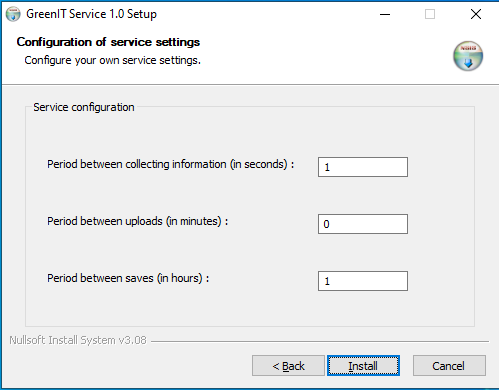

# OCS Inventory Service - Green IT

## Introduction

Here is the documentation to properly configure the GreenIT service.

> _IMPORTANT NOTE : Please, be careful with important notes._

## Description

Currently supported on Windows, this service is made to gather power consumption information.

> _**IMPORTANT NOTE : This service is required if you use GreenIT Plugin downloadable <a href="https://github.com/Atineon/ocsinventory-plugin_greenit">here</a>**_

## Prerequisites

> _NOTE : Every agents which have the service installed can return GreenIT data._

- Windows 10

> _**IMPORTANT NOTE : You can install it on a virtual machine but it will not count in the comsumption calculation !**_

## Installation

To install the service on your agents :

- Download the service <a href="https://github.com/Atineon/ocsinventory-service_greenit/releases/">here</a> to get the executable and start it.

- Go to the config page :

  

- Configuration :

  - The period between collecting information is a time in seconds that will allow the service to start colecting information.

    > _Example : if you put it to 5, it will collect information every 5 seconds._

  - The period between upload is a time in minutes that will allow the service to write information collected into the data file _(C:\\ProgramData\GreenIT\data.json)_

    > _Example : if you put it to 5, it will write information into data file every 5 minutes.
    > **If you put it to 0, it will write information in data file each data collect.**_

    > _NOTE : "C:\\ProgramData" is an unvisible folder._

  - The period between saves is a time in hours that will allow the service to create a ".bak" file next to data file to don't lose your last data.

    > _Example : if you put it to 5, it will create/update the backup file every 5 hours._

- Click on install and don't forget to check "Run GreenIT Service 1.0" at the end.

> _IMPORTANT NOTE : It is important to check "Run GreenIT Service 1.0" to install the software as a Windows service !_

- If you haven't checked the box, you can install it manually after the install of the software :
  - Open a terminal and go in the software installation folder path.
  - Run the command `.\GreenIT.exe install` and wait until the plugin is installed.

And yes, that's all :-)
