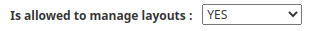

# Manage layout

Since 2.10, it is possible to create custom table layout in the console interface. This feature allows you to save the displayed columns of the tables and to re-display them quickly.

## How to create a layout

On any page with a table (except the multi-criteria page), select the columns you want to save using the `Show/Hide` dropdown and click on the button `Add a new layout`.

Set the `layout name`, the `layout description` and the `visibility scope` (only me, my group ou all users) and click on `OK`.

The `visibility scope` option is available only if `Is allowed to manage layouts` is enabled on profile rights. By default, the visibility scope will be limited to the user.

## How to use layout

Go back to the page(s) where you saved layouts and use the `Available layouts` dropdown to change the column layouts.

## How to manage layout

Go to `Manage > Layouts`. You can edit or delete the layout from this page. 

