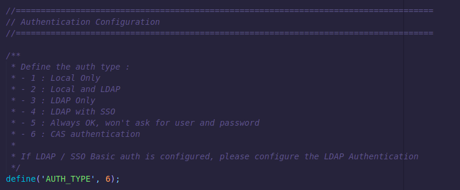
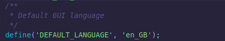

# Manage authentification with CAS

It is possible to delegate authentication of the administration console of OCS Inventory. 
So we will see how to delegate the connection to the OCSInventory NG GUI to a CAS server.

**`Note: We assume that you have a working and fully configured CAS server`**

## Prerequisites

In the first place, you need to enable the advanced configuration :
* Navigate to ```Configuration > General configuration```
* Click on the  ```Server``` tab
* Set  ```ADVANCE_CONFIGURATION``` to ON
* Click on ```Update```

Our only prerequisites for OCS is the **jasig/phpcas** extension already installed by composer.

## Configure LDAP options in web gui

Here is a summary of the available web configuration : 

| Configuration item | Description | Example |
|---|---|---|
| **CAS_PORT** | CAS Server port  | 443 |
| **CAS_URI**  | CAS URI | /cas   |
| **CAS_HOST**  | CAS Server host | authentication.org  |
| **CAS_DEFAULT_ROLE**  | Default role of CAS based user, assigned at first connection |   |


## Configure AUTH Method from var.php file 

After configuring the CAS connection from web console, you will need to edit the ```var.php``` file located in ```/usr/share/ocsinventory-reports/ocsreports``` folder (by default).

In this file you will find a section named : ```Authentication Configuration``` (see screenshot below)



To change the way OCS manage authentication, you will have to edit the **AUTH_TYPE** value :
* 1 => Local database only
* 2 => Local database and LDAP Connection
* 3 => LDAP Only (Keep in mind that if the LDAP Server is down, AUTH will be also down)
* 4 => LDAP with SSO Capabilities 
* 5 => Always_OK not recommended, will log without checking the password
* 6 => CAS authentication


Because the usual login screen won't be shown, users will not be able to change their language preferences. This can be set as a global change in the same file : 

