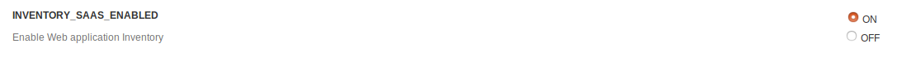
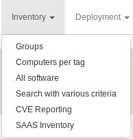
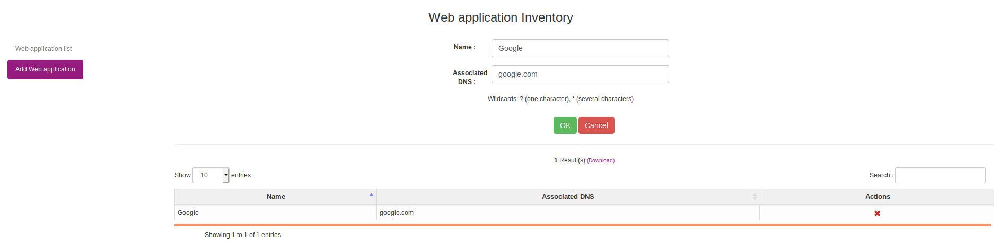
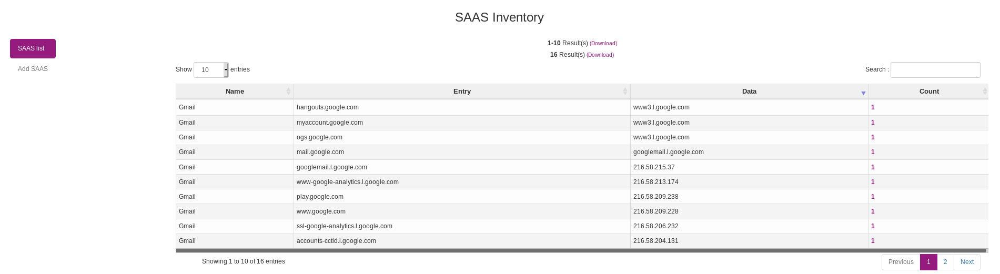
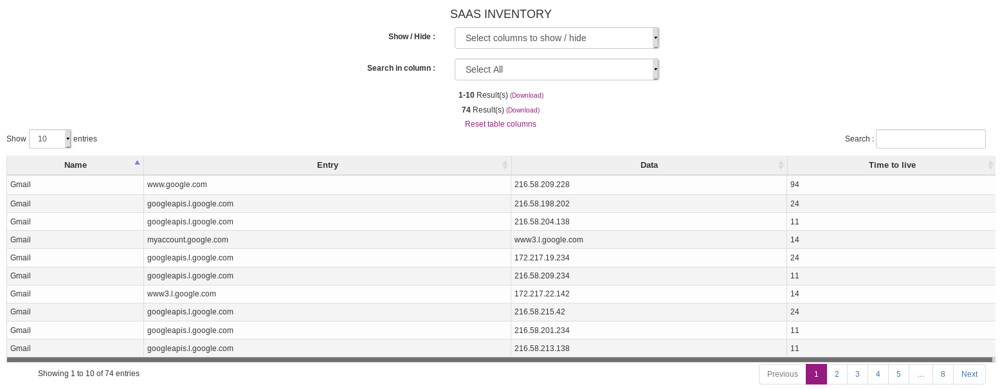

# Managing SAAS Inventory

## Introduction

SAAS (Software as a Service) Inventory feature has been added in 2.7 release.

At the moment, this feature is only available for windows agent. Its goal is to inventory web applications used on a computer or by a user. OCSInventory will look at the DNS cache of the windows machine to see which web site has been reached in a given amount of time. 

This inventory feature is installed as a plugin on the Windows Agent (by default in "C:\Programs files\OCS Inventory Agent\Plugins") and is named "Saas.ps1". Thus, removing this file will prevent SAAS inventory from working.

SAAS Inventory is working only with agent 2.6.0.0 and newer.

## Enable SAAS Inventory 

To activate SAAS Inventory, go to ```Configuration > General configuration```, and click on _Inventory_ entry in left navigation pane. At the bottom of the page click on _ON_ for **INVENTORY_SAAS_ENABLED**.



## Register a domain to be inventoried

Since we are using the DNS cache of the windows machine, all the DNS entries are retrieved by the agent. To solve this problem, we implemented a whitelist which allow to filter the domain names to inventory.

To add a new domain go to ```Inventory > SAAS Inventory``` and click on _Add SAAS_ in left menu.



In order, enter the name that corresponds to the SAAS you want to register and its associated domain. After, click on _OK_.   




## Show inventory results

In the case SAAS Inventory is enabled and configured, you will have to wait for the agent to send its inventory or trigger one manually.

### On a global reporting

To display the inventoried data, go to ```Inventory > SAAS Inventory``` and click on _SAAS list_ in left menu.

You will find below the displayed informations :

+ Name : SAAS name of the matching entry.
+ Entry : Associated domain.
+ Data : IP address associated to the domain.
+ Count : Number of machine matching this entry.



When you click on the count number, you will be redirected to a search reporting based on the domain name.

### On computer details

Go to computer details page and click on _Software_ in left navigation pane. Below software table, the SAAS Inventory table list all matching entries for this machine.


