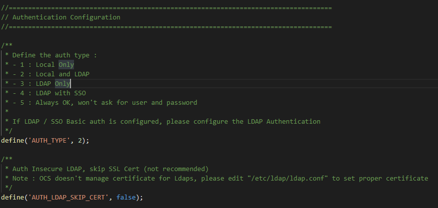

# Manage authentification with LDAP

It is possible to delegate authentication of the administration console of OCS Inventory. 
So we will see how to delegate the connection to the OCSInventory NG GUI to LDAP.

**`Note: We assume that you have a working and fully configured LDAP server`**

## Prerequisites

Keep in mind that we won't explain how to setup an LDAP Server and we won't explain how to debug LDAP connexion. We think that this part is more related to the LDAP Server itself than OCS.

In the first place, you need to enable the advanced configuration :
* Navigate to ```Configuration > General configuration```
* Click on the  ```Server``` tab
* Set  ```ADVANCE_CONFIGURATION``` to ON
* Click on ```Update```

Our only PHP prerequisites for OCS is the **php-ldap** extension.

In the case you want to setup Ldaps connection, you will need to configure the following file to setup the used certificate :
* /etc/ldap/ldap.conf

## Configure LDAP options in web gui

Here is a summary of the available web configuration : 

| Configuration item | Description | Example |
|---|---|---|
| **CONEX_LDAP_SERVEUR** | LDAP Server URL  | ldap://my.awesome.ldap for unsecured connection or ldaps://my.awesome.ldap for Ldaps |
| **CONEX_ROOT_DN**  | User used to login and synchronize | CN=Ocsuser,CN=Users,DC=ocs,DC=loc  |
| **CONEX_ROOT_PW**  | Password of the DN User  | N/A  |
| **CONEX_LDAP_PORT**  | LDAP Server PORT | 389 for unsecured and 636 for ldaps (by default)   |
| **CONEX_DN_BASE_LDAP**  | Base DN where Users which are able to login are located | CN=Users,DC=ocs,DC=loc  |
| **CONEX_LOGIN_FIELD**  | The attribute with which a user sign in | sAMAccountName or uid |
| **CONEX_LDAP_PROTOCOL_VERSION**  | Protocol version number | 3 |
| **CONEX_LDAP_CHECK_DEFAULT_ROLE**  | Default role of LDAP based user |   |
| **CONEX_LDAP_NB_FILTERS**  | Default number of LDAP filters |  2 |
| **CONEX_LDAP_FILTER1**  | First LDAP filter that will be used for evaluating the security level of a LDAP user (blank for none) | &(memberOf=CN=MyGroup,CN=Users,DC=MyDomain,DC=dc) |
| **CONEX_LDAP_FILTER1_ROLE**  | Role of the user that match FILTER1  |   |
| **CONEX_LDAP_FILTER2**  | Second LDAP filter that will be used for evaluating the security level of a LDAP user (blank for none) | &(memberOf:1.2.840.113556.1.4.1941:=CN=MyParentGroup,CN=Users,DC=MyDomain,DC=dc) |
| **CONEX_LDAP_FILTER2_ROLE**  | Role of the user that match FILTER2  |   |

### How do filters work ?

The fields CONEX_LDAP_FILTER correspond to the first part of the LDAP filter request. It mean OCS is going to match the user using the filter and the login field set in the config variable CONEX_LOGIN_FIELD. 

The number of filters can be adjusted with CONEX_LDAP_NB_FILTERS (minimum of 1, default of 2 and maximun equals number of roles).

Below, the complete query for 2 filters :

    (CONEX_LDAP_FILTER1(CONEX_LOGIN_FIELD=user.login))
    or
    (CONEX_LDAP_FILTER2(CONEX_LOGIN_FIELD=user.login))

Example :

    (&(memberOf=CN=MyGroup,CN=Users,DC=MyDomain,DC=dc)(sAMAccountName=user.login))

To explain this example, the LDAP is going to look for a user who belongs to the group MyGroup `AND` who has user.login as a login identifier.

In this example, the CONEX_LDAP_FILTER1 is equal to `&(memberOf=CN=MyGroup,CN=Users,DC=MyDomain,DC=dc)`

It exits two operators : `&` for `AND` and `|` for `OR`.

So we can use a more intricate filter like :

    (&(|(memberOf=CN=MyGroup,CN=Users,DC=MyDomain,DC=dc)(memberOf=CN=MyGroup2,CN=Users,DC=MyDomain,DC=dc))(sAMAccountName=user.login))

To explain this example, the LDAP is going to look for a user who belongs to the group MyGroup `OR` who belongs to the group MyGroup2 `AND` who has user.login as a login identifier.

In that case the CONEX_LDAP_FILTER1 is equal to `&(|(memberOf=CN=MyGroup,CN=Users,DC=MyDomain,DC=dc)(memberOf=CN=MyGroup2,CN=Users,DC=MyDomain,DC=dc))`

## Configure AUTH Method from var.php file 

After configuring the LDAP connection from web console, you will need to edit the ```var.php``` file located in ```/usr/share/ocsinventory-reports/ocsreports``` folder (by default).

In this file you will find a section named : ```Authentication Configuration``` (see screenshot below)



To change the way OCS manage authentication, you will have to edit the **AUTH_TYPE** value :
* 1 => Local database only
* 2 => Local database and LDAP Connection
* 3 => LDAP Only (Keep in mind that if the LDAP Server is down, AUTH will be also down)
* 4 => LDAP with SSO Capabilities 
* 5 => Always_OK not recommended, will log without checking the password

The second parameter is **AUTH_LDAP_SKIP_CERT**, this option is only used when performing an LDAPS connection, it will skip certificate checking. Of course we don't recommend using it and is only present for debug, tests purposes.

## Configure SSO Authentication 

To configure SSO Authentication, you will need to :
* LDAP Configuration setup and working on OCS
* AUTH_TYPE value in var.php set to **4**
* Apache / Kerberos configuration to pass ticket to OCS Webconsole

**`Note: We won't provide configuration for Kerberos and Apache since its not related to OCS Inventory`**


