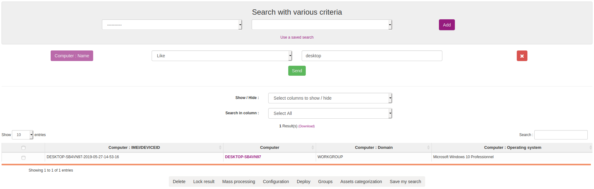
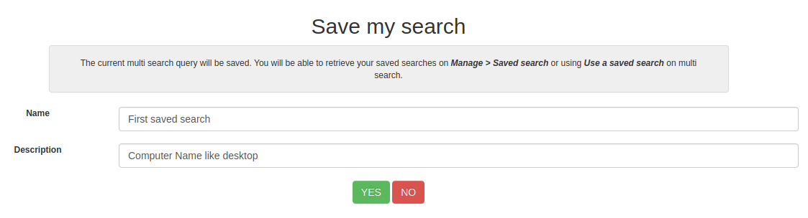
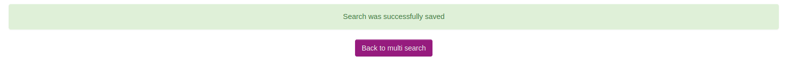
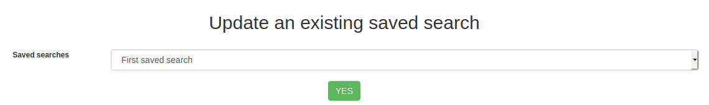
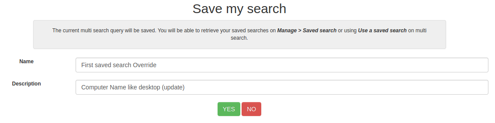
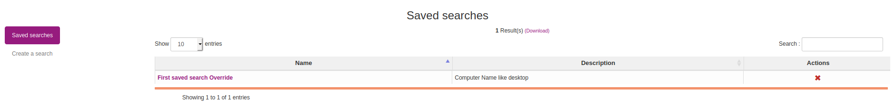

# Using and managing saved searches

Saved searches is a new feature introduced in version 2.7.
It's goal is to save a current multicriteria search to permit future re-use.

## Create saved search

First step is to create a multicirteria search. If you don't know how to create a multicriteria search please read the documentation [Querying inventory results](04.Management-console-and-its-advanced-features/Querying-inventory-results.md).

When your search is created, click on `Save my search` button at the bottom of the page.

Set the name and the description of your search and click on `YES`. A success message appears, click on `Back to multi search` to return to your search.

## Use saved searches

Two method exist to use saved searches. You can access your saved searches from the multi search page by cliking on `Use a saved search`.

You can also list all your saved searches from `Manage > Saved searches`.

When you are on the Saved searches page, click on the search name you want to use.

You will be redirected to the multicriteria page with all parameters set-up.

## Update saved search

To update an existing saved search, create a new search or use a saved search on multicriteria. Click on `Save my search` button at the bottom of the page.

Select the saved search that you want to update and click on `YES`.

Modify the name or the description or both and click on `YES`.

Search parameters will be updated.

