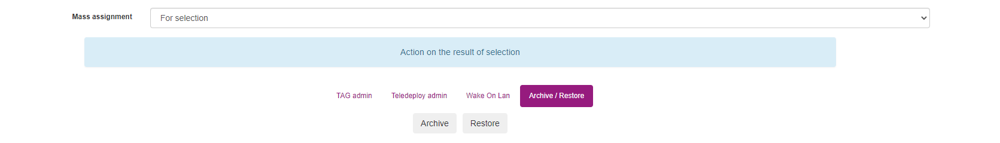

# Using computers archive capabilities

## Introduction

Archiving capabilities has been implemented during the nightlies from July and in the 2.8 release.
Its goal is to keep old machines available for consultation but without having them in the basics reporting of the web console

## Visualize computers

To see Active and Archived computers you will need to go in the "All Computers" menu.

You will find three tabs at the top of the page :
* By default, OCS will redirect you in the "Active computers" tab which is the list of all non-archived computers.
* By clicking on "Archived computers", you will be able to see computer in the "archived" state.
* You can also click on "All computers" to see all computers without taking in account their status.

## Archive computers

To archive one computer, you need to get in the "All computers" menu in the "Active computers" tab.

In the "Actions" columns, you will be able on the purple arrow icon to set one specific computer in archive mode.

A validation pop-up will appear and ask for confirmation.
After the validation, your computer will appear in the "Archived computers" tab

## Remove archive status

To remove one computer from archive, you need to get in the "All computers" menu in the "Archived computers" tab.

In the "Actions" columns, you will be able on the purple arrow icon to remove one specific computer in archive mode.

A validation pop-up will appear and ask for confirmation.
After the validation, your computer will appear in the "Active computers" tab

## Bulk archiving / de-archiving

You can set a machine group in archive (or remove them from archive status) using the multi search and from the all computers page by selecting them and clicking on "Mass processing"

From the mass processing page, you will be able to navigate to the "Archive / Restore" tab.

You will have two buttons : 
* Archive => Will set selected machines to "archived" status
* Restore => Remove them from archived status

