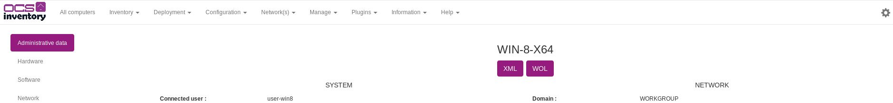
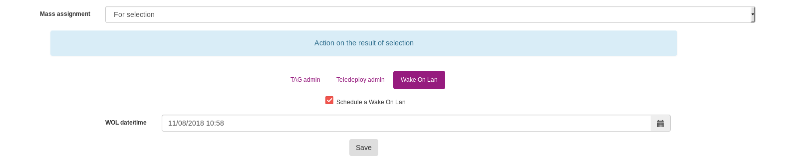

# Using Wake On Lan

## Introduction

The Wake On Lan feature allows you to "wake up" a remote machine.

## WOL on only one machine

To trigger a Wake On Lan on one machine, navigate to the ```Computer details``` page of the machine when you want to wake up and click on the ```WOL``` button.



## WOL multiple machines immediatly

To trigger a Wake On Lan on multiple machines, navigate to the ```All computers``` page. Check machine you need to wake up and click on ```Mass Processing``` button. Navigate to the ```Wake On Lan``` tab and click on ```Send```.


**`Note : you can perform the same operation from a multi-criteria search`**

## Schedule wol

To schedule WOL, navigate to the ```All computers``` page. Check machine you need to wake up and click on ```Mass Processing``` button. Navigate to the ```Wake On Lan``` tab and check ```Schedule a Wake On Lan```.

Click on ```Save``` when you scheduled your WOL.




**`Note : you can perform the same operation from a multi-criteria search`**

## Configure CronTab

In command line, configure a CronTab to call the file cron_wol.php in

    ocsreports/crontab/cron_wol.php

**`Note: It's recommended to set the frequency to every minute`**
