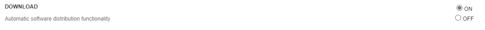
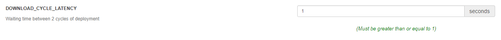
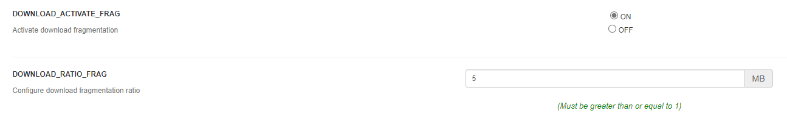
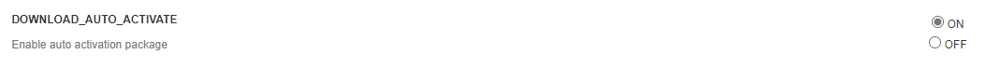

# Deployment configuration

In this chapter, we will get through how to configure properly the OCS Inventory deployment feature. The deployment configuration is available on `Configuration > General configuration > Deployment`.

In the first place, to use OCS Inventory deployment feature is to activate it. Set the `DOWNLOAD` parameter to `ON`.

`Note : package creation is still available even if the DOWNLOAD parameter is disabled. However, the package will not be deployed on the machines.`

When an Agent receives a deployment package, the download start by a "download period". A period is composed of cycles defined by the configuration `DOWNLOAD_PERIOD_LENGTH`. By default, a period contains 10 cycles.

At each cycle, the agent computes *cycle’s number modulo package priority*. If this result is equal to 0, it starts to download a fragment file of your package. **The agent downloads ONLY ONE fragment of a same package per cycle.** The agent will downloads the others fragments of your package each time the result of *cycle’s number modulo package priority* computation will be 0.

After each fragment, the agent will wait `DOWNLOAD_FRAG_LATENCY`. Configuration option set to 10
seconds by default.

When all fragments of a cycle are downloaded, the agent will wait `DOWNLOAD_CYCLE_LATENCY` (configuration option set to 60 seconds by default) before beginning a new cycle and increment cycle number.

`Note: You may use these three settings to customize your network bandwidth usage. By increasing latency options, you will increase time to download fragments and reduce network use average.`

The `DOWNLOAD_TIMEOUT` parameter correspond to the validity in days of a package on an agent. If the time used to deploy a package is over `DOWNLOAD_TIMEOUT` days, package will be cleaned and `ERR_TIMEOUT` will be sent to OCS Inventory server.

The `DOWNLOAD_PERIOD_LENGTH` parameter correspond to the number of cycles per period.

By increasing `DOWNLOAD_PERIOD_LENGTH` option, you will delay new download of failed fragments, but also, by decreasing `DOWNLOAD_PERIOD_LENGTH` to a value lower than 10, you can stop downloading package with priority level higher than this value.

The `DOWNLOAD_URI_FRAG` parameter is to specify the address where deployment packages fragments are located to activate them.

The `DOWNLOAD_URI_INFO` parameter is to specify the address where INFO files of deployment packages are located to activate them.

**The three following parameters are only available since OCS Inventory 2.9.** 

By default, since OCS Inventory 2.9, the deployment feature builds the package in one fragment.

If you want to cut the package in more fragments, set `DOWNLOAD_ACTIVATE_FRAG` at `ON` then configure the `DOWNLOAD_RATIO_FRAG`. 

The fragment number is calculated as follows : 

If your `DOWNLOAD_RATIO_FRAG` is equal to 5MB and your package size is equal to 20MB, the package will be automatically cut in 4 fragments during the package creation.

To activate a package directly after its creation without manually action, set `DOWNLOAD_AUTO_ACTIVATE` at `ON`.

The auto activate package uses the `DOWNLOAD_URI_FRAG` and `DOWNLOAD_URI_INFO` values.

`Notice : don't forget to click on UPDATE button at the bottom page after any configuration modification.`