# Deploying packages or executing commands on client hosts

OCS Inventory NG includes a package deployment feature for client computers. From the central
management server, you can upload packages which will be downloaded through HTTP/HTTPS and executed
by the agent on client computer.

**`Note: This feature has been tested with OCS Inventory NG Agent for Windows service only.
As software installation requires Administrator privileges, agent launched through a login
script or shortcut in start menu under user account may not be able to launch software installation.
Also, background download of package may take a long time, and may block login script.
So, we do not recommend using the package deployment feature when using the login script inventory.`**

## How does it work?

A package has 4 main components:

* A priority
* An action
* A ZIP or TAR.GZ file including how many files and directories you want
* A command to launch

`Note : in the case the action is set to "execute" you don't need to upload a file.`

**There are 11 levels of priority**, ranging from level **0** to 10. Level 0 is the **highest** priority and
level 10 the lowest. Package of priority level 0 will be deployed before package of priority 1.
Package of priority level 1 will be deployed before package of priority 2…

**Action is associated with file to deploy and command to launch**.
This may be one of the following three commands:

* **Action Launch**: to deploy a ZIP or TAR.GZ file and launch, with or without parameters, an executable
file **included** in ZIP or TAR.GZ file. The ZIP or TAR.GZ file will be uncompressed into a temporary directory,
and the associated command (name of executable file without path!) will be launched into this temporary
directory.**This action allows retrieving result code of the command launched.**

* **Action Execute**: to optionaly deploy a ZIP or TAR.GZ file and launch, with or without parameters, an executable
file **included or not** in the optional ZIP or TAR.GZ file. If the executable is not included in the
ZIP or TAR.GZ file, it must be already installed on the client computers. Typically, it may be a Windows 
standard command like Windows Installer call (ie: msiexec), RPM, DPKG or TAR.GZ command on Linux. 
The ZIP or TAR.GZ file will be uncompressed into a temporary directory, and associated command
(name of executable file with path or parameters if needed) will be launched into this temporary directory.
**This action does not allow retrieving the result code of the command launched.** However, this action allows
you to runn a command on client computers, without deploying any file. For example, you can use it
to run specific operating system configuration command.

* **Action Store**: to deploy a ZIP or TAR.GZ file and only store his content on a folder on the 
client computers. **There is no command associated with this action, only a path to specify where
to store the extracted files.**

**`Note: All packages you want want to deploy must be compressed with ZIP for Windows Agents and tar
gzipped for Linux computers.`**

If you want to build your own installer, you may want to look at NullSoft Installer System
([http://nsis.sourceforge.net](http://nsis.sourceforge.net/)) or Inno Setup
([http://www.jrsoftware.org](http://www.jrsoftware.org/)). These tools are GPL
installer for Windows able to create one file self extracting installer.

For example, this feature allows you to create a ZIP package including Media Player Classic executable,
a sub directory including some MP3 files and a play list for Media Player Classic referencing these MP3
into sub directory. Associated command will be a call to Media Player Classic with command line switch
to launch play list. Once this package will be downloaded on Windows clients, users will have Media Player
Classic launched and playing MP3 from play list. Beautiful, isn’t it ;-)

**You create your deployment package through the administration console**. It is automatically described by:

* A reference in the database, used by Communication server to ask agent to download the package.
* An information file, named “info”. It is an XML file describing the package and action agent
will have to launch,
* 0 or more data fragment files. The file you upload (if there is one) will be split into small
parts to allow agents downloading part by part, and then easily resuming a failed download.
If download of a fragment fails, only this fragment will be downloaded again, instead of the entire
package. You will be able to choose fragment size according to your network capabilities.

**`Note: As you will upload your package through Administration console, you may configure PHP
and Apache to allow uploading large files. See § 11.2.4 Uploads size for package deployment to know
how to configure this.`**

**Once your package is built, you must activate it**. Activation specifies which server(s)
the package fragments will be downloaded from. You need to specify an https (ssl) URL for
downloading the INFO file, and a HTTP URL for downloading the fragments.

**Finally, you must select which computer(s) you will deploy the package to.**

When agent send an inventory to Communication server, Communication server tell the agent if he has
one or more packages to deploy, with the level of priority of each package, and where it can find
information files.

Agent then begins a download period. A period is composed of cycles, defined by configuration option
“DOWNLOAD_PERIOD_LENGTH”. By default, a period contains 10 cycles.

At each cycle, the agent computes “cycle’s number modulo package priority”. If it equals to 0,
it downloads a fragment file of your package. The agent downloads ONLY ONE fragment of a same package
per cycle. The agent will downloads the others fragments of your package each time the result of
"cycle’s number modulo package priority” computation will be 0.

After each fragment, the agent will wait “DOWNLOAD_FRAG_LATENCY” (configuration option set to 10
seconds by default).

When all fragments of a cycle are downloaded, the agent will wait “DOWNLOAD_CYCLE_LATENCY”
(configuration option set to 60 seconds by default) before beginning a new cycle and increment
cycle number.

For example, if you are deploying one package with a priority of 5, the agent would pause for
"DOWNLOAD_CYCLE_LATENCY" for cycles 1-4, and then start downloading a fragment of your package when
it starts cycle 5.

When all fragments of a package are downloaded, the agent will launch package command the next time
the "cycle’s number modulo package priority” computation will be 0.

When all cycles of a period have been processed, it waits “DOWNLOAD_PERIOD_LATENCY” (configuration
option set to 0 seconds by default).

If all packages have been successfully downloaded and installed, it stops. If not, it begins a new
period of cycles.

**`Warning: Priority level 0 is a special level. All packages with priority 0 will be downloaded
before all others packages with greater priority at the beginning of each cycle. If download fails,
agent will retry to download failed packages of priority 0, without checking others package.
So it can completely stop deployments.`**

**`USE PRIORITY LEVEL 0 WITH CARE!`**

You may use these settings to customize your network bandwidth usage. By increasing latency options,
you will increase time to download fragments and reduce network use average.

By increasing period length option, you will delay new download of failed fragments, but also,
by decreasing period length to a value lower than 10, you can stop downloading package with priority level
higher than this value.

### **Affect packages with user privilege**

User can't create packages themself. They need to use static group (and visible) created by admin users.

* The admin create a static group and ckeck the “Visible” checkbox
* The admin affects some packages to this static group (e.g: Firefox)
* The user can put its machines in the created group

## Simplified diagram

## Detailed diagram

## Requirements

**Deployement server storing information files must have SSL enabled**, as downloading the deployement
information file is very critical. This information file contains description of package and command
to launch. So, if somebody can usurp your deployement server, he may launch any command he wants on
your computers. That’s why deployment server must use SSL to allow agents authenticating the server
and ensuring this is the real deployment server.

**Agent must have a certificate to validate deployment server authentication.** This certificate must
be stored in a file named **cacert.pem** in OCS Inventory NG agent’s folder under Windows, and in
directory _/etc/ocsinventory-client_ under Linux.

Under Windows, you can use OCS Inventory NG Packager (see Uploading Agent for deployement through
launcher OcsLogon.exe.) to create an agent installer which include certificate, or you can use the
following sample login script to copy certificate file in agent’s folder (we assume that agent is
installed under _C:\Program Files\OCS Inventory Agent_ and certificate file is available on a share
_MYSHARE_ on server _MYSERVER_).

    @echo off
    REM Check if CA file exists
    if exist “C:\Program Files\OCS Inventory Agent\cacert.pem” goto CA_END
    REM CA file does not exists, install it
    Copy \\MYSERVER\MYSHARE\cacert.pem “C:\Program Files\OCS Inventory Agent\cacert.pem”
    :CA_END

**If you have a Public Key Infrastructure**, you must create a valid server certificate for
your deployment server and copy your Authority certificate file into file **cacert.pem**.

**If you do not have a Public Key Infrastructure**, you can use a self signed certificate
for your deployement server, and copy server certificate into file **cacert.pem**.

Refer to § 8.8
[Using SSL certificates in Package deployment](Deploying-packages-or-executing-commands-on-client-hosts.md#using-ssl-certificates-in-package-deployment)
for more informations.

## Creating/Build the package

**`Warning: You can ONLY upload .zip or .tar.gz files.`**

First of all, you must build your package.

Point your mouse on **Deployment** menu and select **Build**.

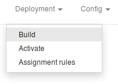

Enter a name for your package.

Select the operating system for this package. You can choose between Windows and Linux.

Select the download protocol for this package. At this time, only HTTP protocol is available.

Select the priority for this package. Package with lesser priority will be downloaded before package 
of greater priority, except if download fails (cf § 8.7 Deployment statistics and success validation.).

You can choose to **warn user** that something is being launched on his computer.
Set Warn user dropdown list to **YES**, fill in the text to display to the user, how long to display it
before automaticaly launching the installation (set 0 to wait indefinitely), and if user can cancel the
deployment or delay it to the next inventory.

You may also specify if package deployment needs an user interaction by setting dropdown list 
**Installation completion need user action** to **YES**, for example, if setup needs that user
fill in a informations on a dialog to terminate. Pay attention that this 

**`Note: You can use HTML tags (eg: " ", "<b></b>") to format the text you show to your users.`**

Last, you can select your action in **Action** dropdown list. Here are some samples describing what
kind of package you can build.

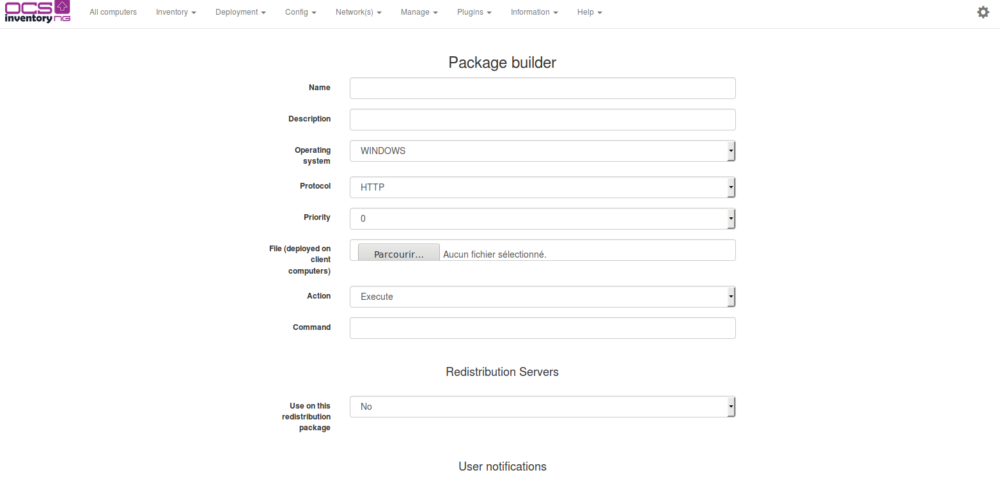

### **Deploying package through the “Launch” command**

The package you want to deploy has one or more files, **with at least an executable file for launching
the package's installation**.

Compress the files using ZIP tool if your package addresses Windows computers, or tar and gzip if it
addresses Linux computers.

Choose action **Launch** and click the **Browse** button to select your ZIP or TAR.GZ file.

In field **Command**, just fill in the name of the executable file without path, but with, optionally,
parameters. It’s this command that will be launched on client computers once the package is
downloaded and uncompressed in a temporary directory.

In the following example, we deploy a new release of OCS Inventory NG Agent for Windows, using silent
installation with a .bat file:

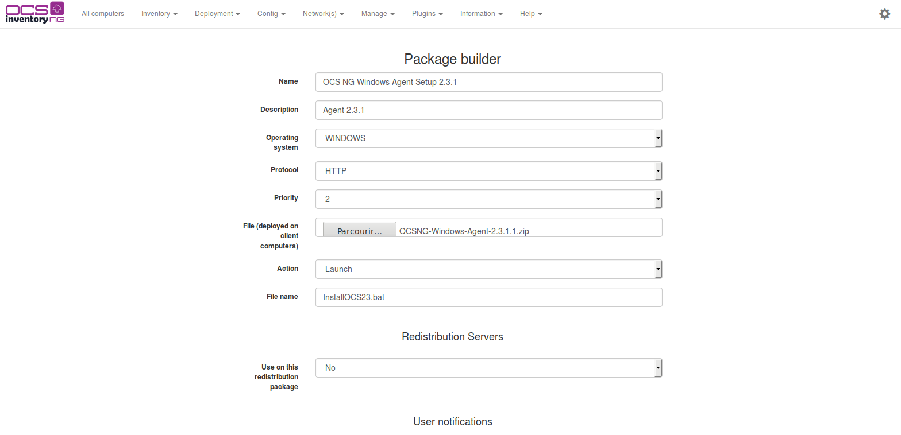

Click **[ Send ]** button to upload the package to the Administration console.

### **Deploying package through the “Execute” command**

You want to execute a program that's already on the target computers.

The Package you want to deploy has optionaly one or more files, with optionally an executable file for
launching package setup. 

Compress the files using ZIP tool if your package addresses Windows computers, or tar and gzip if it
addresses Linux computers.

Choose action **Execute** and click **Browse** button to select your ZIP or TAR.GZ file, or leave the
**File** field empty if you just want to execute a command on the target computers.

In field **Command**, just fill in the path of the executable file to launch with parameters
(full path is not required as application executable is listed on system search path, or is included
in package). It’s this command that will be launched on client computer once the package is downloaded.

**`Note: Environnement variables are expanded in “Command”. It enables you to use things such
as %SystemDrive%, %SystemRoot%, %windir%, %ProgramFiles%, %CommonProgramFiles% ...etc.`**

In the following example, we deploy a software using silent Windows Installer installation. Our ZIP
file only includes the file “software.msi” and the “Command” field contains:

    msiexec.exe /i software.msi /quiet

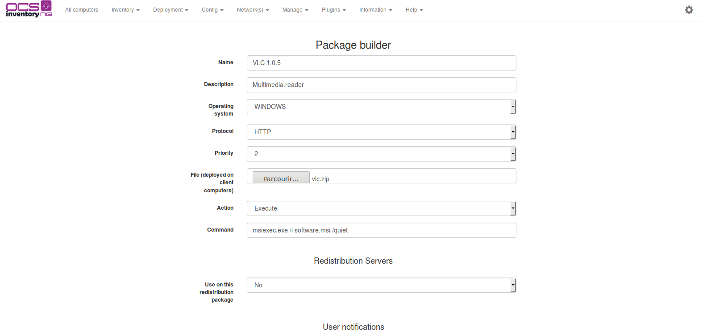

Click **[ Send ]** button to upload the package to the Administration console.

### **Store files through the “Store” command**

The package you want to deploy has one or more files to be stored in a specific folder on client computers.

Compress the files using ZIP tool if your package addresses Windows computers, or tar and gzip if it
addresses Linux computers.

Choose action **Store** and click **Browse** button to select your ZIP or TAR.GZ file.

In field **Path**, just fill in path where agent will store extracted files once package will be downloaded.

**`Note: Environnement variables are expanded in “Command”. It enables you to use things such as
%SystemDrive%, %SystemRoot%, %windir%, %ProgramFiles%, %CommonProgramFiles% ...etc.`**

_If the provided folder path does not exist, it will be recursively created._

In the following example, we deploy a file to store in folder “C:\My Folder”:

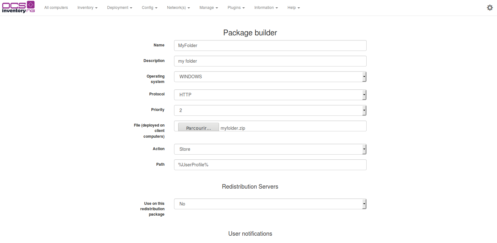

Click **[ Send ]** button to upload package to Administration console.

### Dividing your package in fragments

Next, you must specify the size of you package's fragments to allow agents to download your package
by small parts. This will allow resuming download (ie: If the download of a fragment fails, only this 
fragment will be downloaded another time, not all the package).
Choose fragment size according to your network capabilities.

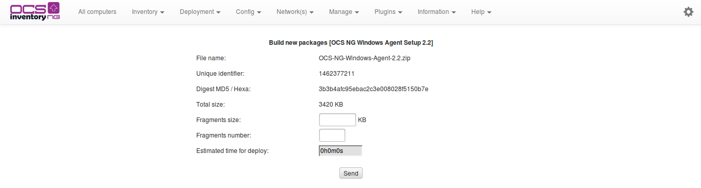

Administration console will then split your package into fragments and store them in a folder named by the
package's timestamp in the **download** directory of your apache web server. It will also create in the same
directory the package information file named **info**, an XML file describing the package and action agent
will have to launch.

**`Note: If you have created a package without any ZIP or TAR.GZ file (ie: through the “Execute” command), the 
administration console will only create the package information file **info** into the package's folder.`**

## Editing package

Once packages have been created, they can always be edited.

Point your mouse on the “Deployment” menu and select “Activate”. You will view here all the activated packages.

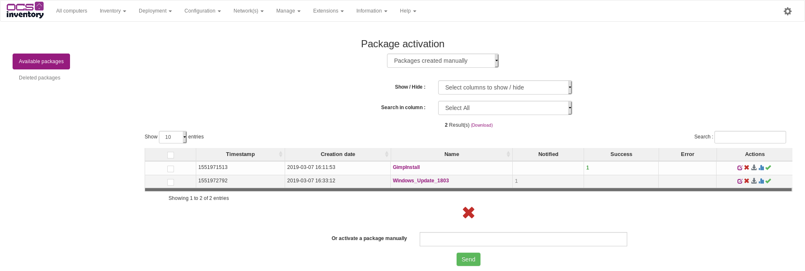

**Click the "Edit" button on the line corresponding to the package you want to edit.**

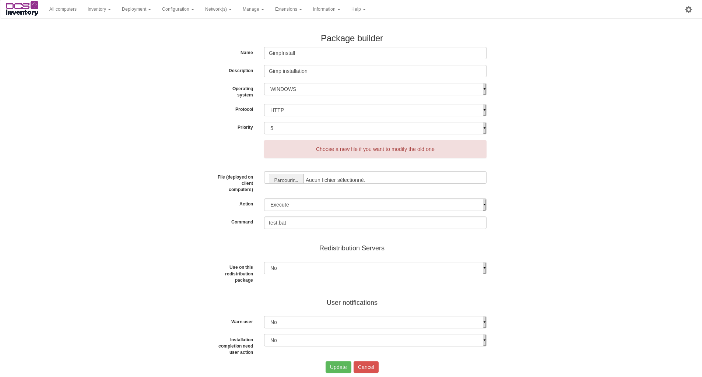

You can edit all informations of your package and you can download a new .zip file. Click on the "Update" button when you have finished editing.

If you have downloaded a new .zip file, you must specify the size of the package fragments. If not, the size of the fragments remains the same.

## Activating package

Once package have been created, you must specify where agents can download it.

Agents will first download the package information file. As this file is very critical, this download must
be done using HTTP over SSL (HTTPS) to ensure that agents can authenticate the deployment server. Next,
the download of the package's fragments described in the information file will be done using standard HTTP.

**`Note: If you do not want to use Administration server as deployment server, you must first copy folder
“download/package_timestamp” from Administration server Apache document root directory to another web
server. You may want to use a directory synchronization utility like rsync
`([`http://samba.anu.edu.au/rsync`](http://samba.anu.edu.au/rsync))`
to automatically do this task; otherwise, we will have to do it manually.`**

You may also choose to host information file on a different web server than the one which hosts fragment
files. For example, if you have multiple geographical sites with only one central Communication server,
you may want to host information files on Communication server, and fragment files on a web server on
each site. For this, you need to activate a package per site, and for each package, information file
will be hosted on Communication server and fragment files on site web server. This will dramatically
decrease intersite network bandwidth use.

Point your mouse on “Deployment” menu and select “Activate”. You will view here all built package,
and also ALL activated package.

**You can click the red cross to delete a built package.** This will delete package reference from
database and also delete information file and fragment files from Administration console download
directory. So, deleted package will be unavailable for activation, all activated packages using
this package will be deleted, and also unaffected from computers.

**Click “Active” button on the line corresponding to the package you want to activate.**

In field “HTTPS url”, enter URL for download in HTTPS package information file.

In field “HTTP url”, enter URL for downloading in HTTP package fragment files.

**`Warning: Do not enter localhost as server address in URL! Remenber that these URLs will be processed
by agents.`**

If your HTTPS or HTTP deployement server works on non standard ports, you can specify working port using
the standard notation “server_address:server_port/folder”. For example, your deployement server works
on port HTTP 8080 and HTTPS 4343 on server 192.168.1.1, and packages are located under /download durectory.
You must fill in:

_https url: 192.168.1.1:4343/download_

_http url: 192.168.1.1:8080/download_

In our case, we’ve choosen to use Administration server as deployment server for both package information
file and package fragments.

So we have filled in in both fill something like “ocs-admin-srv.domain.tld/download”.

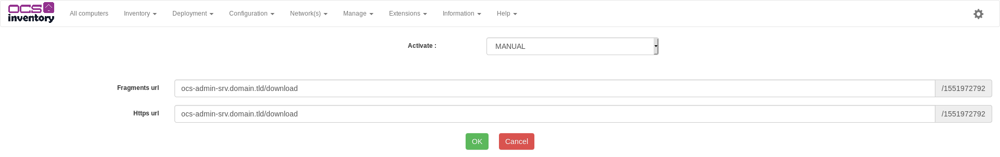

Click send button. Administration console will ensure that both information file and package fragment
files are available on specified URLs.

**“Non notified”** column shows you the number of computers which haven’t yet been notified they have
corresponding package to deploy.

**“Success” column** shows you the number of computers which have successfully deploy corresponding package.

**“Errors” column** shows you the number of computers which encounter errors deploying corresponding package.

**The “Stats” icon** allows you to view percentile of computers which are waiting for notification,
those which are notified (server ask them to deploy the package), and those which have finished
deploying with result code (SUCCESS or ERROR).

## Affecting packages to computers

You can affect package to computer one by one, by displaying computer properties, selecting
**Customization** icon and adding the package. However, this is not the best way if you would like
to affect package to many computers.

The best way is to use **Search with various creteria** functions to search for computers you want,
and to affect package to all these computers in one time.

In the following example, we will affect package we’ve created to all Windows computers.

So first, we search for Windows XP computers.

This search returns computers whitch respond to the request.

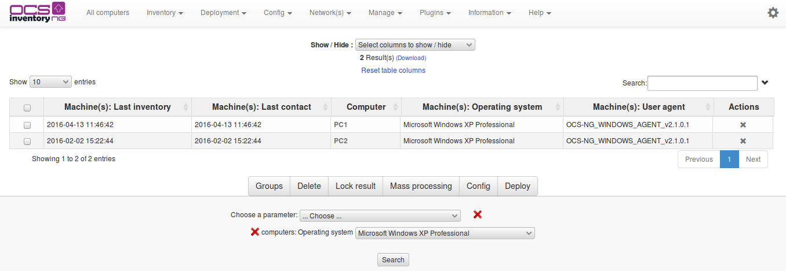

Two possibilities available:

1. Select with check-box computers where you want to deploy package
2. Select nothing and click directly on **Deploy**

Click on **Affect** icon of package line to affect this package to all selected computers.

Agents on computers will be notified at next Communication Server contact they have this package to deploy.
So, while agent do not contact Communication server, computer will appear in console with status
**WAITING NOTIFICATION**. Once agent has contacted Communication server, the status will be **NOTIFIED**.

## Unactivating packages

For removing the package activation follow the steps below:

1. Point your mouse on **Deployment** menu and select **Activate**.

2. List of available (not yet activated) and enabled (activated and ready to be deployed) packages
will appear.

    **`Note: If the package is activated, its Name contains hyperlink.`**

3. Click on the link of the package for which you want to remove the activation.

4. New window with package specifications will pop-up.

5. The red cross icon in Delete column will remove the package activation.

**`Note: Removing the package activation has no affect on any computer where the package has already been
installed. Furthermore, the package is still referenced in database, so all information and fragment
files are still available in Administration server's download directory. However, it has the same
status as if you have just built it.`**

## Deployment statistics and success validation

As package may have been activated and then unactivated, deployment statics are in **Activate** menu.

You can show deployement statics by clicking **Stats** icon for a package.

Since you’ve affected package at least to one computer, you will have graphical stats showing
deployment notification status.

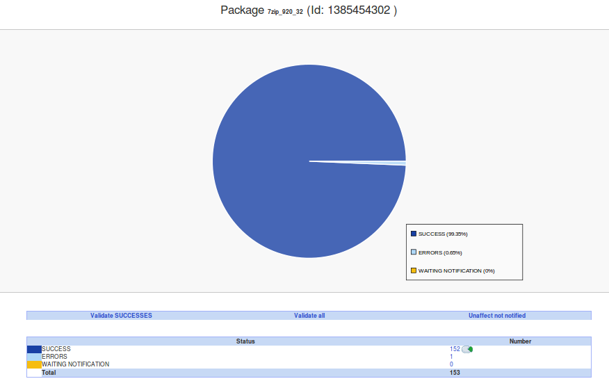

Status may be once of the following:

Status code | Meaning
------|------
**WAITING NOTIFICATION** | Server is waiting for agent communication to notify there is something to download.
**NOTIFIED** | Agent has been notified there is something to download. Now server waiting for result code.
**SUCCESS** | Agent has successfully download package and launch command or stored extracted data. With “Launch” action, this status may be completed with command execution return code. (return code 0).
**ERR_EXIT_CODE_xxx** | Agent has successfully download package, **BUT** command of execution or data store associated terminated **in error** (return code xxx).
**ERR_ALREADY_SETUP** | Package was previously installed successfully on this computer.
**ERR_BAD_ID** | Agent is unable to download package because it cannot find package ID on deployment server.
**ERR_BAD_DIGEST** | Downloaded data are has bad digest, so agent does not execute associated command.
**ERR_DOWNLOAD_INFO** | Agent was unable to download INFO file associated to the package.
**ERR_DOWNLOAD_PACK** | Agent was unable to download ZIP or TAR.GZ file.
**ERR_BUILD** | Agent was unable to rebuild package fragments.
**ERR_UNZIP** | Agent was unable to uncompress downloaded ZIP or TAR.GZ file.
**ERR_OUT_OF_SPACE** | There is not enought space available on disk to uncompress and execute ZIP or TAR.GZ package.
**ERR_BAD_PARAM** | A INFO file parameter of the package is incorrect.
**ERR_EXECUTE_PACK** | Any execution command is specified in INFO file of package.
**ERR_EXECUTE** | Agent was unable to execute associated package command.
**ERR_CLEAN** | Agent was unable to clean downloaded package.
**ERR_DONE_FAILED** | Agent can't retrieve execution result in package cache (cache is used to store result if the server is not responding at the end of package execution).
**ERR_TIMEOUT** | Agent was unable to download package during DOWNLOAD_TIMEOUT days.
**ERR_ABORTED** | User canceled package command execution (you’ve choosen to notify him, and allowed him to cancel).

**“Validating Success”** will clear statistics of computers which have successfully deployed package.

**“Unaffect not notified”** will unaffect package from computers which do not have contacted server
since you’ve affected package to computers. Package will not be deleted, only computers which
do not have yet receive order to deploy this package will have this order cancelled.

**“Validate all”** will clear all statistics, and unaffect package from non notified computers.
It is the same as **Validate Success + Unaffect not notified**.

**`Warning: You MUST validate deployment status once deployment ended to clear database deployment
status for computer. Otherwise, database will grow up and speed down !`**

You can click on number for each status line to display computers having this deployment status.

## Using SSL certificates in Package deployment

The package deployment infrastructure is very powerful, so it requires the use of SSL to validate the
deployment server before trying to download. So you need some SSL certificates for use with your
deployment server.

Certificate definition from
[http://en.wikipedia.org/wiki/Public_key_certificate](http://en.wikipedia.org/wiki/Public_key_certificate)

_“In [cryptography](http://en.wikipedia.org/wiki/Cryptography), a **public key certificate**
(or **identity certificate**) is a certificate which uses a
[digital signature](http://en.wikipedia.org/wiki/Digital_signature) to bind together a
[public key](http://en.wikipedia.org/wiki/Public_key)
with an identity — information such as the name of a person or an organization, their address,
and so forth. The certificate can be used to verify that a public key belongs to an individual._

_In a typical [public key infrastructure](http://en.wikipedia.org/wiki/Public_key) (PKI) scheme,
the signature will be of a [certificate authority](http://en.wikipedia.org/wiki/Certificate_authority) (CA).
In a [web of trust](http://en.wikipedia.org/wiki/Web_of_trust) scheme, the signature is of either
the user (a [self-signed certificate](http://en.wikipedia.org/wiki/Self-signed_certificate)) or other users
("endorsements"). In either case, the signatures on a certificate are attestations by the certificate
signer that the identity information and the public key belong together.”_

You can use a quick, easy but limited way, **self signed certificate**, or a more secure and reliable tool,
**a PKI with a Certificate Authority**.

Apache web server comes with OpenSSL cryptographic library, which allow creating and managing certificates.

### **Using self signed certificates**

**`Warning: Take care about certificate validity period, as web server self signed certificate must be
installed on each client computer running the agent. When certificate will expire, you will have to
generate and deploy new certificate on each client computer!`**

#### **With OCS Inventory NG Server for Linux**

Usually, Apache or mod_ssl packages come with sample scripts to generate certificates, especially
test certificates.

However, we provide below a sample script using OpenSSL for generating a self signed certificate for
use in Apache.

    #!/bin/sh
    #
    # First, generate apache server certificate request
    #
    # Generate 1024 bits RSA key, store private key in a
    # no password protected PEM file server.key, using
    # system default openssl configuration file.
    #
    echo
    echo Generating Apache server private key...
    echo
    openssl genrsa -out server.key 1024
    #
    # Next, sign the apache server certificate with the apache
    # server key
    #
    # Sign with PEM certificate server.crt, using PEM file
    # server.key for server private key, using system default
    # openssl configuration file.
    #
    # The produced certificate will be valid for 1825 days (about 5 years)
    #
    echo
    echo Generating Apache server self signed certificate...
    echo
    openssl req -outform PEM -new -key server.key -x509 -days 1825 -out server.crt

This script generates a RSA private key in file “server.key” and an X.509 self signed certificate in
file “server.crt”.

**First**, launch this script using command:

    sh apache_generate_cert.sh

It will generate private key, and prompt you for certificate properties:

* Country code, usually required
* State or province name, usually required
* City, usually required
* Organisation or company name, usually required
* Organisational Unit name, usually optional
* Common name (this is the DNS name or IP address of your server), required
* An email address, usually optional

In our sample, we’ve generated self signed certificate for our server name “ocs.domain.tld”.

**Next**, you just have to copy server certificate file “server.crt” and server private key file “server.key” files into appropriate directories and update Apache/mod_ssl configuration files to use these files.

**Here is a sample and minimalist Apache/mod_ssl configuration** for using SSL under CentOS/Fedora/RedHat
Linux. (server certificate is stored under “/etc/httpd/conf/ssl.crt” directory and server key is
stored under “/etc/httpd/conf/ssl.key” directory).

**`Note: Generally, Apache/mod_ssl configuration is provided for your system. So, do not use
following configuration if your system already has a configuration file for mod_ssl !`**

    #
    # This is the Apache server configuration file providing SSL support.
    # It contains the configuration directives to instruct the server how to
    # serve pages over an https connection. For detailing information about these
    # directives see <URL:http://httpd.apache.org/docs-2.0/mod/mod_ssl.html>
    #
    # For the moment, see <URL:http://www.modssl.org/docs/> for this info.
    # The documents are still being prepared from material donated by the
    # modssl project.

    #
    # Do NOT simply read the instructions in here without understanding
    # what they do. They're here only as hints or reminders. If you are unsure
    # consult the online docs. You have been warned.
    #

    LoadModule ssl_module modules/mod_ssl.so

    # Until documentation is completed, please check http://www.modssl.org/
    # for additional config examples and module docmentation. Directives
    # and features of mod_ssl are largely unchanged from the mod_ssl project
    # for Apache 1.3.
    #
    # When we also provide SSL we have to listen to the
    # standard HTTP port (see above) and to the HTTPS port
    #
    # To allow connections to IPv6 addresses add "Listen [::]:443"
    #

    Listen 0.0.0.0:443

    #
    # Some MIME-types for downloading Certificates and CRLs
    #

    AddType application/x-x509-ca-cert .crt
    AddType application/x-pkcs7-crl .crl

    # Pass Phrase Dialog:
    # Configure the pass phrase gathering process.
    # The filtering dialog program (`builtin' is a internal
    # terminal dialog) has to provide the pass phrase on stdout.

    SSLPassPhraseDialog builtin

    #
    # SSL Virtual Host Context
    #
    <VirtualHost _default_:443>
    # Use separate log files:

    ErrorLog logs/ssl_error_log
    TransferLog logs/ssl_access_log

    # SSL Engine Switch:
    # Enable/Disable SSL for this virtual host.

    SSLEngine on

    # SSL Cipher Suite:
    # List the ciphers that the client is permitted to negotiate.
    # See the mod_ssl documentation for a complete list.

    SSLCipherSuite ALL:!ADH:!EXPORT56:RC4+RSA:+HIGH:+MEDIUM:+LOW:+SSLv2:+EXP

    # Server Certificate:
    # Point SSLCertificateFile at a PEM encoded certificate. If
    # the certificate is encrypted, then you will be prompted for a
    # pass phrase. Note that a kill -HUP will prompt again. A test
    # certificate can be generated with `make certificate' under
    # built time. Keep in mind that if you've both a RSA and a DSA
    # certificate you can configure both in parallel (to also allow
    # the use of DSA ciphers, etc.)

    SSLCertificateFile /etc/httpd/conf/ssl.crt/server.crt

    # Server Private Key:
    # If the key is not combined with the certificate, use this
    # directive to point at the key file. Keep in mind that if
    # you've both a RSA and a DSA private key you can configure
    # both in parallel (to also allow the use of DSA ciphers, etc.)

    SSLCertificateKeyFile /etc/httpd/conf/ssl.key/server.key

    # SSL Engine Options:
    # StdEnvVars:
    # This exports the standard SSL/TLS related `SSL_*' environment variables.
    # Per default this exportation is switched off for performance reasons,
    # because the extraction step is an expensive operation and is usually
    # useless for serving static content. So one usually enables the
    # exportation for CGI and SSI requests only.

    SSLOptions +StdEnvVars

    # SSL Protocol Adjustments:
    # The safe and default but still SSL/TLS standard compliant shutdown
    # approach is that mod_ssl sends the close notify alert but doesn't wait for
    # the close notify alert from client. When you need a different shutdown
    # approach you can use one of the following variables:
    # o ssl-unclean-shutdown:
    # This forces an unclean shutdown when the connection is closed, i.e. no
    # SSL close notify alert is send or allowed to received. This violates
    # the SSL/TLS standard but is needed for some brain-dead browsers. Use
    # this when you receive I/O errors because of the standard approach where
    # mod_ssl sends the close notify alert.
    # o ssl-accurate-shutdown:
    # This forces an accurate shutdown when the connection is closed, i.e. a
    # SSL close notify alert is send and mod_ssl waits for the close notify
    # alert of the client. This is 100% SSL/TLS standard compliant, but in
    # practice often causes hanging connections with brain-dead browsers. Use
    # this only for browsers where you know that their SSL implementation
    # works correctly.
    # Notice: Most problems of broken clients are also related to the HTTP
    # keep-alive facility, so you usually additionally want to disable
    # keep-alive for those clients, too. Use variable "nokeepalive" for this.
    # Similarly, one has to force some clients to use HTTP/1.0 to workaround
    # their broken HTTP/1.1 implementation. Use variables "downgrade-1.0" and
    # "force-response-1.0" for this.

    SetEnvIf User-Agent ".*MSIE.*" nokeepalive ssl-unclean-shutdown downgrade-1.0 force-response-1.0

    # Per-Server Logging:
    # The home of a custom SSL log file. Use this when you want a
    # compact non-error SSL logfile on a virtual host basis.
    CustomLog logs/ssl_request_log "%t %h %{SSL_PROTOCOL}x %{SSL_CIPHER}x \"%r\" %b"

    </VirtualHost>

Once you’ve configured your Apache web server, don’t forget to restart Apache daemon for changes to
take effect.

**Last**, you have to install server certificate file “server.crt” on each client computer into OCS
Inventory Agent installation directory, under the name “cacert.pem”.

**For Debian 9 Stretch:**

    apt install ssl-cert
    a2ensite default-ssl
    a2enmod ssl
    make-ssl-cert generate-default-snakeoil --force-owerwrite
    systemctl restart apache2

copy /etc/ssl/certs/ssl-cert-snakeoil.pem to cacert.pem and distribute

**For Fedora/RedHat/Centos 7:**

openssl command creates a public certificate and a private key.

    openssl genrsa -out server.key 2048
    openssl req -new -key server.key -out server.csr

Self-sign the certificate

    openssl x509 -req -days 3650 -in server.csr -signkey server.key -out server.crt

Set up the certificate

Place these 2 files in certificates directory

    cp server.crt /etc/ssl/certs/
    cp server.key /etc/ssl/private/

Set the correct values in /etc/httpd/conf.d/ssl.conf.

### **Using PKI with Certificate Authority**

We assume that you’re already using an internal PKI or commercial one like Verisign.

However, if you don’t have an internal PKI, and don’t want to pay for certificates,
you can use services provided by cacert.org ([http://www.cacert.org](http://www.cacert.org/)),
a free worldwide PKI provider. Using cacert.org services require that you register your email
and DNS domain name, before to be able to request server certificate. See cacert.org manuals.

You may take a look at Pablo Iranzo Gómez excellent article
([http://alufis35.uv.es/OCS-Inventory-Package-Deployment.html](http://alufis35.uv.es/OCS-Inventory-Package-Deployment.html))
for more detailled instructions about using cacert.org certificates in OCS Inventory NG.

#### **With OCS Inventory NG Server for Linux**

Usually, Apache or mod_ssl packages come with sample scripts to generate certificates request to submit
to a PKI provider.

However, we provide below a sample script using OpenSSL for generating a certificate request for use in
Apache.

    #!/bin/sh
    #
    # Generate server certificate request
    #
    # Generate 1024 bits RSA key, store private key in a
    # no password protected PEM file server.key, store certificate
    # request in a PEM file server.csr, using system default
    # configuration file
    #
    # The produced key will be valid for 1825 days (5 years)
    #
    echo
    echo Generating server private key and certificate request...
    echo
    openssl req -newkey rsa:1024 -outform PEM -out server.csr -keyout server.key -keyform PEM \
    -days 1825 -nodes

This script generates a RSA private key in file “server.key” and a certificate request in file “server.csr”.

**First**, launch this script using command:

    sh apache_request_cert.sh

It will generate private key, and prompt you for certificate request properties:

* Country code, usually required
* State or province name, usually required
* City, usually required
* Organisation or company name, usually required
* Organisational Unit name, usually optional
* Common name (this is the DNS name or IP address of your server), required
* An email address, required to receive certificate generated by Certificate Authority.
* An optional challenge password
* An optional company name

In our sample, we’ve generated certificate request for our server name “ocs.domain.tld”.

**Next**, you must transmit your certificate request “server.csr” to your PKI Certificate Authority.

**Once you’ve received your server certificate from Certificate Authority**, you just have to
copy server certificate file “server.crt” and server private key “server.key” files into
appropriate directories, and update Apache/mod_ssl configuration files to use these files.

You must also retreive Certificate Authority root certificate into file “ca_root.crt” to specify
it in Apache configuration.

**Here is a sample and minimalist Apache/mod_ssl configuration** for using SSL under CentOS/Fedora/RedHat
Linux. (server certificate is stored under “/etc/httpd/conf/ssl.crt” directory and server key is stored
under “/etc/httpd/conf/ssl.key” directory).

**`Note: Generally, Apache for Win32 comes with a predefined Apache/mod_ssl configuration file. So,
do not use following configuration if your system already has a configuration file for mod_ssl !`**

    #
    # This is the Apache server configuration file providing SSL support.
    # It contains the configuration directives to instruct the server how to
    # serve pages over an https connection. For detailing information about these
    # directives see <URL:http://httpd.apache.org/docs-2.0/mod/mod_ssl.html>
    #
    # For the moment, see <URL:http://www.modssl.org/docs/> for this info.
    # The documents are still being prepared from material donated by the
    # modssl project.
    #
    # Do NOT simply read the instructions in here without understanding
    # what they do. They're here only as hints or reminders. If you are unsure
    # consult the online docs. You have been warned.
    #

    LoadModule ssl_module modules/mod_ssl.so

    # Until documentation is completed, please check http://www.modssl.org/
    # for additional config examples and module docmentation. Directives
    # and features of mod_ssl are largely unchanged from the mod_ssl project
    # for Apache 1.3.

    #
    # When we also provide SSL we have to listen to the
    # standard HTTP port (see above) and to the HTTPS port
    #
    # To allow connections to IPv6 addresses add "Listen [::]:443"
    #
    Listen 0.0.0.0:443

    #
    # Some MIME-types for downloading Certificates and CRLs
    #
    AddType application/x-x509-ca-cert .crt
    AddType application/x-pkcs7-crl .crl

    # Pass Phrase Dialog:
    # Configure the pass phrase gathering process.
    # The filtering dialog program (`builtin' is a internal
    # terminal dialog) has to provide the pass phrase on stdout.
    SSLPassPhraseDialog builtin

    ##
    ## SSL Virtual Host Context
    ##

    <VirtualHost _default_:443>

    # Use separate log files:
    ErrorLog logs/ssl_error_log
    TransferLog logs/ssl_access_log

    # SSL Engine Switch:
    # Enable/Disable SSL for this virtual host.
    SSLEngine on

    # SSL Cipher Suite:
    # List the ciphers that the client is permitted to negotiate.
    # See the mod_ssl documentation for a complete list.
    SSLCipherSuite ALL:!ADH:!EXPORT56:RC4+RSA:+HIGH:+MEDIUM:+LOW:+SSLv2:+EXP

    # Server Certificate:
    # Point SSLCertificateFile at a PEM encoded certificate. If
    # the certificate is encrypted, then you will be prompted for a
    # pass phrase. Note that a kill -HUP will prompt again. A test
    # certificate can be generated with `make certificate' under
    # built time. Keep in mind that if you've both a RSA and a DSA
    # certificate you can configure both in parallel (to also allow
    # the use of DSA ciphers, etc.)
    SSLCertificateFile /etc/httpd/conf/ssl.crt/server.crt

    # Server Private Key:
    # If the key is not combined with the certificate, use this
    # directive to point at the key file. Keep in mind that if
    # you've both a RSA and a DSA private key you can configure
    # both in parallel (to also allow the use of DSA ciphers, etc.)
    SSLCertificateKeyFile /etc/httpd/conf/ssl.key/server.key

    # Certificate Authority (CA):
    # Set the CA certificate verification path where to find CA
    # certificates for client authentication or alternatively one
    # huge file containing all of them (file must be PEM encoded)
    # Note: Inside SSLCACertificatePath you need hash symlinks
    # to point to the certificate files. Use the provided
    # Makefile to update the hash symlinks after changes.
    #SSLCACertificatePath /etc/httpd/conf/ssl.crt
    SSLCACertificateFile /usr/share/ssl/certs/ca_root.crt

    # SSL Engine Options:
    # StdEnvVars:
    # This exports the standard SSL/TLS related `SSL_*' environment variables.
    # Per default this exportation is switched off for performance reasons,
    # because the extraction step is an expensive operation and is usually
    # useless for serving static content. So one usually enables the
    # exportation for CGI and SSI requests only.
    SSLOptions +StdEnvVars

    # SSL Protocol Adjustments:
    # The safe and default but still SSL/TLS standard compliant shutdown
    # approach is that mod_ssl sends the close notify alert but doesn't wait for
    # the close notify alert from client. When you need a different shutdown
    # approach you can use one of the following variables:
    # o ssl-unclean-shutdown:
    # This forces an unclean shutdown when the connection is closed, i.e. no
    # SSL close notify alert is send or allowed to received. This violates
    # the SSL/TLS standard but is needed for some brain-dead browsers. Use
    # this when you receive I/O errors because of the standard approach where
    # mod_ssl sends the close notify alert.
    # o ssl-accurate-shutdown:
    # This forces an accurate shutdown when the connection is closed, i.e. a
    # SSL close notify alert is send and mod_ssl waits for the close notify
    # alert of the client. This is 100% SSL/TLS standard compliant, but in
    # practice often causes hanging connections with brain-dead browsers. Use
    # this only for browsers where you know that their SSL implementation
    # works correctly.
    # Notice: Most problems of broken clients are also related to the HTTP
    # keep-alive facility, so you usually additionally want to disable
    # keep-alive for those clients, too. Use variable "nokeepalive" for this.
    # Similarly, one has to force some clients to use HTTP/1.0 to workaround
    # their broken HTTP/1.1 implementation. Use variables "downgrade-1.0" and
    # "force-response-1.0" for this.
    SetEnvIf User-Agent ".*MSIE.*" nokeepalive ssl-unclean-shutdown downgrade-1.0 force-response-1.0

    # Per-Server Logging:
    # The home of a custom SSL log file. Use this when you want a
    # compact non-error SSL logfile on a virtual host basis.
    CustomLog logs/ssl_request_log "%t %h %{SSL_PROTOCOL}x %{SSL_CIPHER}x \"%r\" %b"

    </VirtualHost>

Once you’ve configured your Apache web server, don’t forget to restart Apache daemon for changes to
take effect.

**Last**, you have to install Certificate Authority root certificate file “ca_root.crt” on each client
computer into OCS Inventory Agent installation directory, under the name “cacert.pem”.

##Example: Deploying new version of Service agent for Windows

Create a ZIP “OCS-NG-Windows-Agent-2.0.zip” including file “OCS-NG-Windows-Agent-Setup.exe”.

Next, connect to Administration console and go to menu “Deployment / Build”.

* **Fill in package name**, for example “Ocs Agent Service 2.0”,
* **select target operating system** “Windows”,
* **select protocol** “HTTP”,
* **select priority** “5”,
* **browse to select ZIP file**,
* **select action** “Launch”
* **and fill in file name** with Service Agent setup command line switches, for example
“OcsAgentSetup.exe /S /NOSPLASH /UPGRADE /NP /DEBUG /SERVER:my_ocs_server.domain.tld”
(/S to run installer in silent mode, /NOSLPASH to disable installer spash screen, /UPGRADE to
indicate that you’re upgrading an already installed Service Agent, /NP to disable use of IE proxy
settings, /DEBUG to enable creation of log files, /SERVER to indicate that agent must connect to
server at address “my_ocs_server.domain.tld”).

**`Note: Don’t forget /UPGRADE command line switch to allow upgrading an existing OCS Inventory NG agent
installed as a service.`**

And validate by clicking **[ Send ]** button..

Next choose fragment size and click **[ Send ]** button.

Now, deployement package is created. You have to activate it.

Go to menu **Deployment / Activate**.

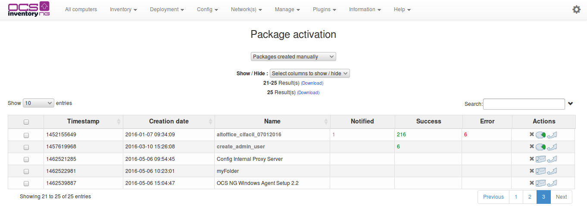

Click on button **Activate** in the corresponding line.

* Fill in HTTPS url where metadata file INFO can be downloaded by agents using HTTPS.
* Fill in HTTP url where fragment files can be downloaded by agent using HTTP.

And click **[ Send ]** button.

Now, package is ready to be affected to computers.

Go to **Search** menu, search for computers having Operating System equals
to “Windows (ALL)” and click **Search** button.

Next, click **Deploy** on **Mass processing** line.

To finish, click on Affect button in the corresponding line to the package you want.

