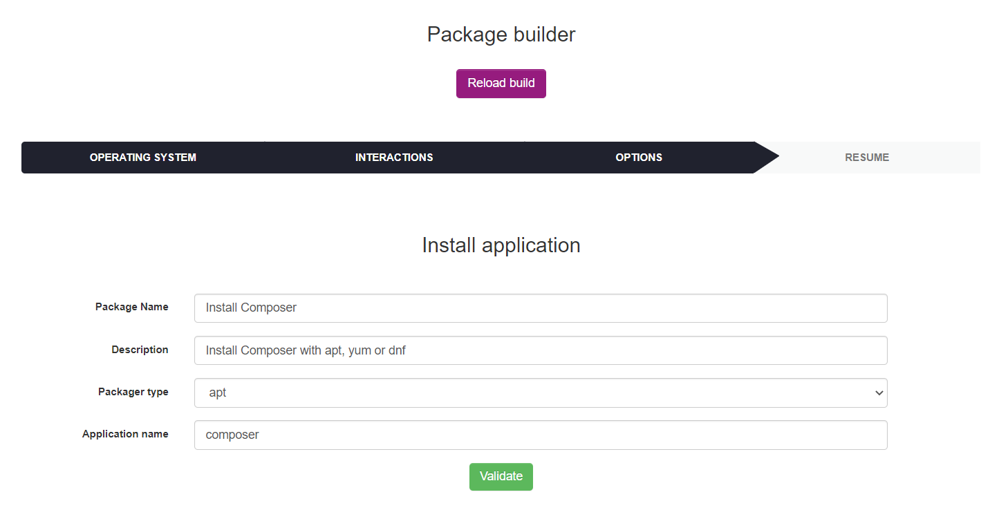
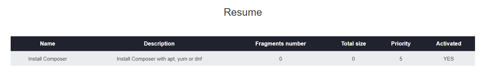
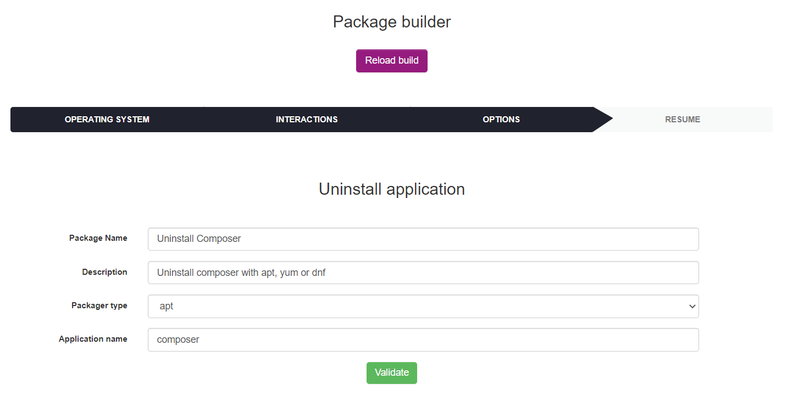
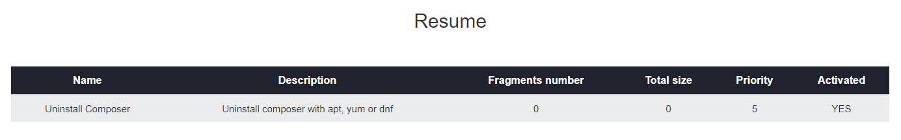
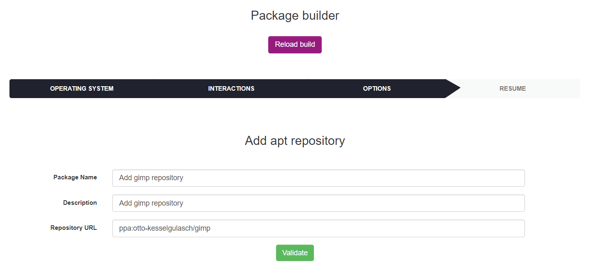
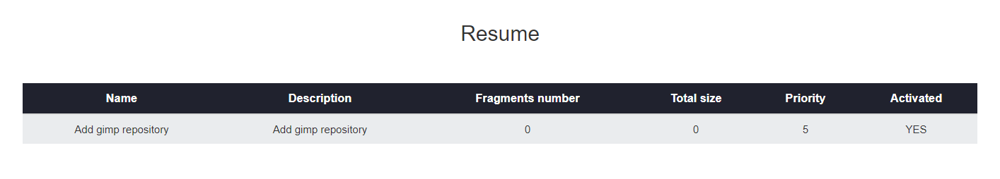
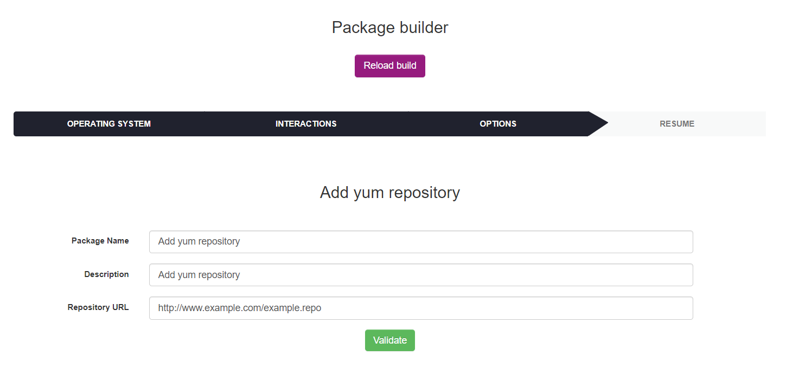
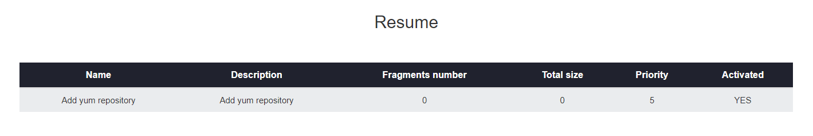

# Linux deployment templates

## Summary

### Install / Uninstall

* [Install application](#install-application)
* [Uninstall application](#uninstall-application)
* [Add apt repository](#add-apt-repository)
* [Add yum repository](#add-yum-repository)

### Scripts

* [Bash/sh script](#powershell-script)

### Others

* [Store file/folder](#store-file-or-folder)
* [Custom package](#custom-package)

## Install application

To install application, go to `Deployment > Build > Linux > Install / Uninstall` and click on `Install application`.

List of installation application's form parameters :

* **Package Name** : the package display name
* **Description** : the package description
* **Package type** : apt/yum/dnf
* **Application name** : the application to be installed

Below the list of default installation application's parameters (not configurable by the user):

* **Priority** : 5
* **Action** : Execute
* **Protocole** : HTTP
* **Command** : {package type} install -y {application name} ; exit 0
* **Notify User** : No
* **Notify can abort** : No
* **Notify can delay** : No
* **Need done action** : No

Next, click on `Validate`. After the package has been created its resume is displayed.

The fragments number and the Activated column value depends on your deployment configuration. For more informations see [Deployment configuration](../Configuration.md).

## Uninstall application

To uninstall application, go to `Deployment > Build > Linux > Install / Uninstall` and click on `Uninstall application`.

List of uninstall application's form parameters :

* **Package Name** : the package display name
* **Description** : the package description
* **Package type** : apt/yum/dnf
* **Application name** : the application to be uninstalled

Below the list of default uninstall application's parameters (not configurable by the user):

* **Priority** : 5
* **Action** : Execute
* **Protocole** : HTTP
* **Command** : {package type} remove -y {application name} ; exit 0
* **Notify User** : No
* **Notify can abort** : No
* **Notify can delay** : No
* **Need done action** : No

Next, click on `Validate`. After the package has been created its resume is displayed.

The fragments number and the Activated column value depends on your deployment configuration. For more informations see [Deployment configuration](../Configuration.md).

## Add apt repository

To add apt repository, go to `Deployment > Build > Linux > Install / Uninstall` and click on `Add apt repository`.

List of add apt repository's form parameters :

* **Package Name** : the package display name
* **Description** : the package description
* **Repository URL** : repository URL to be deployed

Below the list of default add apt repository's parameters (not configurable by the user):

* **Priority** : 5
* **Action** : Execute
* **Protocole** : HTTP
* **Command** : add-apt-repository -y '{repository url}'
* **Notify User** : No
* **Notify can abort** : No
* **Notify can delay** : No
* **Need done action** : No

Next, click on `Validate`. After the package has been created its resume is displayed.

The fragments number and the Activated column value depends on your deployment configuration. For more informations see [Deployment configuration](../Configuration.md).

## Add yum repository

To add yum repository, go to `Deployment > Build > Linux > Install / Uninstall` and click on `Add yum repository`.

List of add yum repository's form parameters :

* **Package Name** : the package display name
* **Description** : the package description
* **Repository URL** : repository URL to be deployed

Below the list of default add yum repository's parameters (not configurable by the user):

* **Priority** : 5
* **Action** : Execute
* **Protocole** : HTTP
* **Command** : yum-config-manager --add-repo {repository url}
* **Notify User** : No
* **Notify can abort** : No
* **Notify can delay** : No
* **Need done action** : No

Next, click on `Validate`. After the package has been created its resume is displayed.

The fragments number and the Activated column value depends on your deployment configuration. For more informations see [Deployment configuration](../Configuration.md).