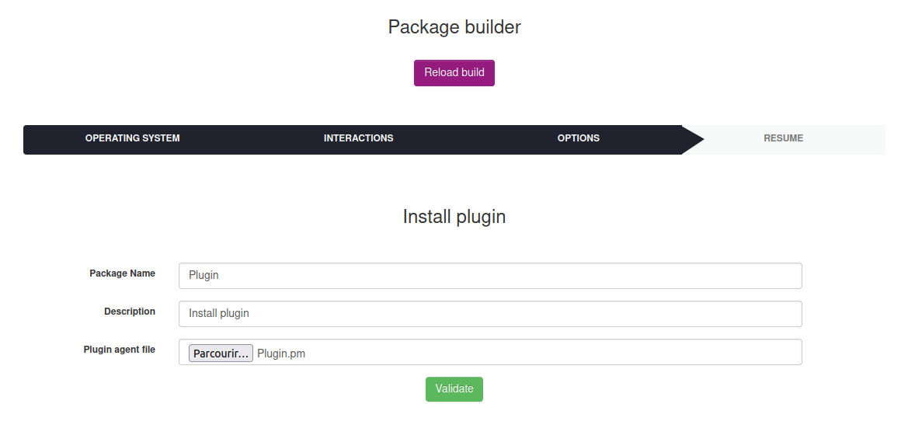
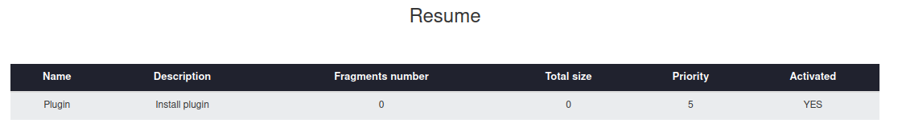
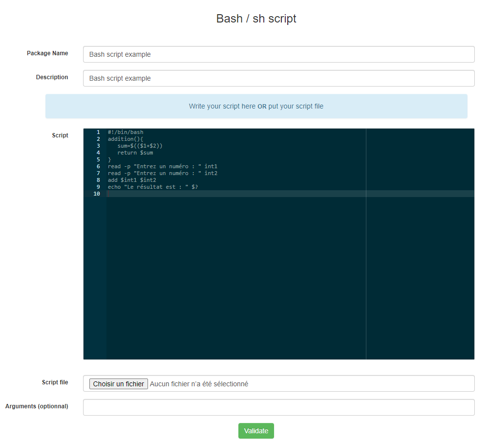
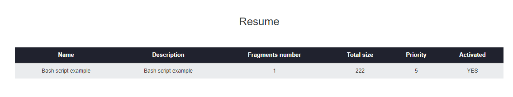

# Linux deployment templates

## Summary

### Install / Uninstall

* [Install application](#install-application)
* [Uninstall application](#uninstall-application)
* [Add apt repository](#add-apt-repository)
* [Add yum repository](#add-yum-repository)
* [Install plugin](#install-plugin)

### Scripts

* [Bash sh script](#bash-sh-script)

### Others

* [Store file/folder](#store-file-or-folder)
* [Custom package](#custom-package)

## Install application

To install application, go to `Deployment > Build > Linux > Install / Uninstall` and click on `Install application`.

List of installation application's form parameters :

* **Package Name** : the package display name
* **Description** : the package description
* **Package type** : apt/yum/dnf
* **Application name** : the application to be installed

Below the list of default installation application's parameters (not configurable by the user):

* **Priority** : 5
* **Action** : Execute
* **Protocole** : HTTP
* **Command** : {package type} install -y {application name} ; exit 0
* **Notify User** : No
* **Notify can abort** : No
* **Notify can delay** : No
* **Need done action** : No

Next, click on `Validate`. After the package has been created its resume is displayed.

The fragments number and the Activated column value depends on your deployment configuration. For more informations see [Deployment configuration](../Configuration.md).

## Uninstall application

To uninstall application, go to `Deployment > Build > Linux > Install / Uninstall` and click on `Uninstall application`.

List of uninstall application's form parameters :

* **Package Name** : the package display name
* **Description** : the package description
* **Package type** : apt/yum/dnf
* **Application name** : the application to be uninstalled

Below the list of default uninstall application's parameters (not configurable by the user):

* **Priority** : 5
* **Action** : Execute
* **Protocole** : HTTP
* **Command** : {package type} remove -y {application name} ; exit 0
* **Notify User** : No
* **Notify can abort** : No
* **Notify can delay** : No
* **Need done action** : No

Next, click on `Validate`. After the package has been created its resume is displayed.

The fragments number and the Activated column value depends on your deployment configuration. For more informations see [Deployment configuration](../Configuration.md).

## Add apt repository

To add apt repository, go to `Deployment > Build > Linux > Install / Uninstall` and click on `Add apt repository`.

List of add apt repository's form parameters :

* **Package Name** : the package display name
* **Description** : the package description
* **Repository URL** : repository URL to be deployed

Below the list of default add apt repository's parameters (not configurable by the user):

* **Priority** : 5
* **Action** : Execute
* **Protocole** : HTTP
* **Command** : add-apt-repository -y '{repository url}'
* **Notify User** : No
* **Notify can abort** : No
* **Notify can delay** : No
* **Need done action** : No

Next, click on `Validate`. After the package has been created its resume is displayed.

The fragments number and the Activated column value depends on your deployment configuration. For more informations see [Deployment configuration](../Configuration.md).

## Add yum repository

To add yum repository, go to `Deployment > Build > Linux > Install / Uninstall` and click on `Add yum repository`.

List of add yum repository's form parameters :

* **Package Name** : the package display name
* **Description** : the package description
* **Repository URL** : repository URL to be deployed

Below the list of default add yum repository's parameters (not configurable by the user):

* **Priority** : 5
* **Action** : Execute
* **Protocole** : HTTP
* **Command** : yum-config-manager --add-repo {repository url}
* **Notify User** : No
* **Notify can abort** : No
* **Notify can delay** : No
* **Need done action** : No

Next, click on `Validate`. After the package has been created its resume is displayed.

The fragments number and the Activated column value depends on your deployment configuration. For more informations see [Deployment configuration](../Configuration.md).

## Install plugin

To install a plugin, go to `Deployment > Build > Linux > Install / Uninstall` and click on `Install plugin`.

List of install plugin's form parameters :

* **Package Name** : the package display name
* **Description** : the package description
* **Plugin agent file** : Agent file you wish to deploy on targets (most likely found in the 'agent' directory of the plugin)

Below the list of default install plugin's parameters (not configurable by the user):

* **Priority** : 5
* **Action** : Execute
* **Protocole** : HTTP
* **Command** : sh installplugin.sh
* **Notify User** : No
* **Notify can abort** : No
* **Notify can delay** : No
* **Need done action** : No

Next, click on `Validate`. After the package has been created its resume is displayed.

The fragments number and the Activated column value depends on your deployment configuration. For more informations see [Deployment configuration](../Configuration.md).

## Bash sh Script

To create a bash/sh script package, go to `Deployment > Build > Linux > Scripts` and click on `Bash/sh script`.

List of Bash script's form parameters :

* **Package Name** : the package display name
* **Description** : the package description
* **Script** : area to write batch script
* **Script file** : batch script file

`Note : if you write script on Script area don't put script file and vice versa.`

Below the list of default Bash script's parameters (not configurable by the user):

* **Priority** : 5
* **Action** : Execute
* **Protocole** : HTTP
* **Command** : sh bashscript.sh {custom arguments}
* **Notify User** : No
* **Notify can abort** : No
* **Notify can delay** : No
* **Need done action** : No

Next, click on `Validate`. After the package has been created its resume is displayed.

The fragments number and the Activated column value depends on your deployment configuration. For more informations see [Deployment configuration](../Configuration.md).

## Store file or folder

To create a store file/folder package, go to `Deployment > Build > Linux > Others` and click on `Store file/folder`.

List of Store's form parameters :

* **Package Name** : the package display name
* **Description** : the package description
* **Path** : path to store file or folder
* **File** : file or folder to store

`Note : if you want to store multiple files, compress before.`

Below the list of default Batch store's parameters (not configurable by the user):

* **Priority** : 5
* **Action** : Store
* **Protocole** : HTTP
* **Path** : {custom path}
* **Notify User** : No
* **Notify can abort** : No
* **Notify can delay** : No
* **Need done action** : No

Next, click on `Validate`. After the package has been created its resume is displayed.

The fragments number and the Activated column value depends on your deployment configuration. For more informations see [Deployment configuration](../Configuration.md).

## Custom package

To create a custom package go to `Deployment > Build > Linux > Others` and click on `Custom package`.

List of Custom package's form parameters :

* **Package Name** : the package display name
* **Description** : the package description
* **Protocol** : HTTP/HTTPS
* **Priority** : deployment priority
* **File** : file to deploy
* **Action** : Execute/Launch/Store
* **Command/Path** : set the command or the path (depends on selected action)
* **Warn user** : display message before deployment

Next, click on `Validate`. After the package has been created its resume is displayed.

The fragments number and the Activated column value depends on your deployment configuration. For more informations see [Deployment configuration](../Configuration.md).