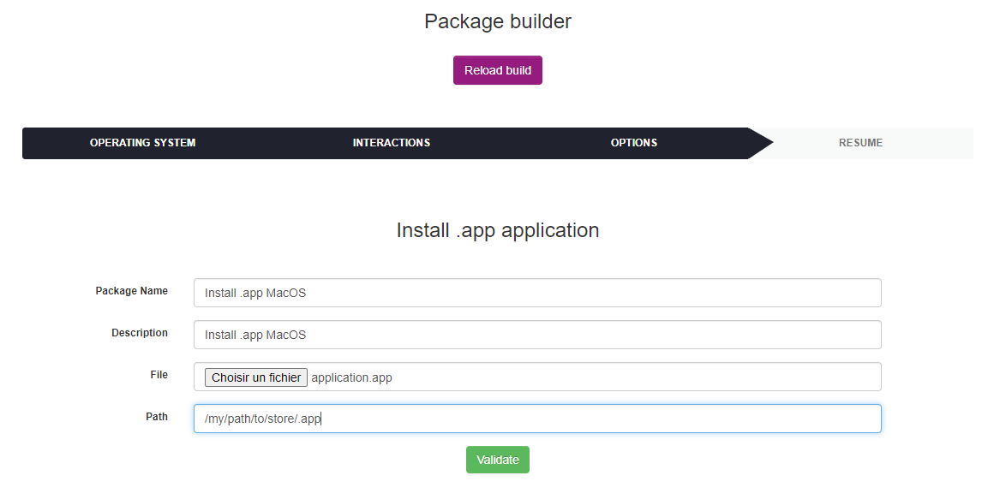
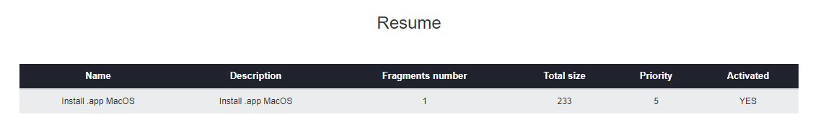
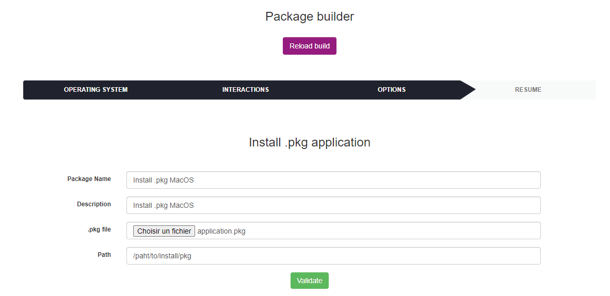
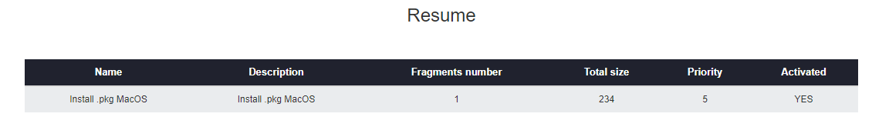
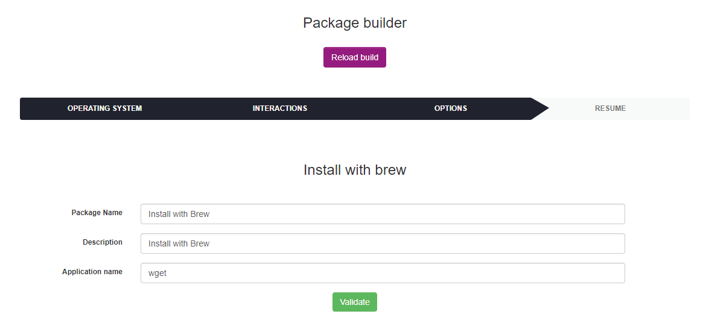
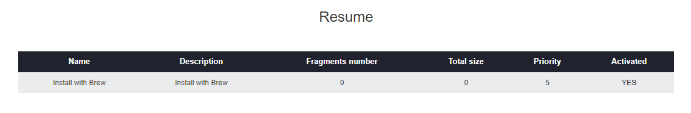
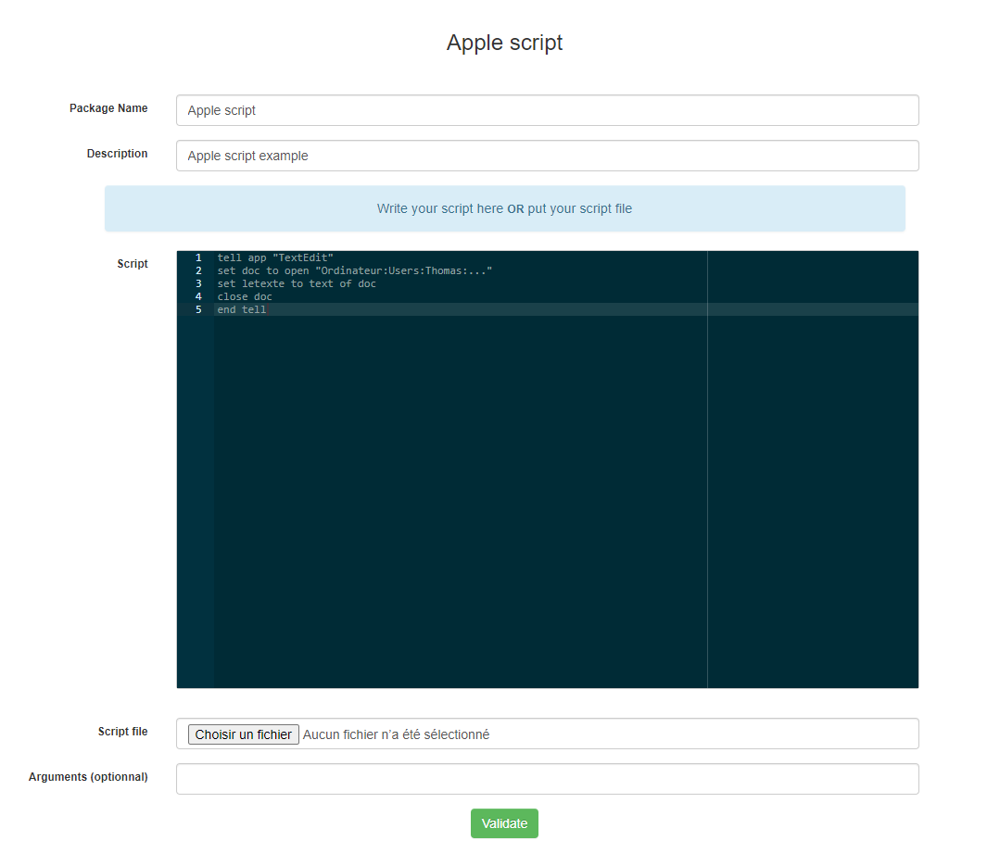
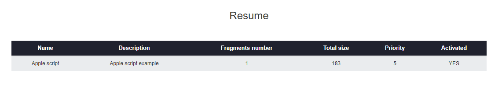

# MacOS deployment templates

## Summary

### Install / Uninstall

* [Install .app application](#install-.app-application)
* [Install .pkg application](#install-.pkg-application)
* [Install with brew](#install-with-brew)

### Scripts

* [Apple script](#apple-script)
* [Bash sh script](#bash-sh-script)

### Others

* [Store file/folder](#store-file-or-folder)
* [Custom package](#custom-package)

## Install .app application

To install .app application, go to `Deployment > Build > MacOS > Install / Uninstall` and click on `Install .app application`.

List of installation .app application's form parameters :

* **Package Name** : the package display name
* **Description** : the package description
* **File** : the .app file
* **Path** : the application path to be installed

Below the list of default installation .app application's parameters (not configurable by the user):

* **Priority** : 5
* **Action** : Store
* **Protocole** : HTTP
* **Command** : {custom path file}
* **Notify User** : No
* **Notify can abort** : No
* **Notify can delay** : No
* **Need done action** : No

Next, click on `Validate`. After the package has been created its resume is displayed.

The fragments number and the Activated column value depends on your deployment configuration. For more informations see [Deployment configuration](../Configuration.md).

## Install .pkg application

To install .pkg application, go to `Deployment > Build > MacOS > Install / Uninstall` and click on `Install .pkg application`.

List of installation .pkg application's form parameters :

* **Package Name** : the package display name
* **Description** : the package description
* **File** : the .pkg file
* **Path** : the application path to be installed

Below the list of default installation .pkg application's parameters (not configurable by the user):

* **Priority** : 5
* **Action** : Execute
* **Protocole** : HTTP
* **Command** : installer -pkg application.pkg -target {custom path file}
* **Notify User** : No
* **Notify can abort** : No
* **Notify can delay** : No
* **Need done action** : No

Next, click on `Validate`. After the package has been created its resume is displayed.

The fragments number and the Activated column value depends on your deployment configuration. For more informations see [Deployment configuration](../Configuration.md).

## Install with brew

To install with brew, go to `Deployment > Build > MacOS > Install / Uninstall` and click on `Install with brew`.

List of installation with brew's form parameters :

* **Package Name** : the package display name
* **Description** : the package description
* **File** : the .app file
* **Path** : the application path to be installed

Below the list of default installation with brew's parameters (not configurable by the user):

* **Priority** : 5
* **Action** : Execute
* **Protocole** : HTTP
* **Command** : username=$(last -1 | awk '{print $1}');su - $username -c 'brew install {custom application name}
* **Notify User** : No
* **Notify can abort** : No
* **Notify can delay** : No
* **Need done action** : No

Next, click on `Validate`. After the package has been created its resume is displayed.

The fragments number and the Activated column value depends on your deployment configuration. For more informations see [Deployment configuration](../Configuration.md).

## Apple Script

To create an Apple script package, go to `Deployment > Build > MacOS > Scripts` and click on `Apple script`.

List of Apple script's form parameters :

* **Package Name** : the package display name
* **Description** : the package description
* **Script** : area to write batch script
* **Script file** : batch script file

`Note : if you write script on Script area don't put script file and vice versa.`

Below the list of default Apple script's parameters (not configurable by the user):

* **Priority** : 5
* **Action** : Execute
* **Protocole** : HTTP
* **Command** : osascript applescript.scpt {custom arguments}
* **Notify User** : No
* **Notify can abort** : No
* **Notify can delay** : No
* **Need done action** : No

Next, click on `Validate`. After the package has been created its resume is displayed.

The fragments number and the Activated column value depends on your deployment configuration. For more informations see [Deployment configuration](../Configuration.md).

## Bash sh Script

To create a bash/sh script package, go to `Deployment > Build > MacOS > Scripts` and click on `Bash/sh script`.

List of Bash script's form parameters :

* **Package Name** : the package display name
* **Description** : the package description
* **Script** : area to write batch script
* **Script file** : batch script file

`Note : if you write script on Script area don't put script file and vice versa.`

Below the list of default Bash script's parameters (not configurable by the user):

* **Priority** : 5
* **Action** : Execute
* **Protocole** : HTTP
* **Command** : sh bashscript.sh {custom arguments}
* **Notify User** : No
* **Notify can abort** : No
* **Notify can delay** : No
* **Need done action** : No

Next, click on `Validate`. After the package has been created its resume is displayed.

The fragments number and the Activated column value depends on your deployment configuration. For more informations see [Deployment configuration](../Configuration.md).

## Store file or folder

To create a store file/folder package, go to `Deployment > Build > MacOS > Others` and click on `Store file/folder`.

List of Store's form parameters :

* **Package Name** : the package display name
* **Description** : the package description
* **Path** : path to store file or folder
* **File** : file or folder to store

`Note : if you want to store multiple files, compress before.`

Below the list of default Batch store's parameters (not configurable by the user):

* **Priority** : 5
* **Action** : Store
* **Protocole** : HTTP
* **Path** : {custom path}
* **Notify User** : No
* **Notify can abort** : No
* **Notify can delay** : No
* **Need done action** : No

Next, click on `Validate`. After the package has been created its resume is displayed.

The fragments number and the Activated column value depends on your deployment configuration. For more informations see [Deployment configuration](../Configuration.md).

## Custom package

To create a custom package go to `Deployment > Build > MacOS > Others` and click on `Custom package`.

List of Custom package's form parameters :

* **Package Name** : the package display name
* **Description** : the package description
* **Protocol** : HTTP/HTTPS
* **Priority** : deployment priority
* **File** : file to deploy
* **Action** : Execute/Launch/Store
* **Command/Path** : set the command or the path (depends on selected action)
* **Warn user** : display message before deployment

Next, click on `Validate`. After the package has been created its resume is displayed.

The fragments number and the Activated column value depends on your deployment configuration. For more informations see [Deployment configuration](../Configuration.md).