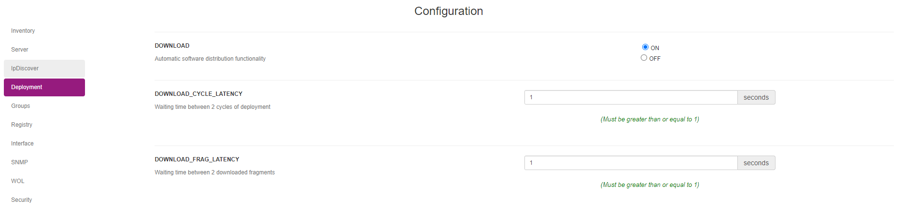

# Prerequisites on OCS deployment

This chapter will try to list all the requirement needed by the server and agents.

## Server configuration

Having deployment configured properly on the server is not really complicated, you'll have to keep two things in mind : 
* By default deployment is not enabled
* SSL / HTTPS is a mandatory, OCS doesn't send deployment package if the server is not configured with HTTPS

To enable OCS Inventory deployment feature, login with a sadmin user and navigate to the `Configuration -> General configuration` menu.

On the left of the page, click on the `Deployment` tab and set the `DOWNLOAD` settings to ON. 
Don't forget to click on the update button at the bottom of the page otherwise your settings won't be saved.



To configure the SSL with OCS, you need make sure that `mod_ssl` is available on your system.
Please, refer to your system documentation to get it installed and working.

You will find the official documentation here : https://httpd.apache.org/docs/2.4/en/ssl/ssl_howto.html

**Please note that OCS need to have the CN of the certificate to be EXACTLY the same of the Domain Name used by the agents**

## Agent configuration

The agent only need SSL configured to work with deployment.

You will find below a recommended configuration for OCS agent (Windows) : 
```
[OCS Inventory Agent]
ComProvider=ComHTTP.dll
Debug=1
Local=
NoSoftware=0
HKCU=0
NoTAG=0
IpDisc=
[HTTP]
Server=https://myfqdn.ocs.server/ocsinventory
SSL=1
CaBundle=cacert.pem
AuthRequired=0
User=
Pwd=
ProxyType=0
Proxy=
ProxyPort=0
ProxyAuthRequired=0
ProxyUser=
ProxyPwd=
[OCS Inventory Service]
PROLOG_FREQ=24
INVENTORY_ON_STARTUP=1
OLD_PROLOG_FREQ=24
TTO_WAIT=240
```

As you can see the server URL is set in HTTPS, the SSL parameter is set on 1 and CaBundle is set. CaBundle refer to the SSL Certificate path.

*Reminder : Windows agent configuration can be found in `C:\ProgramData\OCS Inventory NG\Agent`*