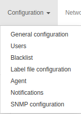
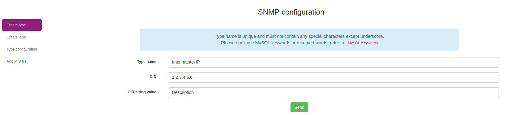
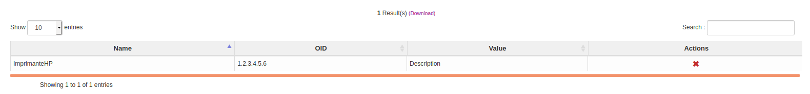
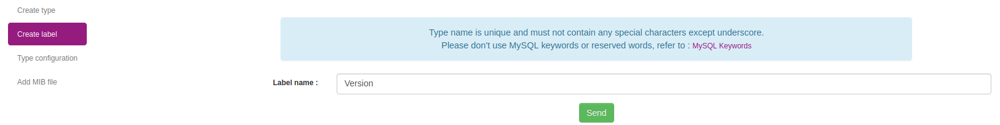
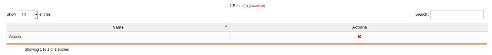
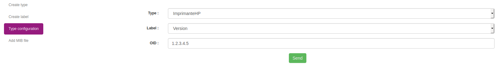
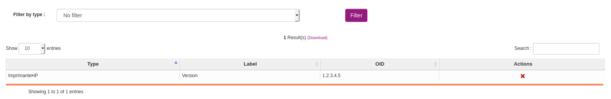
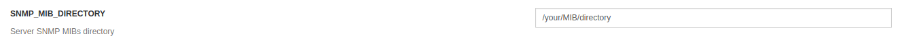
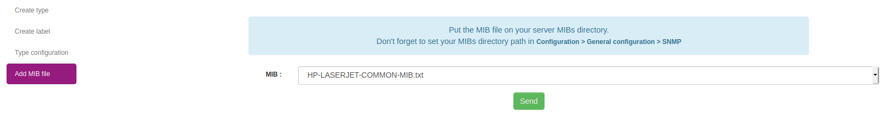
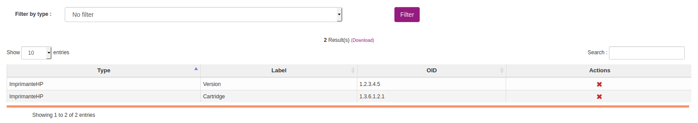

# Managing SNMP on Web Console

Since version 2.7, OCS Inventory's SNMP feature has been reworked

## Prerequisites

- snmp package on debian based operating systems
- net-snmp-utils package on redhat based operating systems

## Introduction

OCS Inventory SNMP is now based on a dynamic data model, which mean that the database model and inventory will be adapted depending on the queried device.

Basically, OCS will work using the following method :
1 - Declare a type and setup a matching criteria for this type
2 - Configure the needed labels (fields) for this type
3 - Configured the inventoried OID or import a mib file and link them to a label

## SNMP Type configuration

An SNMP type will be used to identify a specific device and link this device to a data model.

When the OCS Inventory agent will scan the network, it will use this type configuration to determine the corresponding data model and which MIBs / OID to use during the scan.

To configure an SNMP Type, go to `Configuration > SNMP configuration > Create type`.

First step, create a new type. SNMP type corresponding to the device that you want to inventory like printer, switch, etc ..

Set your type name, its OID and the string value corresponding to this OID. Click on `Send`.

**`Note : Type name must be unique and must not contain any special characters except underscore. Don't use MySQL keywords or reserved words, refer to : `[MySQL Keywords](https://dev.mysql.com/doc/refman/8.0/en/keywords.html)**

Below, you can see all created type. You can remove a type using the red cross.

**`Warning : Removing a type with already populated data will erase all existing informations (inventory data, configuration, etc..)`**

## SNMP Label configuration

A label is basically a field. When a label is linked to a type it will update the type's data model.

To create a label, click on `Create label` and create a label for every fields you need on your device. 

For example : Name, Description, Mac Address, Firmware version, Print level, etc..

**`Note : Label name must be unique and must not contain any special characters except underscore. Don't use MySQL keywords or reserved words, refer to : `[MySQL Keywords](https://dev.mysql.com/doc/refman/8.0/en/keywords.html)**

Below, you can see all created label. You can remove a label using the red cross.

## SNMP OID / MIBs configuration

When a type and their corresponding label are created, you will be able to configure which OID / MIBs file need to be used to scan the device.

### 1 - Manual type configuration

Click on `Type configuration` on the left navigation panel. Select your type, select your label and set the OID coresponding to the label's type. If you want tu use this field for reconciliation, check `Use for reconciliation`. Click on `Send`. 

Below, you can see all type configuration. You can remove configuration using the red cross.

If you want to display just one type configuration, select the type you want with the select field `Filter by type` and click on `Filter`.

### 2 - Configuring type from MIBs file

**`Warning : We advise you to increase your max_input_vars value on server's php.ini otherwise larger MIB file won't be imported correctly`**

Go to `Configuration > General configuration > SNMP` and set your server MIB folder directory. All MIBs files will need to be stored in this directory. We recommand to use the standard MIBs directory of your operating system.

Navigate to `Configuration > SNMP configuration > Add MIB file`. 

A dropdown will list every MIB files present in the directory configured above.
Select the MIB file you want to use.

OCS Inventory will scan the mib file and show every available entry in it. 

**`Note : Keep in mind that if a MIB depend from another MIB files, you will need to have them all on the system.`**

Select the type that you want to configure.

Check every OID needed and link it to one of the label created earlier. You can search by OID name string and Numeric OID.

On type configuration panel, you can see all type configuration. You can remove configuration with the red cross.

If you want to display just one type configuration, select the type you want with the select field `Filter by type` and click on `Filter`.

