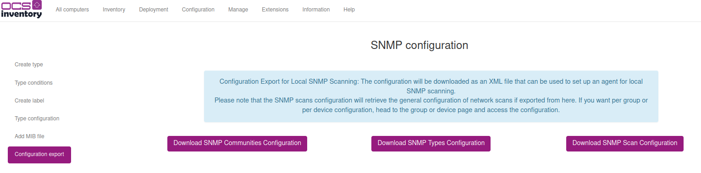
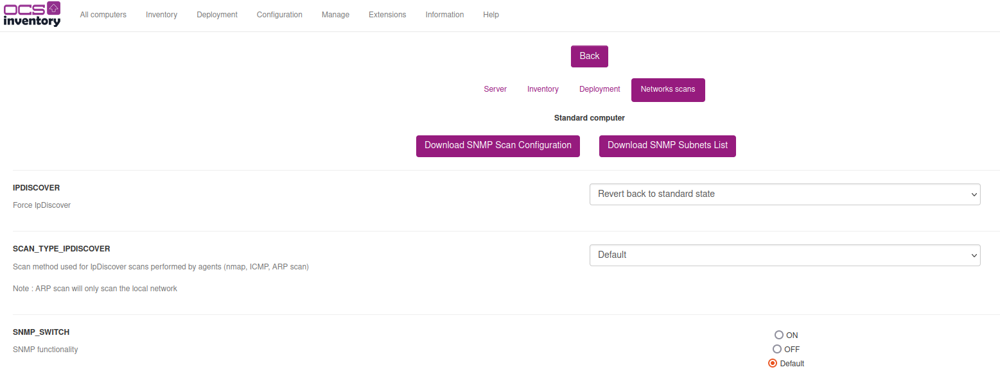

# Local SNMP Feature in OCS Inventory Agent

The local SNMP feature allows the agent to perform an SNMP scan even if it can't communicate with the server. The scan will output a xml file in the directory specified when using the --local option.

## Using the Local SNMP Scan Feature
### Prerequisites

- Unix agent version 2.10.2 or higher
- Net::Ping, Nmap::Parser or arp-scan command-line tool
- Local SNMP configuration files (see the Configuration section for details about configuring and retrieving the files)

### Configuration

To perform a local scan, the agent uses configuration files instead of the configuration it would have received from the server if connected to it:

- localsnmp_scans_conf.xml: Configuration of the network scan, which scan type to use, and ARP bandwidth option
- localsnmp_communities_conf.xml: Configuration of the communities to use
- localsnmp_subnets_conf.xml: List of the subnets to scan
- localsnmp_types_conf.xml: Configuration of the types

These four files are required and should be placed under a snmp/ directory within the agent configuration directory, e.g. `/etc/ocsinventory-agent/snmp/`. Since this feature isn't enabled by default, you will need to create the snmp/ directory manually.

### Retrieving the Configuration Files

First, make sure the SNMP feature is enabled on OCS, and that types and communities have been configured. Refer to the [SNMP documentation](../06.Network-Discovery-with-OCS-Inventory-NG/Using-SNMP-scan-feature.md) for more details.
    
Network Scans can also be configured if needed, but the default configuration values can be used for an initial scan.

Then, head to Configuration > SNMP Configuration > Configuration export. Click the buttons to download each file. 



The per device/group scan configuration can be retrieved from the device detail page:
Configuration > Edit > Networks scans > Download SNMP Scan Configuration



This page also provides the fourth configuration file needed to set up a local scan: make sure the SNMP_NETWORK field is completed and then hit the "Download SNMP Subnets List" button.

You should have downloaded 4 files so far. Place them inside the snmp/ directory inside your agent configuration path (e.g., /etc/ocsinventory-agent).

```
~ ❯ ls /etc/ocsinventory-agent/snmp/                              
localsnmp_communities_conf.xml  localsnmp_scans_conf.xml  localsnmp_subnets_conf.xml  localsnmp_types_conf.xml
```

Located on the same path, edit the following two files to enable the feature :

* `ocsinventory-agent.cfg`: add the line `localsnmp=1`

If SNMP was already configured, the `snmp=1` line can be left as is : if performing the inventory locally (i.e. using --local), only the localsnmpscan module will be used.

* `modules.conf`: add or uncomment the following line:
```
use Ocsinventory::Agent::Modules::LocalSnmpScan;
```

___

### Performing the Scan

After following the configuration steps, performing the scan locally is only a matter of launching the inventory in local mode. To do so, use the `--local=/path/to/output/dir/` command-line option, like so : 

`ocsinventory-agent --local=/tmp/`

The output of the local SNMP scan will be an XML file named `<DEVICEID>_snmp.ocs` in the directory specified by the --local option.

This file can then be injected into the OCS server using the perl `ocsinventory-injector.pl` script.

___
### Troubleshooting

If encountering an issue, the agent log file can be searched for reference to localsnmpscan and snmpscan. More logs will be produced if the agent uses the debug mode.