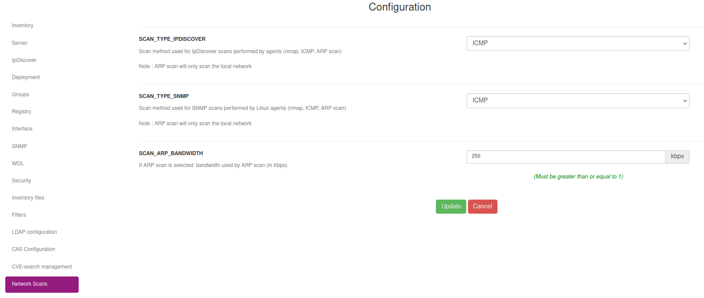
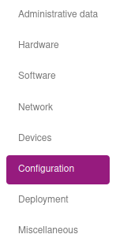
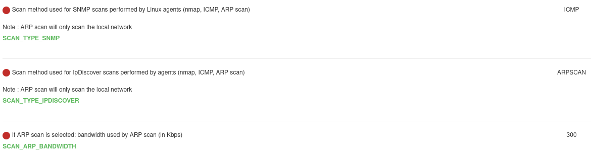
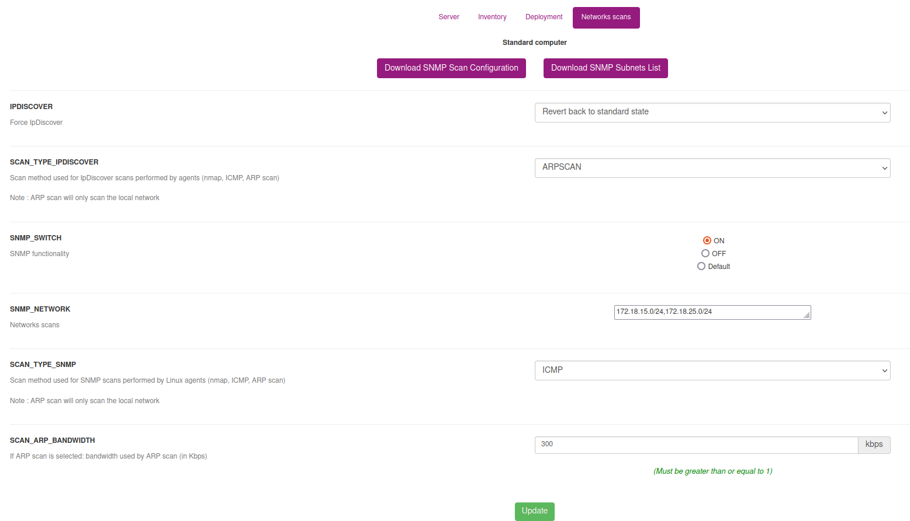
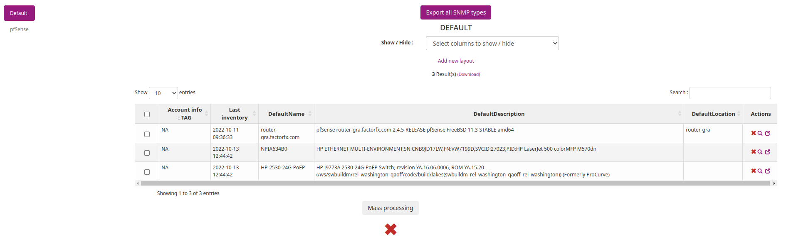
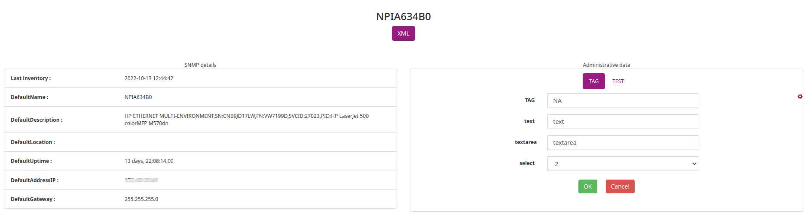
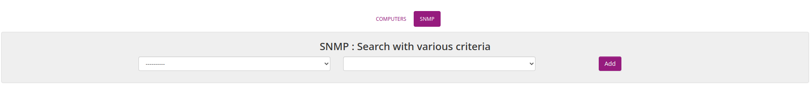
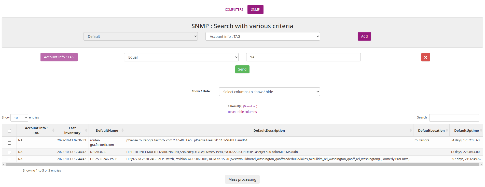
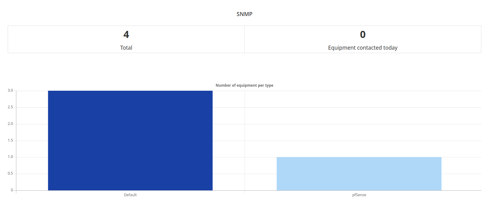

# Using SNMP scan feature

**`Warning: SNMP scan feature is available only for Unix Agent.`**

## How does it works ?

Since version 2.8 and nightlies from the 10th of june, OCS Inventory integrates a new SNMP scan feature. The main goal of the SNMP integration in OCS Inventory is to enhance data collected by Ipdiscover. Using SNMP scan, you will be able to get a lot of informations about network devices which don't have an OCS Agent.

SNMP scan will be performed by the OCS Unix Agent using IP addresses collected by Ipdiscover. The IP Addresses list is sent by the server during the initial contact with the agent (PROLOG step).

You can find more informations about Ipdiscover [here](../06.Network-Discovery-with-OCS-Inventory-NG/Using-IP-discovery-feature.md).

**`Warning: an Agent MUST BE Ipdiscover elected (or forced manually) to be able to make SNMP scan.`**

## Configuring SNMP scan

### **General options**


To manage SNMP general options in Web Interface, go to `Configuration` menu, click on `General configuration` and go to the `SNMP` tab.


This is the SNMP configuration options available:

* **SNMP**: activate or deactivate SNMP scan feature. If this option is _OFF_, no SNMP scans will be made by any OCS agent
* **SNMP_MIB_DIRECTORY**: set the server MIBs folder path

For more in depth configuration options, see the `Network Scans`  tab :



* **SCAN_TYPE_SNMP**: set the SNMP scan type (by default set to ICMP. Possible values are ICMP, NMAP, ARPSCAN)
* **SCAN_ARP_BANDWIDTH**: set the ARP scan bandwidth (by default set to 256kbps. Option will be displayed if SCAN_TYPE_SNMP is set to ARPSCAN)

**`Note: ARPSCAN will require the arp-scan command line tool to be installed on the agent.`**

These values are also customizable per group or per device. You will need to access the `Configuration` tab of the group or device you want to configure.
As an example, from a device details : 



After scrolling a bit, you will see the options and their values :



To edit the values, click on the `Edit` button at the top, right under the device name. 

On the next page, go to the `Networks scans` tab :



You can now edit the values and click the 'Update' button to save your changes.

**`Note: Since these options are customizable at the general, group and device level, the device value will override the group value, which will override the general value (i.e. general < group < device).`**


### **Manage SNMP communities**

To be able to scan a SNMP device, you must use SNMP community. SNMP community can be viewed as authentication informations to be allowed to scan SNMP devices. SNMP community is created by 2 informations:

* SNMP version : it is the SNMP version supported by the SNMP device(s) (can be version 1, version 2, version 2c etc...)
* SNMP community name : it is the community name you set in your SNMP device(s). For many SNMP devices, the default SNMP community name is public.

SNMPv3 configuration parameters :

* Username : Security name
* Level : Security level (noAuthNoPriv | authNoPriv | authPriv)
* Authpasswd : Authentication protocol pass phrase
* Authproto : Authentication protocol (MD5 | SHA)
* Privpasswd : Privacy protocol pass phrase
* Privproto : Privacy protocol (DES | AES)

If you set your own SNMP communities in your SNMP devices, you have to add it in OCS Inventory configuration. OCS agent will received informations about this communities and will try to scans SNMP devices using every SNMP communities you set in administration console. SNMP communites informations are directly added in database.


To manage SNMP communities in Web Interface, go to `Manage` menu, click on `Network scan` and go to the `Manage SNMP communites` tab.


You can now add a new SNMP communities using the `Add` button. A new screen is displayed :


You have to set a community name and a SNMP version (using the drop list).

* To delete a SNMP community, click on the red cross
* To modify a SNMP community, click on the edit icon

`Required libraries on Unix Agent to use SNMPv3 :`
```
apt-get install libdigest-hmac-perl
DES Privacy protocol : apt-get install libcrypt-des-perl
AES Privacy protocol : apt-get install libcrypt-rijndael-perl
```

### **Configuring SNMP data model to scan**

SNMP scan is now based on a dynamic data model, which mean that the database model and inventory will be adapted depending on the queried device.

To configure SNMP scan data model, read the documentation [Managing SNMP on Web Console](../06.Network-Discovery-with-OCS-Inventory-NG/Managing-and-using-SNMP-feature.md).

**`Note: SNMP scan feature won't work without data model configuration.`**

### **Electing computer(s) to be able a SNMP scan**

To be able an Agent to scan its network using SNMP (without waiting for an Ipdiscover automatic election), you may have to set its custom parameters at computer side or at groups side.

#### **Configuring computer custom parameters**

To make a single Agent to scan its network using SNMP, you have to set it in its custom parameters. First, go to its `Configuration` page and click on `Edit`. Then, click on the `Networks scans` tab.


**`Note: Since OCS Inventory NG 2.1, you can scan remote networks (others that where the agent is located)`**


* If no network address appears in **IPDISCOVER** option, you have to set it manually using the drop list 
* You can enable/disable a computer to make SNMP scans using **SNMP_SWITCH** option. By default, global configuration parameter is taken, corresponding to the Default radio button.

Click on the `Update` button to save your modifications.

#### **Configuring groups custom parameters**

To make a multiple Agents to scan its network using SNMP, you have to set it in group custom parameters.
First, click the `Inventory` menu and `Groups`. Select the group that you want to be able to a SNMP scan. At the bottom of the customization page click on `Select a parameter to be modified`.
Then, click on the `Networks scans` tab.


The configuration parameters are the same that a single computer.

Click on the `Update` button to save your modifications.

## Configuring Unix Unified Agent

### **Prerequisites**

To be able to make SNMP using OCS Unified Unix agent, you have to install Net::SNMP perl module. You can find more information in the page [Unix agent](../03.Basic-documentation/Setting-up-the-UNIX-agent-manually-on-client-computers.md).

### **Copying SSL certificate file**

To allow Unix Unified agent to download snmp_com.txt file using HTTPS, you have to copy SSL certificate file (as cacert.pem) in your OCS server configuration directory in your basevardir directory.

**`Note: basevardir directory is the path specified in your /etc/ocsinventory-agent/ocsinventory-agent.cfg using basevardir = parameter.`**

Your OCS server configuration directory is a directory created automatically using your OCS server URL (http:__ocsinventory-ng_ocsinventory for example).

For example, if your basevardir parameter is _/var/lib/ocsinventory-agent/_ and your OCS server URL is ``http://ocsinventory-ng/ocsinventory``, so you have to copy your cacert.pem certificate file in /var/lib/ocsinventory-agent/http:__ocsinventory-ng_ocsinventory directory.

**`Note: If you already use a SSL certificate for OCS packages deployment, you may not have to copy a new one for SNMP scans feature. Indeed, if you use the same HTTPS server for OCS package deployment and snmp_com.txt file download, cacert.pem file will be same one in the same directory.`**

### **Scans informations using debug mode**

To see more informations about SNMP scan, you can launch _ocsinventory-agent_ using debug mode, like this:

    $ sudo ocsinventory-agent --debug

You will see an debug output about SNMP scan like this:

    [Sun Jan  9 19:40:56 2020][debug] [snmpscan] Scanning 192.168.11.4 device
    [Sun Jan  9 19:40:56 2020][debug] [snmpscan] Running HP (11) MIB module
    [Sun Jan  9 19:40:56 2020][debug] [snmpscan] Running If MIB module
    [Sun Jan  9 19:40:56 2020][debug] [snmpscan] Running Printer MIB module
    [Sun Jan  9 19:40:57 2020][debug] [snmpscan] Scanning 192.168.11.2 device
    [Sun Jan  9 19:41:09 2020][info] [snmpscan] No more SNMP device to scan
    [Sun Jan  9 19:41:09 2020][debug] sending XML
    [Sun Jan  9 19:41:09 2020][debug] sending: <?xml version="1.0" encoding="UTF-8"?>
    <REQUEST>
      <CONTENT>
        <IMPRIMANTE_HP>
          <DESCRIPTION>HP ETHERNET MULTI-ENVIRONMENT,SN:CNB9JD17LW,FN:VW7199D,SVCID:27023,PID:HP LaserJet 500 colorMFP M570dn</DESCRIPTION>
          <MACADDRESS>98:E7:F4:A6:34:B0</MACADDRESS>
        </IMPRIMANTE_HP>
      </CONTENT>
      <DEVICEID>thekid-2010-10-13-20-11-26</DEVICEID>
      <QUERY>SNMP</QUERY>
    </REQUEST>
    [Sun Jan  9 19:41:09 2020][debug] [snmpscan] End snmp_end_handler :)

In this example, you can see that the agent scanned an equipment and the data related to your SNMP data model configuration.


## SNMP Inventory

You can see all SNMP Inventory on `Inventory > SNMP`.


The left panel lists all types that you created before with the SNMP data model configuration.



Click on the detail icon to display a quick overview of a SNMP device's information.


Click on the red cross to delete an equipment.

Click on `Export all SNMP type` to export all equipments of all types in CSV format.

Click on the window icon to open the details page.



On the details page, you can export the informations of this equipment in XML format and update the administrative datas.

## Search with various criteria

Since 2.11, the SNMP feature has been added in `Search with various criteria`.

Go to `Inventory > Search with various criteria` and click on `SNMP` tab at the top of the page.



`Note : the SNMP tab is available only if the SNMP feature is enabled`

Select the type you want and the column you want to search on and click `Add`.

Select the operator and set the value and click on `Send`.



For the moment, the SNMP multi-criteria search only allows you to search on one type at a time.

## SNMP statistics

At the bottom of the dashboard, you will find the SNMP statistics.



`Note : the SNMP statistics are available only if the SNMP feature is enabled`