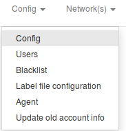
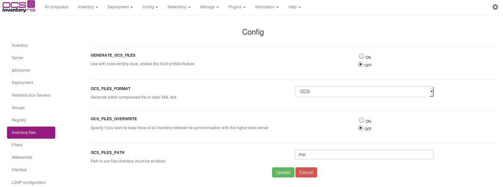

#Synchronization between OCS servers master/slaves

## Operating principe

Since 1.02 release, you can use the OCS_OPT_GENERATE_OCS_FILES server parameter to automatically generate
these files to "inject" it to a higher level server. (in case of multi entities configuration for example).

In that case, you can use a cronjob if the two servers are connected, or put it on the higher level server
and run it on loopback.

**`Warning: This feature just allows you to "inject" inventories into a higher level server. It will be
impossible to deploy packages from the highest server.`**

## Simplified Diagram

## Prerequires

ocsinventory-injector.pl is a script designed to send inventory to an OCS server using .ocs files
generated by -local (or /local for windows). You must have a writable directory to store .ocs files.
If you want to automate this synchronization, you have to create a cronjob.

## Configuration of management console

To configure this feature, click on _Config_, and _Config_. Then, click on _Inventory Files_ tab.

**`Warning: Don't forget to create the directory with writable rights.`**

## Server configuration

The configuration file is in

    /etc/apache2/conf.d/z-ocsinventory-server.conf

You can verify values here

    # ===== INVENTORY FILES MAPPING SETTINGS =====

    # Use with ocsinventory-injector, enable the multi entities feature
    PerlSetEnv OCS_OPT_GENERATE_OCS_FILES 1
    # Generate either compressed file or clear XML text
    PerlSetEnv OCS_OPT_OCS_FILES_FORMAT OCS
    # Specify if you want to keep trace of all inventory between to synchronisation with the higher level server
    PerlSetEnv OCS_OPT_OCS_FILES_OVERWRITE 0
    # Path to ocs files directory (must be writeable)
    PerlSetEnv OCS_OPT_OCS_FILES_PATH /home/ocs

**`Warning: Values in database (GUI) take precedence over the configuration file, that's why you
have to use web interface to configure this feature.`**

## Command line options

**Options** | **Complete options** | **Meaning**
------|------|------
-h | --help | Command line options
-d | --directory | Load every .ocs files from a directory
-f | --file | Load a speficic file
-u | --url | Ocsinventory backend URL, default is [http://ocsinventory-ng/ocsinventory](http://ocsinventory-ng/ocsinventory)
--useragent |   | HTTP user agent, default is OCS-NG_LOCAL_PL_v".VERSION."
-r | --remov | Remove succesfuly injected files
-m | --msg | Show message returned my ocsinventory
-v | --verbose | Verbose mode
--stdin |   | Read data from STDIN

**`Note: You can specify a --file or a --directory or STDIN. Current directory is the default`**

## Exemples

### **Synchronsation of one inventory**

    perl ocsinventory-injector.pl  -v -f myInventory.ocs  -u http://OCSmasterServer/ocsinventory

### **Synchronsation of all inventories in a specific directory**

    perl ocsinventory-injector.pl  -v -r -d /my/specific/directory -u http://OCSmasterServer/ocsinventory

## Cron job

You can "inject" inventories automaticaly with a new entry in your crontab :

    ##### Every 5 minutes ----- execution of OCS injector
    */5  * * * *   root    perl /usr/src/OCSNG_UNIX_SERVER-1.3.3/binutils/ocsinventory-injector.pl -v -r -d /home/ocs -u http://OCSmasterServer/ocsinventory
