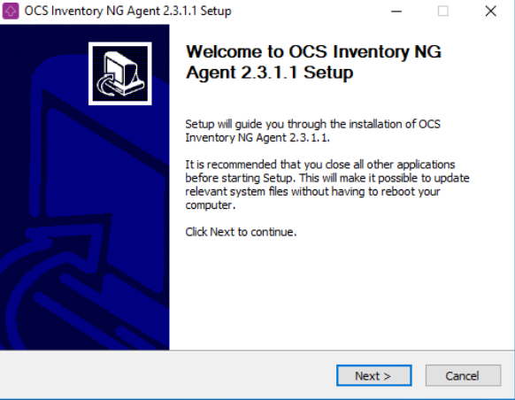
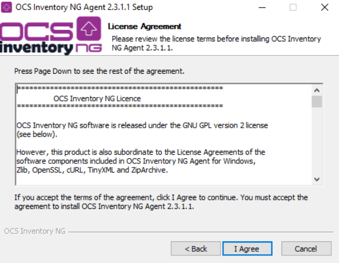
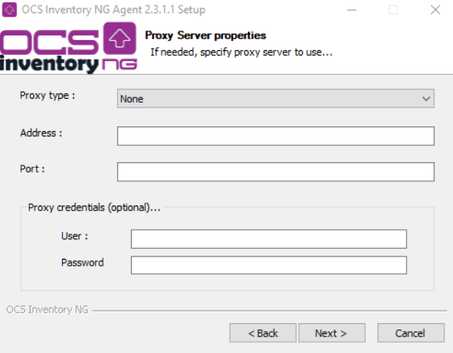
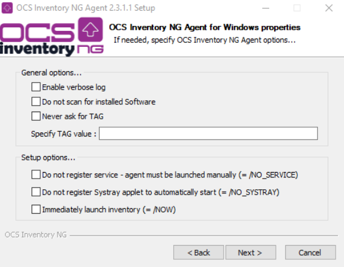
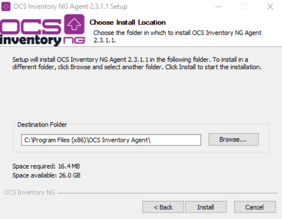
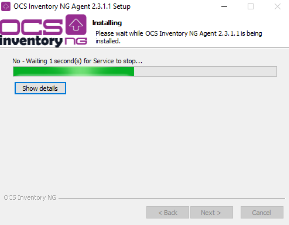

# Using local proxy cache to deploy on remote network

Since 2.0 version, it's possible to use proxies cache as a redistribution server. Agents witch are
located on a different entity than OCS Inventory server will download their deployment packages
on local proxy, and will not use WAN connection to get back packages so.

## Operating principe

A new deployment package is created from OCS Inventory NG server and affected to differents machines
located on a different geographical entity. On remote entity, first agent will download package
on OCS Inventory server. HTTP is filtered through the remote entity proxy and cached, that's why
next agents will retrieve the package directly in proxy cache (because stored in the cache at the
previous query), and will not use WAN connection so.

* \+ : avoids overloading of you WAN connection bandwidth.
* \- : if a package is defective, you will have to clean the proxy cache, in order to avoid next
agents to download this bad package.

## Architecture

## Prerequires

* an OCS Inventory NG server configured to use deployment feature OPT_DEPLOY to ON, SSL activate,
certificate SSL cacert.pem presents on computers)
* a proxy on remote entity with a cache relatively large (depending on you packages size)
* agents configured to use proxy (ProxyType, Proxy, ProxyPort, ProxyAuthRequired, ProxyUser,
ProxyPwd in ocsinventory.ini)

## Agents configuration

Depending on proxy type (transparent/authentificator), differents configurations are possibles.

### **Configuration step by step**

Launch **OCS-NG-Windows-Agent-Setup.exe** file. A windows opens. Click on **Next** button.

Accept user licence clicking on **I accept**.

Specify the address of your OCS Inventory NG server, authentification parameters of web server (optionnal)
and if you want to do a SSL control, define certificate path.

Specify proxy type, proxy address, listen port, and its authentification parameters.

Specify if you want to have a better verbose in your logs, if you want to register OCS as a service
and if you want or not see it in systray, administrative TAG of machine, and then if you want to send
an inventory just after the end of the installation. Click on **Next** button.

Choose installation directory of binaries. Click on **Install** button.

Installation is in progress.

Click on Close button.

End of installation.

### **Result in ocsinventory.ini**

Here, the configuration file of an agent using authentifiant proxy:

    [OCS Inventory Agent]
    ComProvider=ComHTTP.dll
    Debug=2
    Local=
    HKCU=0
    NoTAG=0
    IpDisc=
    [HTTP]
    Server=http://OCSserveur.mondomaine/ocsinventory
    SSL=1
    CaBundle=cacert.pem
    AuthRequired=1
    User=
    Pwd=
    ProxyType=1
    Proxy=ProxyLocal.mondomaine
    ProxyPort=8080
    ProxyAuthRequired=1
    ProxyUser=EdJdsJc6fNXRXzMlaDblzQ==|||E02L5EtgtxzUSEPp98J25Q==
    ProxyPwd=BHC2aWyaiD5Pgl1UmLXBmw==|||NH5R4H3hZiDiDFkVezPAVQ==
    [OCS Inventory Service]
    PROLOG_FREQ=24
    OLD_PROLOG_FREQ=24
    TTO_WAIT=83460

**`Note: User name and password used to proxy authentification are encrypted.`**
