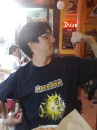

## Résumé de la rencontre team sur Paris

Mercredi 7 juillet 2010, une partie de la team s'est retrouvée à Paris pour faire le point sur
l'avancée SNMP. Différents points ont été abordés sur la récupération des infos SNMP et la forme des
fichiers de référence. L'autre point important a concerné la mise à jour de ces fichiers et la
possibilité de le faire par le serveur OCS. La sortie de l'agent Unifié en version 2.0A est donc
confirmée pour le courant de l'été.

Pour vous donner une idée de l'ambiance très studieuse de cette réunion, voici quelques photos:

Guillaume (Mortheres) racontant son combat pour imposer son OS favori...

Erwan (Airoine) cherchant l'inspiration dans une pinte de bière (la deuxième déjà...)

Pierre (plemmet) mangeant la glace de l'homme invisible... A moins que ce soit la \<bip> de
l'homme invisible..

Un bel ordi (sous kubuntu... burkkkkk!!!) appartenant à mortheres... \<troll> Et oui, OpenBSD
ne fonctionne pas sur un portable! \</troll>
