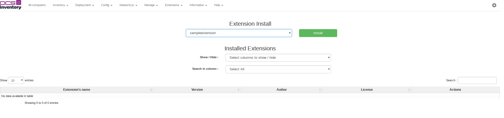

##Installation
Python3 is required to use the plugin engine.

First, you need one python's package : scp.
Install it with the command pip3.

```bash
sudo apt install pip3
sudo pip3 install scp
```

##Utilisation


####Install plugin in web
Download the plugin, place it in the extension folder in ocsreports and unzip it.

Go on ocsreports in extension tab. Select the plugin and click on install.




Logout and login for finish the web installation.
Now you can process to installation on the server.

####Install plugin in server
For install plugin on server, use the script ocsreports/tools/install_plugin.py.

Execute the script in sudo:
```bash
sudo python3 install_plugin.py
```

Enter the path where plugin's location:
```bash
Where is the plugins location [/usr/share/ocsinventory-reports/ocsreports/extensions/]
/path/to/plugin/
```
_Don't forget the last slash_

After, the script will suggest all repositories who can be plugins.
Select with a number the plugin who you want to install:
``` bash
[0] => plugin1
[1] => plugin2
[2] => plugin3
...
0
```

Now there are two specific cases:
 * The Ocs server is in same server.
 * Ocs Server is in other server.

In case where ocs is in other server, you need to enter the server's informations:
``` bash
What is the host:
127.0.0.1
What is the username:
root
What is the password:
Password:
```

In both case, you will enter the OCS server location:
``` bash
Where is the server location [/etc/ocsinventory-server]

```

You can write nothing if the path in brackets is correct.
The script will copy all needed file in the server location
and finish with the apache restarting.
