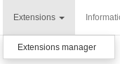
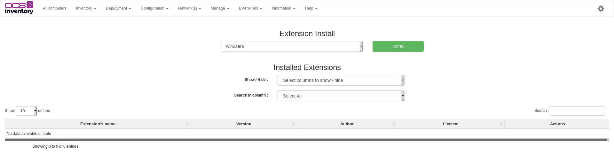

# Using extension engine

Since 2.6, the plugin engine has been completely rewritten and improved.

**`Note : Be careful to download the plugin version compatible with the extension engine`**

## Prerequisites for the extention engine

To use the extension engine, Python3 is required.

First, you need one python's package : scp.
Install it with the command pip3.

```bash
sudo apt install python3-pip
sudo pip3 install scp
```

## Installation

Installing a plugin on your server(s) occurs in 3 steps:

1. Installation of the extension package on the Administration server's filesystem;
2. Activation of the extension via the Administration console;
3. Installation of the extension for the Communication server.

Once the plugin is installed on your server(s) you still have to deploy an agent-part on all your agents.

### Plugin installation on filesystem

First download the extension here:

Github : https://github.com/PluginsOCSInventory-NG

OR

Plugin site : https://plugins.ocsinventory-ng.org/

Then, place the downloaded zip file on the `extensions` folder of your Administration server and unzip it.

**` The Administration server's extenstions folder is /usr/share/ocsinventory-reports/ocsreports/extensions by default `**

You may delete the zip file after it is unzipped.

### Plugin activation

Log into your Administration console and go to the "Extensions" tab.

Select the plugin and click on "Install".





Logout and login for finish the web installation.

You can now proceed with the installation on your Communication server.

### Scripted communication server installation

To install your plugin on the Communication server, the `install_plugin.py` may be used.

On your Administration server, go to the `/usr/share/ocsinventory-reports/ocsreports/tools` 
folder, and execute the script with sudo:

```bash
sudo python3 install_plugin.py
```

Enter the path to your Administration server's `extensions` folder:

```bash
Where is the plugins location [/usr/share/ocsinventory-reports/ocsreports/extensions/]
/path/to/plugin/
```

_Don't forget the last slash_

After, the script will present you all the plugins that can be installed.
Select with a number the plugin that you want to install:

``` bash
[0] => plugin1
[1] => plugin2
[2] => plugin3
...
0
```

Now there are two specific cases:

 * The Ocs server is in same server.
 * Ocs Server is in other server.

In the case where you Communication server is on another server, you need to enter 
the server's informations:

``` bash
What is the host:
127.0.0.1
What is the username:
root
What is the password:
Password:
```

In both case, you will have to enter the path of you Communication server's configuration directory:

``` bash
Where is the server location [/etc/ocsinventory-server]

```

The script will copy all the needed files into your Communication server's configuration directory.

**`Note :  Don't forget to restart your Communication server's apache service after the installation has finished`**

### Server installation without script

To install plugins without the `install_plugin.py` script, log into your Communication server and go to its configuration 
directory (By default "/etc/ocsinventory-server/").

There, create a new directory into "perl/Apache/Ocsinventory/Plugins/" with the name of the plugin and place the
Map.pm file inside.

Finally, place the plugin's configuration file into the "plugins/" folder.

**`Note :  Don't forget to restart your Communication server's apache service after the installation has finished`**

### Plugin deployment 

Now that your Administration and Communication servers support your plugin, you need to deploy the agent part on you clients.

The plugin's agent part is usualy located in the `agent` subfolder of your plugin's zip file.

So, find this folder back and create a zip file containing all the files in this folder.

Then, create a deployment package with the `Store` action as explained in 
[Deploying packages or executing commands on client hosts](../05.Deployment/Deploying-packages-or-executing-commands-on-client-hosts.md)

Specify `C:\Program Files (x86)\OCS Inventory Agent\Plugins` as the path where the files need to be copied on the agents.
