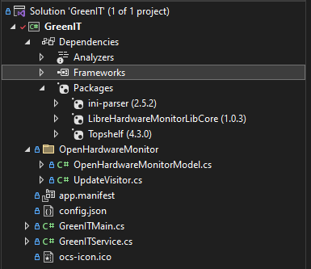
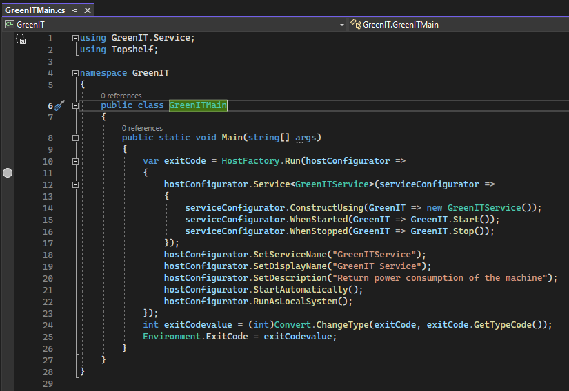
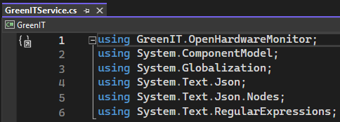
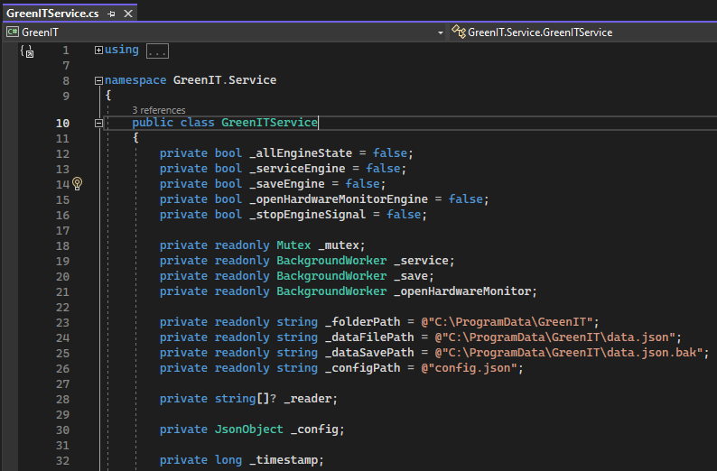
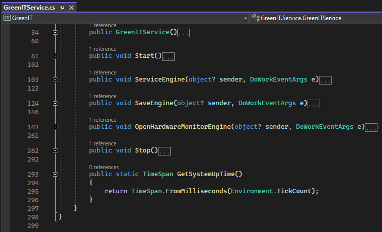
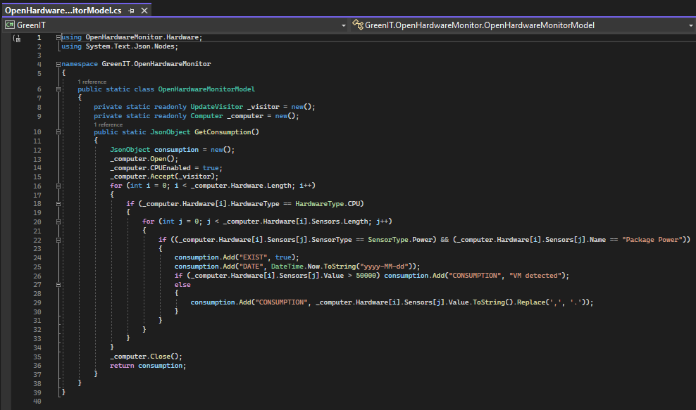

# OCS Inventory Service - Green IT

## Introduction

This documentation provides an overview of how the GreenIT service works.

## Software version

The project was developed using Visual Studio Community 2022 version 17.5.0 on a Windows 10 Pro x64 (22H2) distribution.

> _IMPORTANT NOTE: During installation, make sure to check ".NET desktop development" and ".NET framework 6.0" to avoid any issues when working on the project._

## Structure

The project is organized as follows:

  

## Packages

The service relies on three important packages to function properly:

- ini-parser : Used for reading ini files.

- LibreHardwareMonitorLibCore : Enables the collection of consumption data.

- TopShelf : Allows the project to run as a service.

## Main content

Two files are important to understand how the service works :

- GreenITMain.cs
- GreenITService.cs

### GreenITMain.cs

This file creates the Windows service and defines its settings, such as the service name, description, and run method.

  

### GreenITService.cs

This file is the main component of the service and contains all the functions used by the service.

### Variables definition

  

  

Service was made to be easily upgradeable and maintainable in the future.

Variables are divided into three parts :

- Engine signals : Control each engine.

- Background workers : Part of the different engines, used to run the engines in the background.

- Other settings : Used by the workers, such as the service installation path and destination data file.

### Engine organization

The service operates using three main components:

- Service engine : Monitors the data file.

- Backup engine : Creates a backup of the data file at specified intervals.

- OpenHardwareMonitor engine : Calculates and formats the data.

Functions are organized chronologically in the file :

- Start function
- Service engine
- Backup engine
- OpenHardwareMonitor engine
- Stop function
- Utilities functions

  

### OpenHardwareMonitor engine

The OpenHardwareMonitor engine retrieves the consumption data collected from the OpenHardwareMonitorModel.cs file :

  

It calculates the service uptime and reads/writes data in JSON format to the data file.
