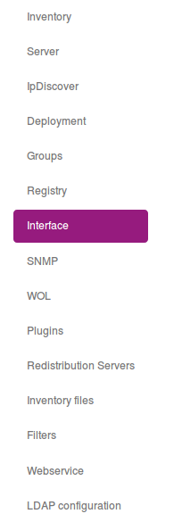

# Creating a theme

## Introduction

Since OCS Inventory 2.5, you have the possibility to create Theme to customize your OCS Reports web console.

At the moment, you can :
* Change CSS
* Images (logo and banner)

## Where it is located ?

The theme folder is located in : ```/usr/share/ocsinventory-reports/ocsreports/themes```

## Install a theme

To install a theme, you need to put your theme's folder in the following place : ```/usr/share/ocsinventory-reports/ocsreports/themes```

## How to change the current theme ?

To change the current theme, you need to go in the OCS Inventory configuration menu : ```Configuration > General Configuration```

Navigate to the ```Interface``` tab.



Then, you need to change the ```CUSTOM_THEME``` to the desired value.


Note : You need to logout and login again to see the theme modification. In the case, it doesn't work, try to clear your browser cache.

## Sample theme

By default, OCS use the theme named ```OCS```

It is located in : ```/usr/share/ocsinventory-reports/ocsreports/themes/OCS```

You can use it as a sample theme.

Note : All style in OCS Inventory can be overrided by the theme engine