## Dashboard
There is a dashboard to display calculated data. You can go to `Inventory >> GreenIT Manager`.

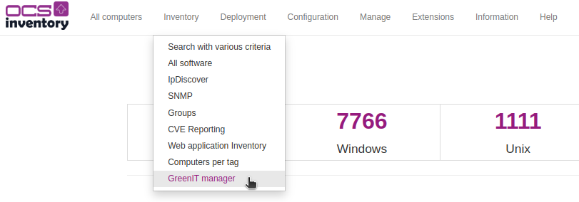

Then on the left, you'll have this menu:

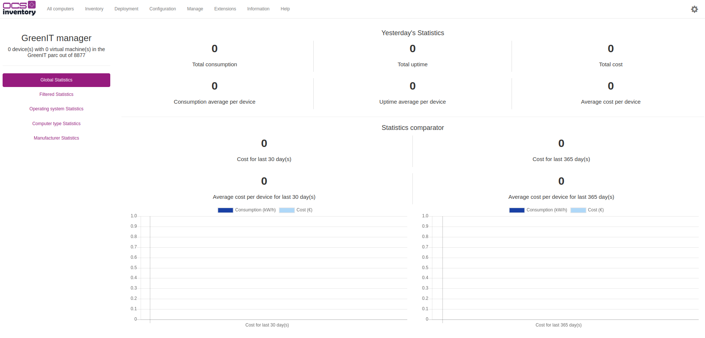

As you can see, there is 5 differents statistics views that can be seen:
- Global   *(Data of all the IT parc)*
- Filtered   *(Data of a single machine or a filtered group)*
- Operating system   *(Preset to display data per operating system)*
- Computer type   *(Preset to display data per computer types)*
- Manufacturer   *(Preset to display data per manufacturers)*

### The global statistics
This is the global statistics and the default view of your IT parc.

It can display two principal blocks:
- Yesterday's statistics
- Statistics comparator

The yesterday's statistics block have 3 parts than explain:
- Consumption
- Uptime
- Cost

Each blocks have a total of and an average of the data.

Whereas the statistics comparator have only the cost part and a graphical view wich compare the total consumption with the cost. There is two comparators dates which can be changed in the config view.

Example picture of the global stats view with data:

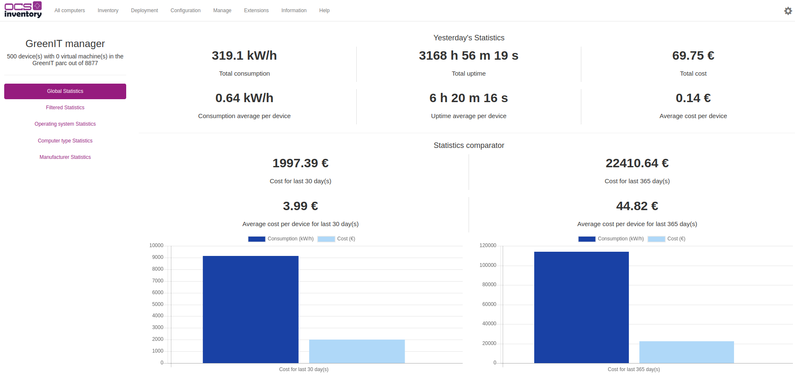

### Filtered statistics
The filtered view is usefull to apply a filter on the global data. The OCS-Inventory filter can help you to filter with assets category, groups, operating system or tags.

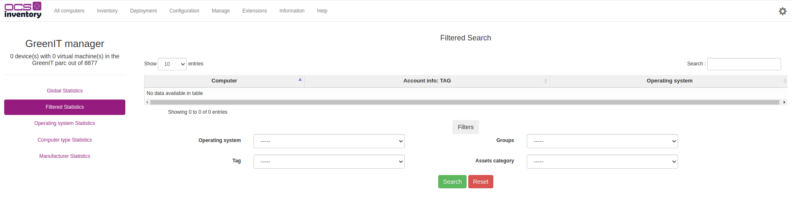

If you already have executed the crontab and you have result like this:

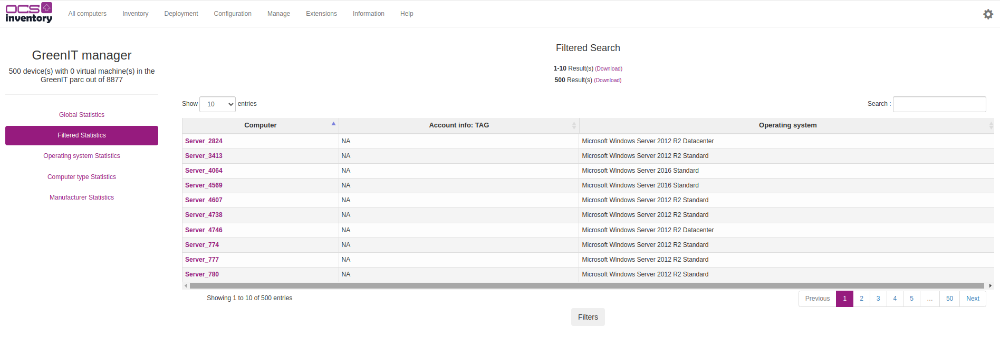

you can interact with the name of the computer in the table to have unique data about this computer:

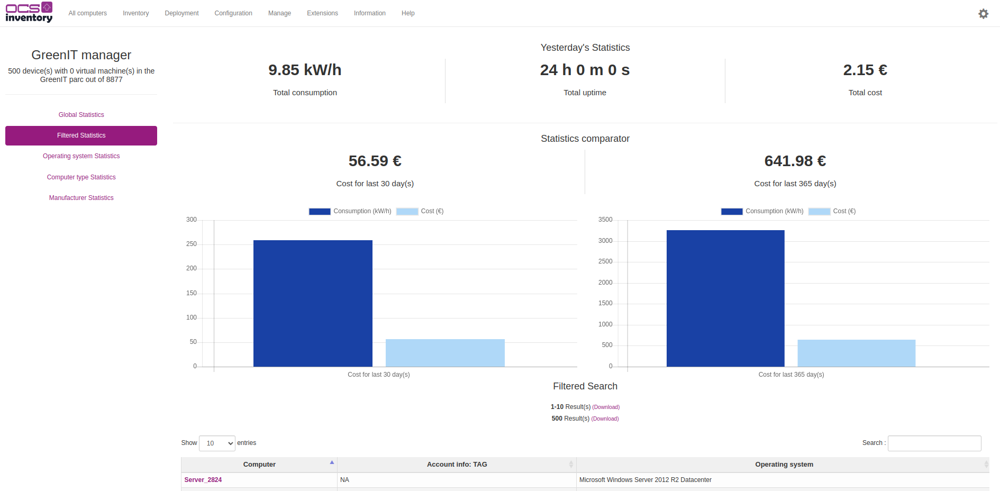

or you can apply a filter, when you apply it, there is a message that inform you the filter is active. Below this message, a generate filtered stats button is available too.

If you click on generate filtered stats, the filtered view will be displayed like the global stats view but with filtered data:

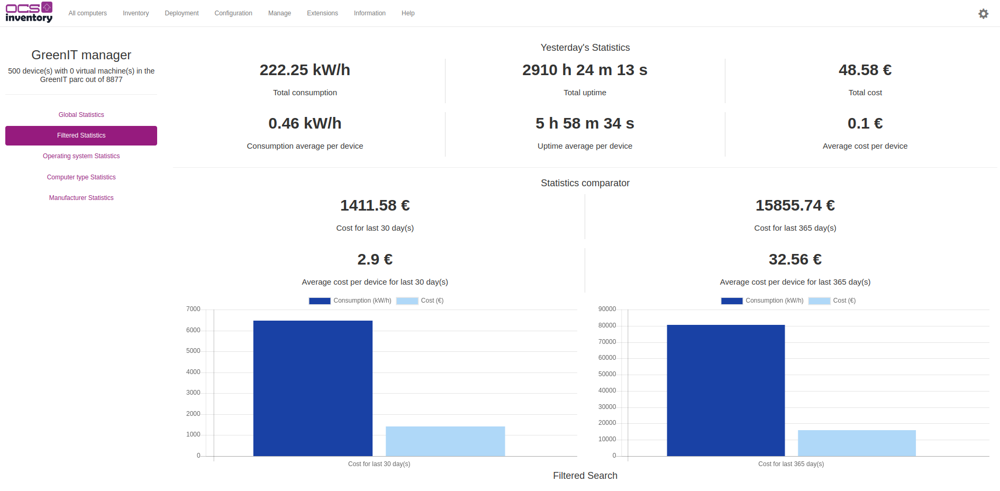

### Operating system statistics
The operating system stats view is a preset to compare windows clients and servers.

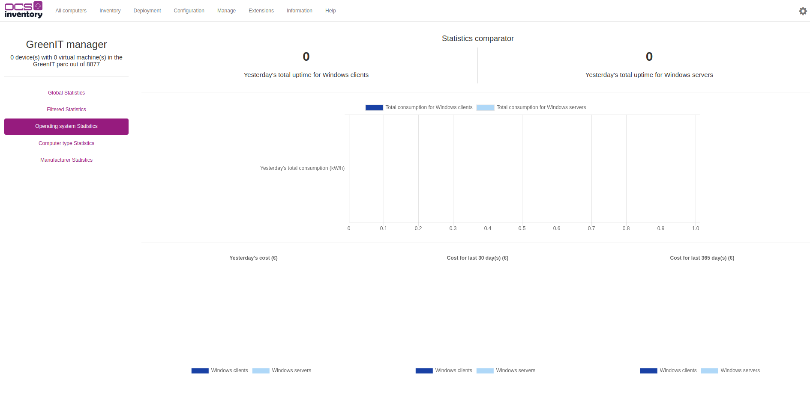

This view is splited into 2 parts:
- D-1 uptime and total consumption
- 3 doughnuts diagram of cost per operating system to compare D-1, compare date X and compare date Y

Example picture of operating system stats view with data:

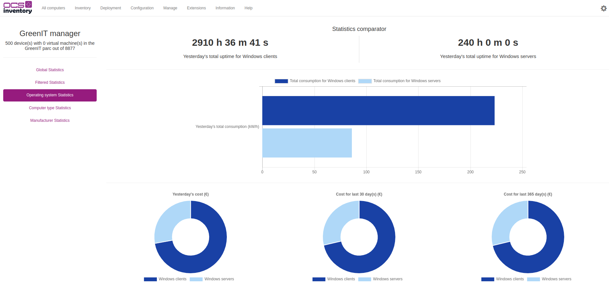

### Computer type statistics
This view is a preset that compare between 3 different type of computer:
- Desktop
- Laptop
- Other

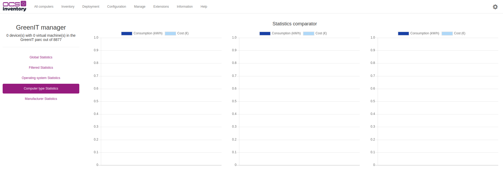

This view is cut into 2 parts:
- The first part cannot be displayed when there isn't data, it is an average cost of compare data X and Y for each computer type. 
- The second part is 3 verticals bar diagrams that compare total consumption with the cost of each computer type.

Example picture of operating system stats view with data:

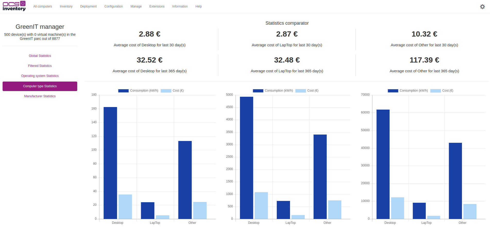

### Manufacturer statistics
This preset is used to see the top 5 of consumption per manufacturer.

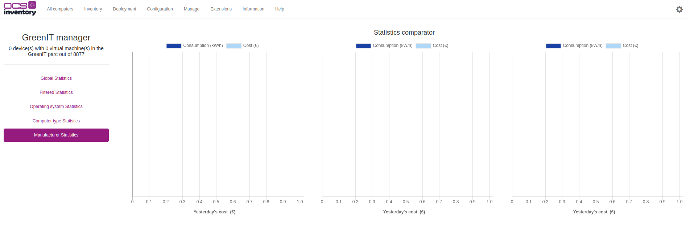

As computer type stats view, the view is cut into 2 parts:
- The first part cannot be displayed when there isn't data, it is an average cost of compare data X and Y for each 5 first manufacturers.
- The second part is 3 honrizontal bar diagrams that compare total consumption with the cost of each 5 first manufacturers.

Example picture of operating system stats view with data:

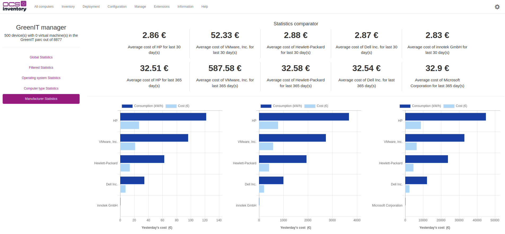