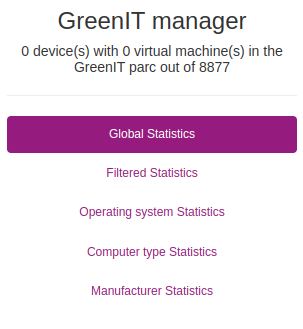

## Dashboard
There is a dashboard to display calculated data. You can go to `Inventory >> GreenIT Manager`.

Then on the left, you'll have this menu:

As you can see, there is 5 differents statistics views that can be seen:
- Global   *(Data of all the IT parc)*
- Filtered   *(Data of a single machine or a filtered group)*
- Operating system   *(Data per operating system)*
- Computer type   *(Data per computer types)*
- Manufacturer   *(Data per manufacturers)*

### The global statistics
This is the global statistics and the default view of your IT parc.

It can display two principal blocks:
- Yesterday's statistics
- Statistics comparator

The yesterday's statistics block have 3 parts than explain:
- Consumption
- Uptime
- Cost

Each block have a total of and an average of the data.

Whereas the statistics comparator have only the cost part and a graphical view wich compare the total consumption with the cost. There is two comparators dates which can be changed in the config view.