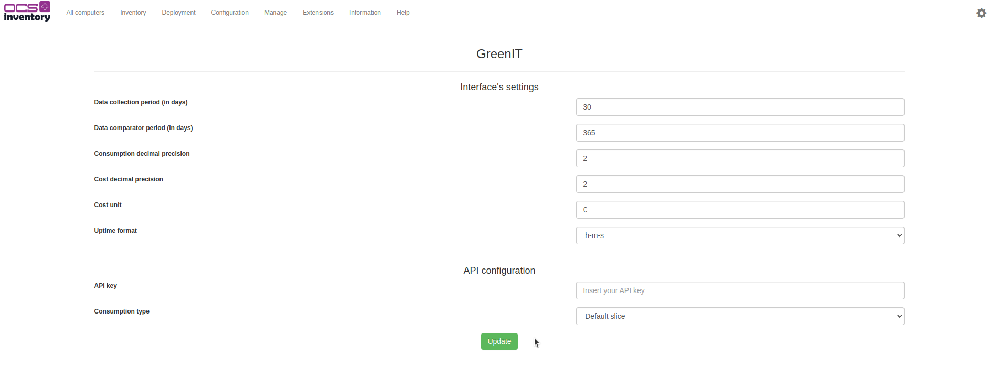

# GreenIT - Server installation

## Introduction
This documentation will show you how to install the GreenIT plugin with the data filter and the crontab.

## Installation

### Prerequisites
The following dependency needs to be installed on your server:

- [Perl module] DateTime.pm

### Plugin
> ***NOTE**: A documentation already exist to install a plugin. You can go check [here](https://wiki.ocsinventory-ng.org/10.Plugin-engine/Using-plugins-installer/#installation)*

### Datafilter
The datafilter is here to limit the data coming from clients. Thanks to this filter, clients will only send new or modified data. It is highly recommanded to install this datafilter if you don't want to don't have slow inventories.

To do that, when you have installed and activated the plugin, copy the files from the datafilter folder *(`greenit/datafilter`)* into your server folder *(`/etc/ocsinventory-server`)*:

  

## Configuration

### Allow access to GreenIT pages
When the plugin is installed, on the web interface you'll have to allow profile to access to two menus.

First, go to `Configuration >> Users`:

When you are on this page, go to the left side of your screen and select `Profiles`:

Then chose the profile which can configure and/or see the greenit interface:

To finish, check ms_greenit_config to allow profile to have access to GreenIT configuration page and ms_greenit_dashboard to have access to the GreenIT dashboard:

> ***IMPORTANT NOTE**: Don't forget to save, logout and reconnect to the account.*

### Plugin configuration
To configure the dashboard, you need to have access to the configuration page like we saw it before. When you have the access, go to `Manage >> GreenIT`:

This page will be displayed, from here, you can configure two things:
- the dashboard data
- the API we use to get electricity prices

For the dashboard data, there is:
- Two periods that can be defined   *(Aim to compare with both periods + D-1 period)*
- Two data precision   *(Define how many decimal you want for each data result)*
- Two other data are for the display format.

And for the API data, there is:
- API key   *(If you have subscribed to OCS-Inventory GreenIT offer, you have recived by mail an API key that needs to be written here)*
- Comsumption type   *(There is deferent slice in industry electricity prices, if you don't know what slice you are, keep it at default. if you precise the slice, it will be more accurate during the approximation of the IT cost)*

### Crontab
The GreenIT module have two cronjob that's needs to be configured if you want the dashboard works well.

The crontab can do calculation at a specific time and permit to the software to be faster to load a page.

There is two execution modes:
- `full`: This mode calculates the power consumption statistics for all computers in the database using the data gathered by the plugin. Please note that executing this mode may take a long time, particularly if there are a large number of computers in the database.
- `delta`: This mode calculates the power consumption statistics for the current day only. Since it processes only the data of the current day, this mode is significantly faster than the full mode. As a result, it can be executed more frequently to update the statistics with the latest data.

To configure the two cronjobs, you'll only have to write this command:   `crontab -e`

And then enter these two lines in:
- `0 5 * * 1 php /usr/share/ocsinventory-reports/ocsreports/extensions/greenit/script/cron_stats.php --mode full`
- `0 5 * * * php /usr/share/ocsinventory-reports/ocsreports/extensions/greenit/script/cron_stats.php --mode delta`
> ***NOTE**: These two cronjobs are the default ones. You are allowed to change the execution time. (By default, every Monday at 5 a.m for full mode and every days at 5 a.m for delta mode)*

And it's done :-)
