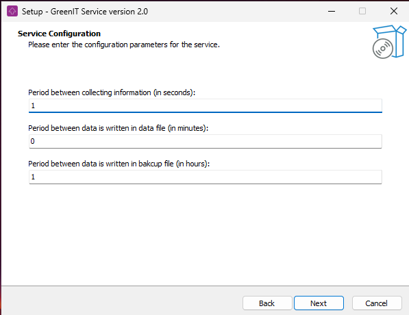

# GreenIT - Agent installation

## Introduction
This documentation explains how to install the GreenIT plugin and service on Windows.

> ***Known issue**: Concerning the EDR detection, the library we use to get consumption data (OpenHardwareMonitor) might have an intrusive behavior, whitelisting the process and its file is recommended.*

## Installation

### Plugin
> ***NOTE**: Documentation already exists for plugin installation. Please refer to this [link](https://wiki.ocsinventory-ng.org/10.Plugin-engine/Using-plugins-installer/#windows-plugin-deployment)*

### Service

#### Executable file
> ***NOTE**: To install it, download the setup of the service [here](https://github.com/OCSInventory-NG/greenit_service/releases/)*

#### CLI Installation
You can also install the service in CLI mode.

Open a terminal and move to the executable folder.

Then you can execute the setup by enter the following command :

`GreenITService_Installer.exe`

It will launch the setup normaly but you can add `/silent` argument to start it in silent mode.

> ***IMPORTANT NOTE**: You must specify more arguments if you use the silent mode!*

Here is the 3 arguments you need to add in silent mode:
- /collectPeriod
- /uploadPeriod
- /savesPeriod

> ***Example**: `GreenITService_Installer.exe /silent /collectPeriod=1 /uploadPeriod=0 /savesPeriod=1`*

> ***NOTE**: More details about arguments [here](#service-configuration)*

## Configuration

### Service configuration
When you start the service setup, you'll get this configuration window:

  

Here you can configure:
- Period between collecting information: a time in seconds for the service to collect information from the computer.
    > ***Example** : if you set it to 5, it will collect information every 5 seconds.*

- Period between uploads: a time in minutes for the service to write information collected into the following file *`C:\ProgramData\GreenIT\data.json`*
    > ***Example** : if you set it to 5, it will write information to the file every 5 minutes. **If set to 0, data will be written each time the service collects information.***

    > ***NOTE**: `C:\ProgramData` is a hidden folder.*

- Period between saves: a time in hours for the service to save the data file into the following file *`C:\ProgramData\GreenIT\data.bak`*
    > ***Example** : if you set it to 5, it will save the data file every 5 hours.*

Once configured, click on **Install** and then check `Run GreenIT Service 1.0` at the end.

> ***IMPORTANT NOTE**: It is important to check `Run GreenIT Service 1.0` to install the software as a Windows service !*

If you haven't checked the box, you can install it manually after the install of the software:
- Open a terminal and go to the software installation folder path.
- Run the command `.\GreenIT.exe install` and wait until the plugin is installed.

And that's it :-)
