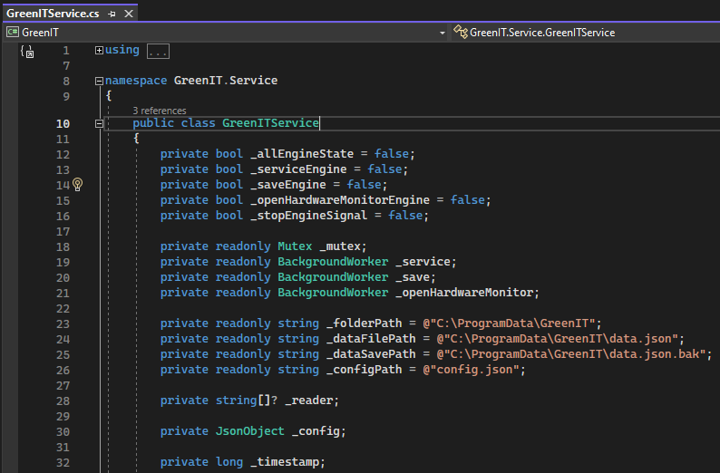

# Green IT - Service

## Introduction

This documentation provides an overview of how the GreenIT service works.

## Software version

The project was developed using Visual Studio Community 2022 version 17.5.0 on a Windows 10 Pro x64 (22H2) distribution.

> _IMPORTANT NOTE: During installation, make sure to check ".NET desktop development" and ".NET framework 8" to avoid any issues when working on the project._

## Structure

The project is organized as follows:

  

## Packages

The service relies on three important packages to function properly:

- Serilog : Used for generate clean formated logs.

- LibreHardwareMonitorLib : Enables the collection of consumption data.

- Microsoft Hosting Extensions : Allows the project to run as a service.

## Main content

Two files are important to understand how the service works :

- Program.cs
- Worker.cs

### Program.cs

This file creates the Windows service and defines its settings, such as the service name and running method.

  

### Worker.cs

This file is the main component of the service and contains all the functions used by the service.

  

  

It was made to be easily upgradeable and maintainable in the future:
- FilesCheck is made to check the files if it exist before trying to write data
- GetData, ApplyNewConsumption, WriteData and BackupData is used to do the entire work like get the data, update the data and write the new data into the data file and backup file.
- GetConsumption is the main function that doing all the calculation.
- SerializeData is a utility function as well as UpdateVisitor.
